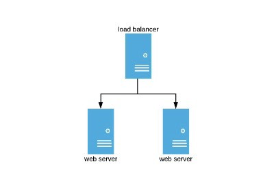

# Εργασία 2 (Ατομική)

Προθεσμία Παράδοσης: 25 Οκτωβρίου 2022

Αυτή η εργασία αποτελείται από τρία μέρη. Αυτή είναι μια ατομική εργασία που θα διεξαχθεί ξεχωριστά από κάθε φοιτητή/τρια.

## Μέρος 1: Εξισορρόπηση φορτίου 

Σε αυτό το μέρος θα δημιουργήσετε και θα αναπτύξετε μια υποδομή εξισορρόπησης φορτίου  χρησιμοποιώντας το Nginx και Ansible. 
Αναμένουμε να έχετε ήδη μια βασική εξοικείωση με το Nginx και το Ansible.

Η εξισορρόπηση φορτίου σε πολλές περιπτώσεις εφαρμογών είναι μια τεχνική που χρησιμοποιείται συνήθως για τη βελτιστοποίηση της χρήσης πόρων, τη μεγιστοποίηση της απόδοσης, τη μείωση της καθυστέρησης και τη διασφάλιση διαμορφώσεων ανεκτικών σε σφάλματα.

Είναι δυνατό να χρησιμοποιηθεί το nginx ως ένας πολύ αποτελεσματικός εξισορροπητής φορτίου HTTP για τη διανομή της κυκλοφορίας σε πολλαπλούς διακομιστές εφαρμογών και για τη βελτίωση της απόδοσης, της επεκτασιμότητας και της αξιοπιστίας των εφαρμογών Ιστού με το nginx.



### Λογισμικό 

Θα βρείτε τον πηγαίο κώδικα για αυτήν την εργασία στον κατάλογο `lb`.
Το βιβλίο (playbook) `nginx-lb.yml` στήνει πολλούς διακομιστές ιστού και ένα ενιαίο πρόγραμμα εξισορρόπησης φορτίου μπροστά από αυτούς τους διακομιστές Ιστού.
Το βιβλίο διαμορφώνει κάθε διακομιστή ιστού χρησιμοποιώντας το πρότυπο διαμόρφωσης `static_site.cfg.j2` και το πρόγραμμα εξισορρόπησης φορτίου χρησιμοποιώντας το πρότυπο διαμόρφωσης `load-balancer.cfg.j2`.

### Εξισορρόπηση φορτίου σε στατικό ιστότοπο

Δημιουργήστε μια μικρή συστοιχία στο CloudLab χρησιμοποιώντας το προφίλ `multi-node-cluster` στο έργο `UCY-CS499-DC`. Η συστοιχία να διαμορφωθεί με έξι (6) φυσικούς κόμβους μηχανής.

Εγκαταστήστε το πρόγραμμα εξισορρόπησης φορτίου και τους διακομιστές ιστού που εξυπηρετούν το στατικό ιστότοποχρησιμοποιώντας το παρεχόμενο βιβλίο `nginx-lb.yml`.
Θα πρέπει να εγκαταστήσετε το πρόγραμμα εξισορρόπησης φορτίου σε ένα μηχάνημα (π.χ. "node1") και τους διακομιστές ιστού σε άλλα μηχανήματα (π.χ. "node2", "node3", ...) για να αποφύγετε παρεμβολές στην απόδοση.

Αξιολογήστε πώς αλλάζει η διεκπεραίωση (αιτήματα/δευτ.) και η καθυστέρηση με την αύξηση του αριθμού των διακομιστών Ιστού (1 έως 4).
Μπορείτε να χρησιμοποιήσετε το εργαλείο συγκριτικής αξιολόγησης HTTP `wrk` για να δημιουργήσετε φόρτο εργασίας.
Θα πρέπει να εκτελείτε το `wrk` σε διαφορετικό μηχάνημα από αυτά που τρέχουν το πρόγραμμα εξισορρόπησης φορτίου και τους διακομιστές ιστού για να αποφύγετε παρεμβολές στην απόδοση.

### Εξισορρόπηση φορτίου στην υπηρεσία ιστού HotelMap

Επαναλάβετε την προηγούμενη άσκηση για το HotelMap.

## Μέρος 2: Χαρακτηρισμός Μετροπρογράμματος Web Search

Σε αυτό το μέρος, θα αναλύσετε το μετροπρόγραμμα Web Search. Αυτό περιλαμβάνει μεταξύ άλλων ανάλυση του χρόνου απόκρισης και ρυθμαπόδοσης.

### Single- vs Multi-threaded Client

Για αυτήν την ερώτηση, θα πρέπει να διαμορφώσετε το σημείο αναφοράς αναζήτησης Ιστού ώστε να εκτελεί έναν ενιαίο διακομιστή διεπαφής και έναν διακομιστή ευρετηρίου, ακολουθώντας τις οδηγίες από το Εργαστήριο Αναζήτησης Ιστού (Web Search). Θα πρέπει να διαμορφώσετε τον διακομιστή ευρετηρίου ώστε να εκτελείται με τόσα νήματα όσοι διαθέσιμοι πυρήνες σε ένα μόνο επεξεργαστή (όπως αναφέρεται μέσω του `lscpu`).

Θα πρέπει να ξεκινήσετε με ένα νήμα πελάτη που στέλνει αιτήματα. Αυτό το κάνουμε για να απομονώσουμε τους χρόνους απόκρισης από τις επιπτώσεις της ουράς, συμφόρηση σε κοινόχρηστους πόρους κ.λπ. Με αυτόν τον τρόπο η ανάλυση επικεντρώνεται μόνο στον χρόνο που πραγματικά χρειάζεται για την επεξεργασία του ερωτήματος.

```
./client node1 8080 /local/websearch/ISPASS_PAPER_QUERIES_100K 1000 1 onlyHits.jsp 1 1 /tmp/out 1
```

Στη συνέχεια, θα πρέπει να πραγματοποιήσετε μια έρευνα για το πώς ο αριθμός των νημάτων πελάτη επηρεάζει την απόδοση του συστήματος. Συνιστούμε να εκτελείτε τον πελάτη με έως και 128 νήματα. Για παράδειγμα, το παρακάτω εκτελεί 8 νήματα πελάτη σε μια μηχανή οκτώ πυρήνων:

```
./client node1 8080 /local/websearch/ISPASS_PAPER_QUERIES_100K 1000 8 onlyHits.jsp 1 1 /tmp/out 1
```

Αναφέρετε και σχολιάστε πώς κλιμακώνεται η απόδοση (ρυθμαπόδοση και καθυστέρηση απόκρισης) με τον αριθμό των νημάτων πελάτη. Μετρήστε τη χρήση της CPU του διακομιστή ευρετηρίου και αναφέρετε πώς συσχετίζεται η χρήση της CPU με την απόδοση.

### Index Partitioning

Θα πρέπει να συγκρίνετε τους χρόνους απόκρισης μιας εγκατάστασης με χρήση καταμερισμού (partitioning) σε δύο διακομιστές ευρετηρίου που λειτουργούν σε διαφορετικά μέρη ευρετηρίου και μια διαμόρφωση χωρίς διαμερισμό. Τα ερωτήματα εκτελούνται διαδοχικά ένα κάθε φορά.

Για αυτό το μέρος, θα πρέπει να διαμορφώσετε το μετροπρόγραμμα αναζήτησης Ιστού για να τρέχει σε  έναν μόνο διακομιστή διεπαφής (frontend server) και δύο διακομιστές ευρετηρίου (index servers) χρησιμοποιώντας το αρχείο διαμόρφωσης `hosts-2-index`, και τέσσερις διακομιστές ευρετηρίου (index servers) χρησιμοποιώντας το νέο αρχείο διαμόρφωσης `hosts-4-index` που θα πρέπει να γράψετε.
Αναφέρετε και σχολιάστε πώς η κατάτμηση επηρεάζει την απόδοση (ρυθμαπόδοση και καθυστέρηση απόκρισης).

## Point Distribution

| Πρόβλημα   | Βαθμολογία |
|------------|--------|
| Q1.1       | 25     |
| Q1.2       | 25     |
| Q2.1       | 25     |
| Q2.2       | 25     |

### Υποβολή

Τώρα πρέπει να υποβάλετε την εργασία σας. Κάντε την αλλαγή σας και σπρώξτε την στο απομακρυσμένο αποθετήριο κάνοντας τα εξής:

```
$ git commit -am "[you fill me in]"
$ git push -u origin main
```

Μπορείτε να σπρώξετε τον κώδικα σας όσες φορές θέλετε, η βαθμολόγηση και ο χρόνος υποβολής θα βασιστούν στην τελευταία σας ώθηση.
