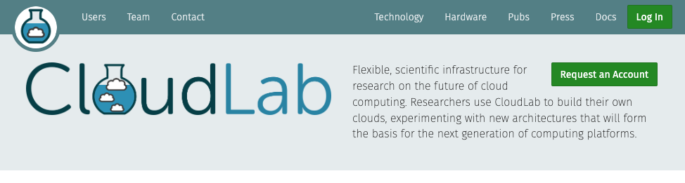

# Lab 0: Administrative Tasks

## Join CloudLab
You can use [CloudLab](https://cloudlab.us/), a [NSF](https://www.nsf.gov/) funded cloud resource provider, for getting compute and storage resources for your work through the semester. Among other usage, you will need to use it for several lab tutorials and assignments. 

You'll need an account to use CloudLab.

If you have an account at one of its federated facilities, like [GENI](http://www.geni.net/) and [Emulab](http://www.emulab.net/), then you already have an account at CloudLab, and you can simply request to join the [`UCY-CS499-DC`](https://www.cloudlab.us/show-project.php?project=ucy-cs499-dc) project. 

If not, you can register an account by visiting http://cloudlab.us and creating an account using your University of Cyprus email address as login. Note that an SSH public key is required to access the nodes CloudLab assigns to you; if you are unfamiliar with creating and using ssh keypairs, we recommend taking a look at the [guide to generating SSH keys](../notes/connect-ssh/generate.md).

### Registering Account

To register an account:

1. Start by visiting https://www.cloudlab.us/ in your browser and clicking the **Request an Account** button.

<figure>
  

  <figcaption>
Figure. CloudLab Portal
</figcaption>
</figure>

2. In the sign-up form, select **Join Existing Project**, and enter `UCY-CS499-DC` as the project name. 

<figure>
  

  <figcaption>
Figure. Request to Join a Project
</figcaption>
</figure>

3. Fill in your personal information, including username, full name, email, and password.

4. Click on **Choose file** under **SSH Public Key file**. Locate the SSH public key file `.pub` and click **Open**.

5. Finally, click on **Submit Request**. You will get an email notification when the project leader approves your request. 

Once your registration request gets approved, you can start using CloudLab to create experiments.

In the meantime, you might want to read through the [CloudLab manual](https://docs.cloudlab.us/) to learn more about it, the chapter on Basic Concepts is particularly helpful.

### Managing Account

Once your registration request gets approved, you can further manage your account through the CloudLab Portal. For example, we recommend you change the default shell to bash:

1. Log into the CloudLab portal. Once you are logged in: Click on your username (top right), select `Manage Account`. 

<figure>
  

  <figcaption>
Figure. Manage Account.
</figcaption>
</figure>

2. Change `Default Shell` to bash, and click `Save`.

## Join GitHub
You can use [GitHub](https://github.com/), a [Git](https://git-scm.com/) repository hosting service, for storing, managing, tracking and controlling changes to your code.
In order to gain access to GitHub you need to register for an account. To do so:

- Go to https://github.com/ and hit **Sign Up**.
- On the page fill out all the usual fields asking you for username, password, etc.
- You should upload a SSH key, please see [Github's guide to generating a SSH key](https://docs.github.com/en/authentication/connecting-to-github-with-ssh/generating-a-new-ssh-key-and-adding-it-to-the-ssh-agent) should you need help with this.
- You might want to read through the [Git Guide](https://github.com/git-guides).
