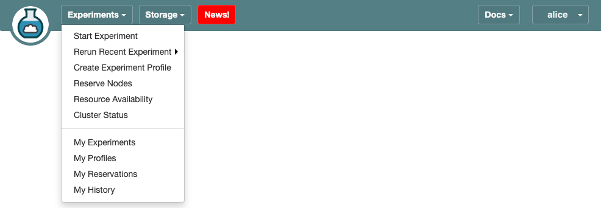
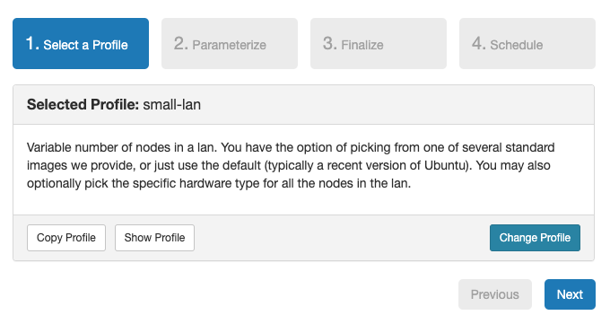
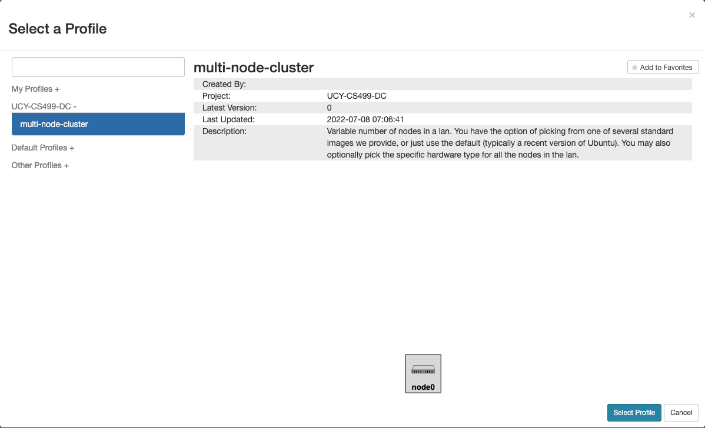
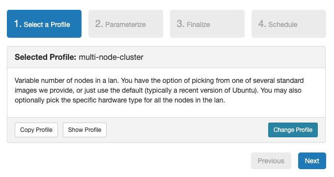
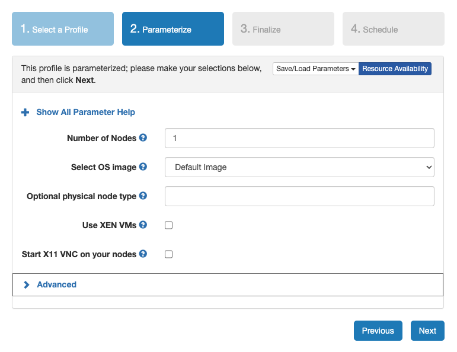
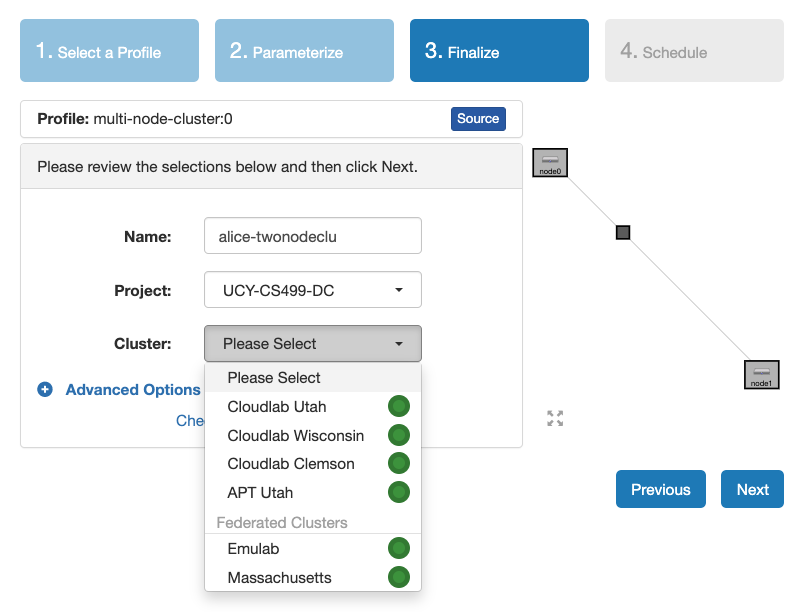
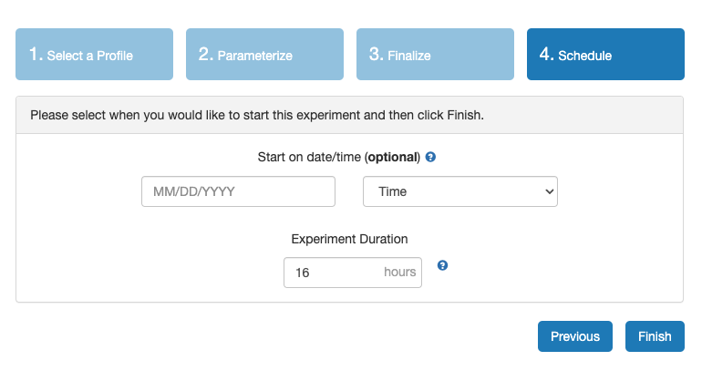
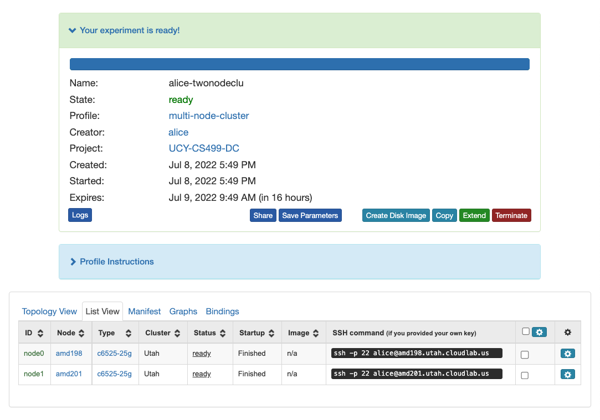
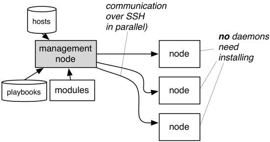

# Lab: Getting Started with CloudLab 

You will do your labs and assignments for CS499 using CloudLab. CloudLab is a research facility which provides bare-metal access and control over a substantial set of computing, storage, and networking resources. If you haven’t worked in CloudLab before, you need to register a CloudLab account.

This lab walks you through the CloudLab registration process and shows you how to start an experiment in CloudLab.

Most importantly, it introduces our policies on using CloudLab that will be enforced throughout the semester.

Along the way it introduces you to some basic DevOps and Linux stuff.

## Introduction

CloudLab is a "meta-cloud"—that is, it is not a cloud itself; rather, it is a facility for building clouds. It provides bare-metal access and control over a substantial set of computing, storage, and networking resources; on top of this platform, users can install standard cloud software stacks, modify them, or create entirely new ones.

The current CloudLab deployment consists of more than 25,000 cores distributed across three sites at the University of Wisconsin, Clemson University, and the University of Utah. CloudLab interoperates with existing testbeds including [GENI](http://www.geni.net/) and [Emulab](http://www.emulab.net/), to take advantage of hardware at dozens of sites around the world.

The control software for CloudLab is open source, and is built on the foundation established for [Emulab](http://www.emulab.net/), [GENI](http://www.geni.net/), and [Apt](http://www.aptlab.net/). Pointers to the details of this control system can be found on CloudLab’s [technology page](https://www.cloudlab.us//technology.php).

## Register a CloudLab account

You’ll need an account to use CloudLab. 

If you have an account at one of its federated facilities, like [GENI](http://www.geni.net/) and [Emulab](http://www.emulab.net/), then you already have an account at CloudLab, and you can simply request to join the `UCY-CS499-DC` project. 

If not, you can register an account by visiting http://cloudlab.us and creating an account using your University of Cyprus email address as login. Note that an SSH public key is required to access the nodes CloudLab assigns to you; if you are unfamiliar with creating and using ssh keypairs, we recommend taking a look at the [guide to generating SSH keys](docs/ssh-keypair/README.md).

To register an account:

1. Start by visiting https://www.cloudlab.us/ in your browser and clicking the **Request an Account** button.

<figure>
  <p align="center"></p>
  <figcaption><p align="center">Figure. CloudLab Portal</p></figcaption>
</figure>

2. In the sign-up form, select **Join Existing Project**, and enter `UCY-CS499-DC` as the project name. 

<figure>
  <p align="center"></p>
  <figcaption><p align="center">Figure. Request to Join a Project</p></figcaption>
</figure>

3. Fill in your personal information, including username, full name, email, and password.

4. Click on **Choose file** under **SSH Public Key file**. Locate the SSH public key file `.pub` and click **Open**.

5. Finally, click on **Submit Request**. You will get an email notification when the project leader approves your request. 

Once your registration request gets approved, you can start using CloudLab to create experiments.

## Start an Experiment

CloudLab resources are assigned to experiments, which is just a grouping of resources allocated to you. 

To start a new experiment:

1. **Log in**

   Start by pointing your browser at https://www.cloudlab.us/, clicking the **Log In** button, and entering your username and password.

<figure>
  <p align="center"></p>
  <figcaption><p align="center">Figure. CloudLab Portal</p></figcaption>
</figure>

2. **Start Experiment**

   Click on the **Experiments** tab in the upper left corner, then select **Start Experiment**. 

<figure>
  <p align="center"></p>
  <figcaption><p align="center">Figure. Experiments Tab</p></figcaption>
</figure>

3. **Experiment Wizard**

   Experiments must be configured before they can be instantiated. A short wizard guides you through the process. The first step is to pick a profile for your experiment. A profile describes [a set of resources](https://docs.cloudlab.us/advanced-topics.html#%28part._rspecs%29) (both hardware and software) that will be used to start your experiment. On the hardware side, the profile will control whether you get [virtual machines](https://docs.cloudlab.us/basic-concepts.html#%28part._virtual-machines%29) or [physical ones](https://docs.cloudlab.us/getting-started.html#:~:text=virtual%20machines%20or-,physical%20ones,-%2C%20how%20many%20there), how many there are, and what the network between them looks like. On the software side, the profile specifies the [operating system and installed software](https://docs.cloudlab.us/advanced-topics.html#%28part._disk-images%29).

   Profiles come from two sources. Some of them are provided by CloudLab itself, and provide standard installation of popular operating systems, software stacks, etc. Others are [created by other researchers](https://docs.cloudlab.us/creating-profiles.html) and may contain research software, artifacts and data used to gather published results, etc. Profiles represent a powerful way to enable [repeatable research](https://docs.cloudlab.us/repeatable-research.html).

   The default profile is `small-lan`, and usually you do not want to use this profile. You should instead click the **Change Profile** button. 
  
   Clicking the **Change Profile** button will let you select the profile that your experiment will be built from.   

<figure>
  <p align="center"></p>
  <figcaption><p align="center">Figure. Experiment Wizard</p></figcaption>
</figure>

4. **Select a Profile**
  
   On the left side is the profile selector which lists the profiles you can choose. The list contains both globally accessible profiles and profiles accessible to the projects you are part of.

   The large display in this dialog box shows the network topology of the profile, and a short description sits below the topology view.

   We provide a few profiles in the `UCY-CS499-DC` project, the `multi-node-cluster` profile will give you a small cluster installation with a variable number of bare metal nodes.

   Once you have chosen a profile hit **Select Profile** and then click **Next**.

<figure>
  <p align="center"></p>
  <figcaption><p align="center">Figure. Select a Profile</p></figcaption>
</figure>

<figure>
  <p align="center"></p>
  <figcaption><p align="center">Figure. Selected Profile</p></figcaption>
</figure>

5. **Choose Parameters**

   Some profiles are simple and provide the same topology every time they are instantiated. But others, like the `multi-node-cluster` profile, are parameterized and allow users to make choices about how they are instantiated. The `multi-node-cluster` profile allows you to pick the number of compute nodes, the hardware to use, and many more options. The creator of the profile chooses which options to allow and provides information on what those options mean. Just mouse over a blue ’?’ to see a description of an option. 
  
   For this lab, we will create a two-node cluster. Change **Number of Nodes** to 2 and click **Next** to continue.

<figure>
  <p align="center"></p>
  <figcaption><p align="center">Figure. Parameterize</p></figcaption>
</figure>

6. **Pick a Cluster**

   CloudLab can instantiate profiles on several different backend clusters. The cluster selector is located right above the **Create” button; the the cluster most suited to the profile you’ve chosen will be selected by default.

   Here you should name your experiment with `CloudLabLogin-ExperimentName`. The purpose of doing this is to prevent everyone from picking random names and ending up confusing each other since everyone in the `UCY-CS499-DC` project can see a full list of experiments created. 
   
   You also need to specify from which cluster you want to start your experiment. CloudLab can instantiate profiles on several different backend clusters. Each cluster has different hardwares. For more information on the hardware CloudLab provides, please refer to [this](https://docs.cloudlab.us/hardware.html). 
   
   Once you select the cluster, click **Next** to continue.  

<figure>
  <p align="center"></p>
  <figcaption><p align="center">Figure. Finalize</p></figcaption>
</figure>

7. **Click Finish!**

   You are now ready to run your experiment or schedule the deployment for later. 
  
   To start your experiment immediately, leave **Start on day/time** empty.
   
   To schedule the deployment for later, set a date and time in **Start on day/time**. A typical use for this option, is to schedule your experiment to start shortly after a resource reservation starts. See the manual for more info on [reservations](http://docs.cloudlab.us/reservations.html).
  
   For this lab, leave **Start on day/time** empty and click **Finish** to confirm your deployment. The reservation and deployment processes will run automatically.
   
<figure>
  <p align="center"></p>
  <figcaption><p align="center">Figure. Schedule</p></figcaption>
</figure>

8. **CloudLab instantiates your profile**


   When you click the **Finish** button, CloudLab will start preparing your experiment by selecting nodes, installing software, etc. as described in the profile. What’s going on behind the scenes is that on one (or more) of the machines in one of the CloudLab clusters, a disk is being imaged, VMs and/or physical machines booted, accounts created for you, etc. This process usually takes a couple of minutes.

<figure>
  <p align="center"></p>
  <figcaption><p align="center">Figure. Deployment</p></figcaption>
</figure>
   
9. **Your experiment is ready!**

   When your experiment is ready to use, the progress bar will be complete, and you’ll be given a lot of new options at the bottom of the screen.
   
   The **Topology View** shows the network topology of your experiment (which may be as simple as a single node). Clicking on a node in this view brings up a terminal in your browser that gives you a shell on the node. The **List View** lists all nodes in the topology, and in addition to the in-browser shell, gives you the command to ssh login to the node (if you provided a public key). The **Manifest** tab shows you the technical details of the resources allocated to your experiment. Any open terminals you have to the nodes show up as tabs on this page.

   Clicking on the **Profile Instructions** link (if present) will show instructions provided by the profile’s creator regarding its use.

   Your experiment is yours alone, and you have full “root” access (via the sudo command). No one else has access to the nodes in your experiment, and you may do anything at all inside of it, up to and including making radical changes to the operating system itself. CloudLab will clean it all up when you’re done!

   Your experiment will **terminate automatically after a few hours**. When the experiment terminates, you will **lose anything on disk** on the nodes, so be sure to copy off anything important early and often. You can use the **Extend** button to submit a request to hold it longer, or the **Terminate** button to end it early.

<figure>
  <p align="center"></p>
  <figcaption><p align="center">Figure. List View</p></figcaption>
</figure>

## Use your experiment

Secure Shell (ssh) is the standard way to connect to a remote machine’s shell. Since you gave CloudLab an ssh public key as part of account creation, you can log in using the ssh client on your laptop or desktop. `node0` is a good place to start. Go to the **List View** on the experiment page to get a full command line for the ssh command and use it to ssh into `node0`. If you are unfamiliar with using an ssh client, we recommend taking a look at this [guide](docs/ssh/README.md). 

```
$ ssh -p 22 alice@amd198.utah.cloudlab.us
# Attempts to ssh to CloudLab
```

You may see a warning like this:

```
The authenticity of host 'amd198.utah.cloudlab.us (128.110.219.109)' can't be established.
RSA key fingerprint is SHA256:bB4TBZMIEhrtJN2mb/Mzn8fvSRUBUC+UamxqkhCU7HA.
Are you sure you want to continue connecting (yes/no)? 
```

Verify that the fingerprint in the message you see matches CloudLab's public key fingerprint. If it does, then type yes.

The interactive session is established, and you may now conduct your administrative tasks.

For example, you can run the `lscpu` command to list information about CPUs that are present in the system, including the number of CPUs.

```
$ lscpu
```

### Run a command over SSH on a single machine

What if the only thing you need to do over the SSH connection is execute a single quick command? You might not want to take the separate actions of connecting and authenticating, running the command, and then disconnecting.

SSH allows users to append the desired command directly to the connection attempt. The command executes, and the connection is closed.

The basic syntax is `ssh user@host "command"`.

For example, you could check the installation status of a package:

```
$ ssh alice@amd198.utah.cloudlab.us "dpkg -l | grep nano"
```

You can also run commands from a local file. The `-s` option of `bash` helps to read the executable command from the standard input:

```
ssh alice@amd198.utah.cloudlab.us 'bash -s' < src/get_host_info.sh
```

If you need to elevate your privileges on the far side of the SSH connection with `sudo`, then force the use of a pseudo-terminal with `-t`. Use this if `sudo` will challenge you for a password. The command looks like this:

```
$ ssh -t alice@amd198.utah.cloudlab.us "sudo apt -y install nano"
```

### Run a command over SSH on multiple machines 

For cluster sizes larger than 2, `parallel-ssh` and `ansible` are very useful tools for running the same commands on multiple machines.

Getting started with these tools is simple. 
1. Choose a machine as your management system and install the tool. Your management node can also be a managed node.
2. Ensure you have passwordless ssh access from your management system to each managed node.
3. Create a hosts file containing an inventory of your nodes.
4. Start using the tool 

We suggest the following:
- For step 1, you use `node0` as the management system.
- For step 2, you use a CloudLab profile that automatically sets up ssh keys for passwordless access. All the CloudLab profiles under `UCY-CS499-DC` meet this requirement.

#### Using `parallel-ssh`

[`parallel-ssh`](https://manpages.org/parallel-ssh) is a program for executing ssh in parallel on a number of hosts. 

On Debian based distributions, you can install `parallel-ssh` using `apt`:

```
$ sudo apt -y install pssh
```

To use `parallel-ssh`, you need to create a text file called hosts file that contains a list of all the hosts that you want to have the command executed on:

```
node0
node1
```

Once you have a hosts file, you can run `parallel-ssh` for all the hosts from this file to execute a command. You can use the `-i` option to display standard output and standard error as each host completes. 

For example, you can run `date` on each host:

```
$ parallel-ssh -i -h pssh_hosts date
```

Sample output:

```
[1] 06:48:49 [SUCCESS] node0
Wed Jul  6 06:48:49 CDT 2022
[2] 06:48:49 [SUCCESS] node1
Wed Jul  6 06:48:49 CDT 2022
```

As another example, you can run `apt` to install `nano` on each host:

```
$ parallel-ssh -i -h pssh_hosts -- sudo apt -y install nano
```

#### Using `ansible`

[Ansible](https://www.ansible.com/) is a modern configuration management tool that facilitates the task of setting up and maintaining remote servers. [Configuration management](https://en.wikipedia.org/wiki/Configuration_management) is an automated method for maintaining computer systems and software in a known, consistent state. 

<figure>
  <p align="center"></p>
  <figcaption><p align="center">Figure. Ansible Architecture</p></figcaption>
</figure>

On Debian based distributions, you can install `ansible` using `apt`:

```
$ sudo apt -y install ansible
```

Similarly to `parallel-ssh`, Ansible uses an inventory file, called hosts to determine which nodes you want to manage. This is a plain-text file which lists individual nodes or groups of nodes (e.g. Web servers, Database servers, etc.). 
The default location for the inventory file is /etc/ansible/hosts, but it’s possible to create inventory files in any location that better suits your needs. In this case, you’ll need to provide the path to your custom inventory file with the `-i` parameter when running Ansible commands. Using per-project inventory files is a good practice to minimize the risk of running a command on the wrong group of servers. A simple hosts file you can start off with looks like this:

```
[webservers]
node0
node1
```

This defines a group of nodes we call `webservers` with two specified hosts in it.

We can now immediately launch Ansible to see if our setup works:

```
$ ansible webservers -i ./hosts -m ping
node0 | SUCCESS => {
    "changed": false, 
    "ping": "pong"
node1 | SUCCESS => {
    "changed": false, 
    "ping": "pong"
}
```

Ansible connects to each individual node in the group of webservers, transmits the required module (here: `ping`), launches the module, and returns the module’s output. Instead of addressing a group of nodes, we can also specify an individual node or a set of nodes with wildcards.

Modules use the available context to determine what actions if any needed to bring the managed host to the desired state and are [idempotent](https://en.wikipedia.org/wiki/Idempotence#Computer_science_meaning), that means if you run the same task again and again, the state of the machine will not change. To find the list of available modules, use `ansible-doc -l`

Instead of shooting off individual ansible commands, we can group these together into so-called playbooks which declare a specific configuration we want to apply to a node. Tasks specified are processed in the order we specify. A playbook is expressed in YAML:

```
---
- name: Configure webserver with nginx
  hosts: webservers
  vars:
    web_root: "{{ ansible_env.HOME }}/static-site"
  tasks:
    - name: install nginx
      apt: 
        name: nginx 
        update_cache: yes
      become: yes
    
    - name: copy the nginx config file
      template:
        src: static_site.cfg.j2
        dest: /etc/nginx/sites-available/static_site.cfg
      become: yes
    
    - name: create symlink
      file:
        src: /etc/nginx/sites-available/static_site.cfg
        dest: /etc/nginx/sites-enabled/default
        state: link
      become: yes

    - name: ensure {{ web_root }} dir exists
      file:
        path: "{{ web_root }}"
        state: directory

    - name: copy index.html
      copy: 
        src: index.html
        dest: "{{ web_root }}/index.html"

    - name: restart nginx
      service: 
        name: nginx 
        state: restarted
      become: yes
```

The format is very readable. 
With `hosts`, we choose specific hosts and/or groups in our inventory to execute against. 
With `vars`, we define variables we want to pass to tasks. These variables can be used within the playbook and within templates as `{{ var }}`. 
With `tasks`, we define the list of tasks we want to execute. Each task hask a name which helps us track playbook progress and a module we want Ansible to invoke.
Finally, for tasks that require root privileges such as installing packages, we use `become` to ask Ansible to activate privilege escalation and run corresponding tasks as `root` user. 

The playbook uses several types of modules, many of which are self explanatory. The template module construct a file’s content using variables. Ansible uses the [Jinja2](http://jinja.pocoo.org/docs/) templating language.

The `ansible-playbook` utility processes the playbook and instructs the nodes to perform the tasks, starting with an implicit invocation of the setup module, which collects system information for Ansible. Tasks are performed top-down and an error causes Ansible to stop processing tasks for that particular node.

```
$ ansible-playbook -i ./hosts.ini nginx.yml
```

Once the playbook is finished, if you go to your browser and access `node0` or `node1`'s public hostname or IP address you should see the following page:

```
nginx, configured by Ansible
If you can see this, Ansible successfully installed nginx.
```

**Exercise**: Extend the nginx setup to display the node that the nginx service is running on. For example, when visiting `node1` you should get the following page: 

```
nginx, configured by Ansible
If you can see this, Ansible successfully installed nginx.
Running on node1.
```

## Terminate your experiment 

Terminate the experiment once you are done. CloudLab is a shared resource, and you should be careful to not waste resources. If we find cases where experiments are not terminated once you are done with them, we will impose a grade penalty.

## Policies on Using CloudLab Resources

**Do not leave your CloudLab experiment instantiated unless you are using it! It is important to be a good citizen of CloudLab.**

The nodes you receive from CloudLab are real hardware machines sitting in different clusters. Therefore, we ask you not to hold the nodes for too long. CloudLab gives users 16 hours to start with, and users can extend it for a longer time. Manage your time efficiently and only hold onto those nodes when you are working on the assignment. Write scripts and use tools to ensure you can easily setup and restart experiments. Remember to back up any data to your local machine so you do not lose data. You should use a private git repository to manage your code, and you must terminate the nodes when you are not using them. If you do have a need to extend the nodes, do not extend them by more than 1 day. We will terminate any cluster running for more than 48 hours.

As a member of the `UCY-CS499-DC` project, you have permissions to access another member’s private user space. Stick to your own space and do not access others’ to peek at/copy/use their code, or intentionally/unintentionally overwriting files in others’ workspaces.
