# What is CloudLab


<br /> 

- https://www.cloudlab.us/
- A shared cloud infrastructure for research and education in computer systems.
- The CloudLab clusters have almost 25,000 cores distributed across three sites around the United States.

---

# Crash course in CloudLab

- Underneath, it’s GENI
   - Same APIs, same account system
   - Even many of the same tools
   - Federated (accept each other’s accounts, hardware)
- Physical isolation for compute, storage (shared net.*)
- Profiles are one of the key abstractions
   - Defines an environment – hardware (RSpec) / software (images)
   - Each “instance” of a profile is a separate physical realization
   - Provide standard environments, and a way of sharing
   - Explicit role for domain experts
- “Instantiate” a profile to make an “Experiment”
   - Lives in a GENI slice

---

# CloudLab's hardware


For more information: https://docs.cloudlab.us/hardware.html

---

# Who Use Cloudlab?

- Course instructors and students
   - For doing lab assignments and final projects
- System researchers

---

# Cloudlab usage - on a typical day

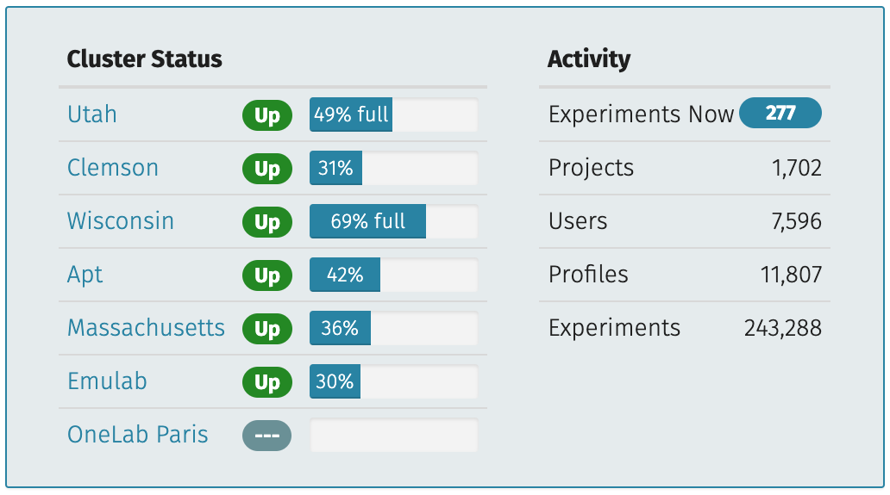

---

# Cloudlab usage - on a busy day (SIGCOMM 2022 deadline)

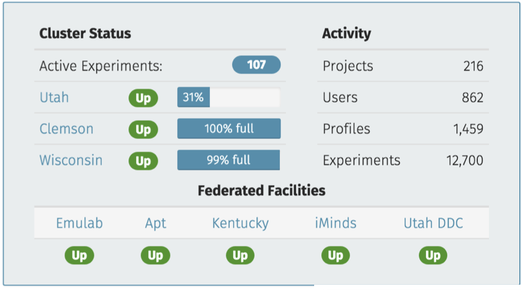

---

# CloudLab users across the United States

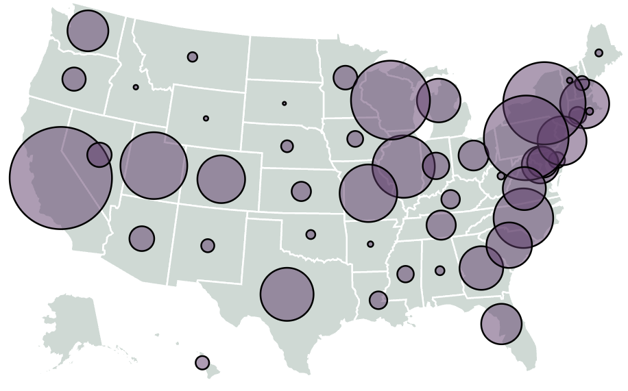

---

# CloudLab users around the World


---

# CloudLab Hardware

---

# Utah/HP: Very dense

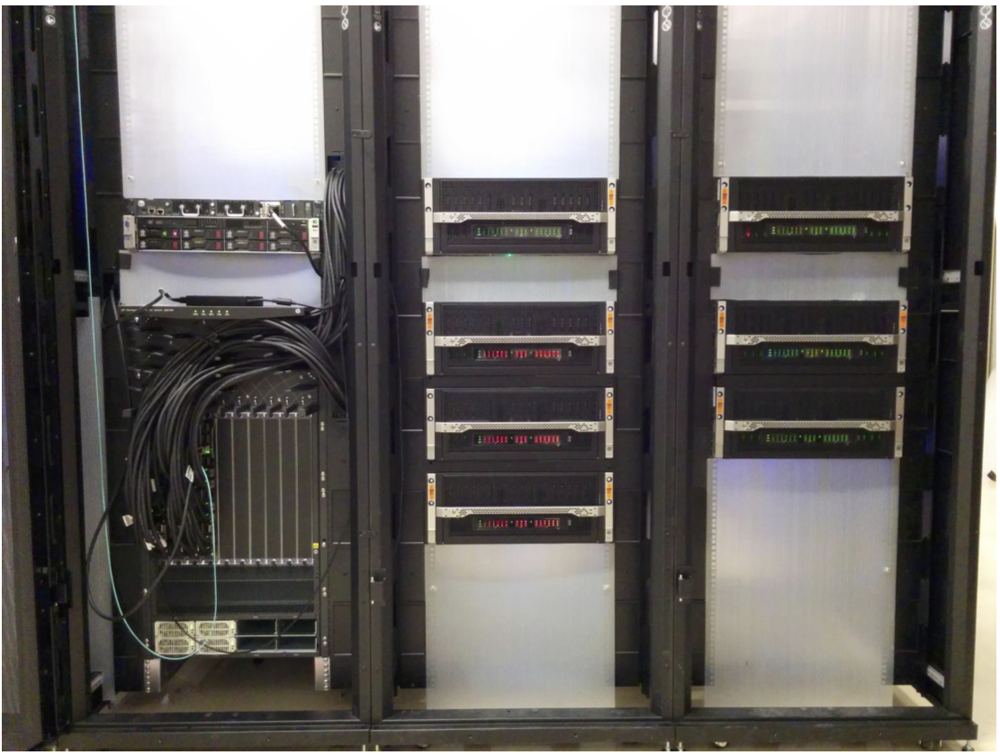

---

# Utah/HP: Low-power ARM64

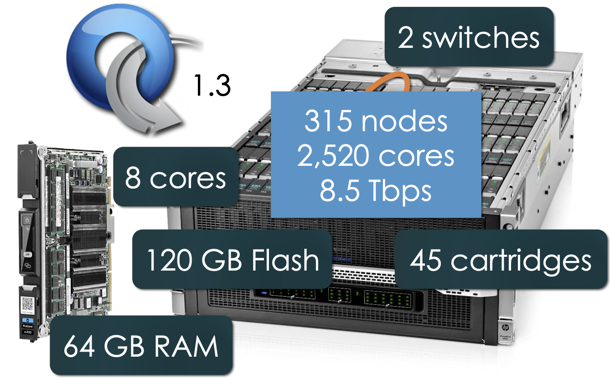

---

# Utah - Suitable for experiments that:

- ... explore power/performance tradeoffs
- ... want instrumentation of power and temperature 
- ... want large numbers of nodes and cores
- ... want to experiment with RDMA via RoCE
- ... need bare-metal control over switches
- ... need OpenFlow 1.3
- ... want tight ARM64 platform integration

---

# Wisconsin/Cisco

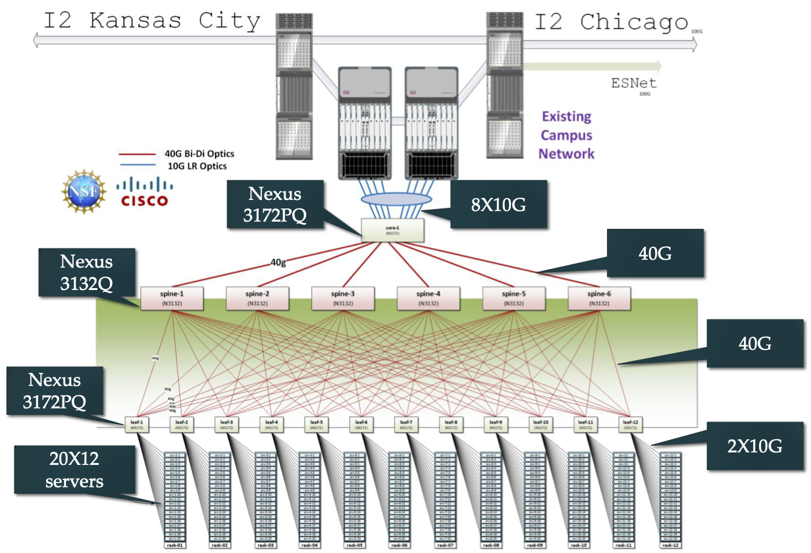

---

# Wisconsin - Compute and storage

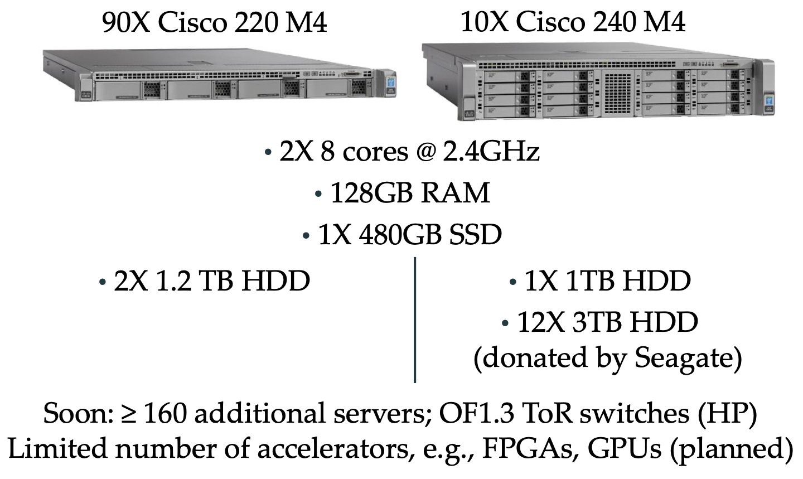

---

# Wisconsin - Suitable for experiments that

- ... need large number of nodes/cores, and bare-metal control over nodes/switches, for sophisticated network/memory/storage research
- ... study network I/O performance, intra-cloud routing (e.g., Conga) and transport (e.g., DCTCP)
- ... study network virtualization (e.g., CloudNaaS)
- ... study in-memory big data frameworks (e.g., Spark/SparkSQL/Tachyon)
- ... explore cloud-scale resource management and scheduling (e.g., Mesos; Tetris)
- ... explore new models for Cloud storage (e.g., tiered; flat storage; IOFlow)
- ... explore new architectures (e.g., RAM Cloud for storage)

---

# Clemson/Dell: High Memory, InfiniBand (IB)

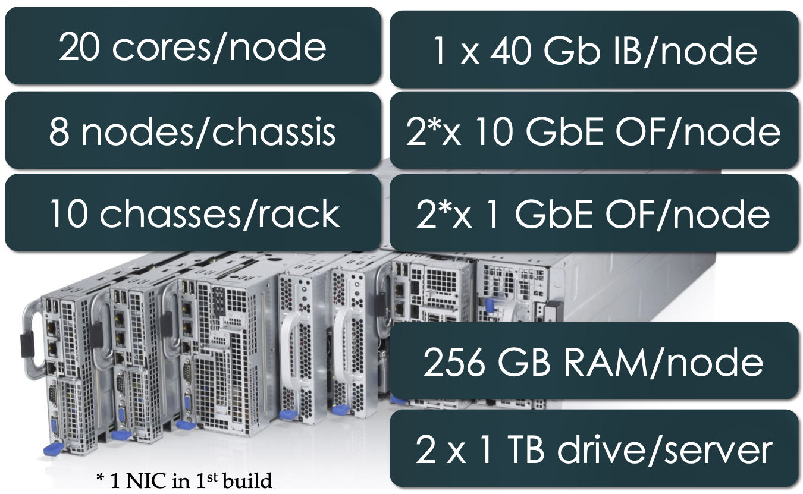

---

# Clemson - Suitable for experiments that:

- need large per-core memory 
   - e.g., High-res media processing
   - e.g. Hadoop
   - e.g., Network Function Virtualization
- ... want to experiment with IB and/or GbE networks 
   - e.g., hybrid HPC with MPI and TCP/IP
- ... need bare-metal control over switches 
- ... need OpenFlow 1.3

--- 

# CloudLab Hands On

--- 

# CloudLab Hands On

- Register an account
- Launch an instance
- Connect via SSH

---

# Registering a Cloudlab account

---

# Registering a Cloudlab account

- Visit https://www.cloudlab.us/signup.php
- You will need to upload an SSH public key

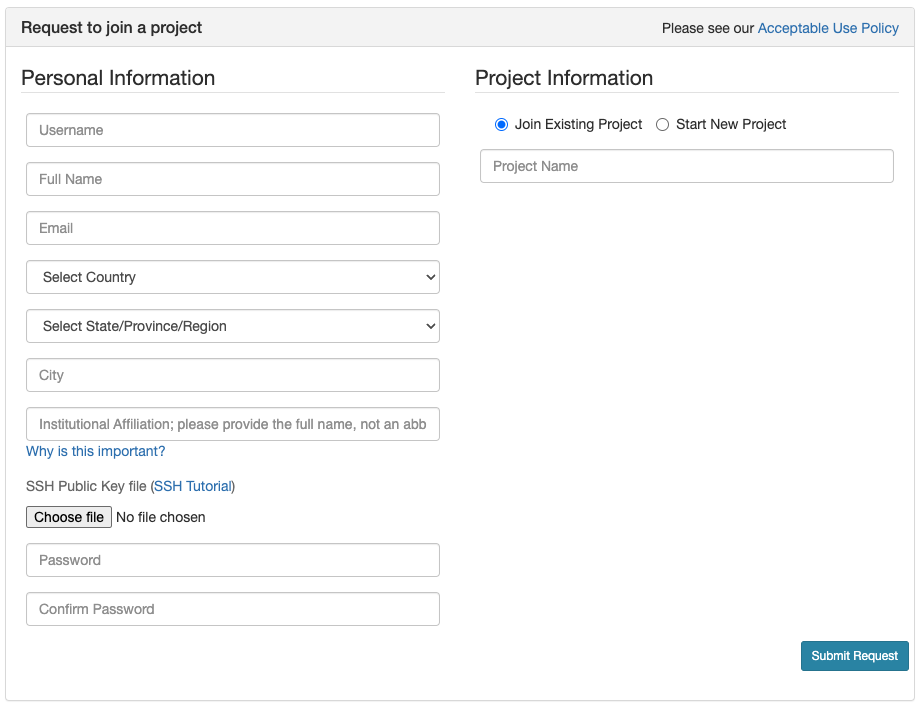

---

# What is SSH

- Secure Shell

- Communication Protocol (like http, https, ftp, etc)

- Do just about anything on the remote computer

- Traffic is encrypted

- Used mostly in the terminal/command line

---

# Clint/Server communication

- SSH is the client 

- SSHD is the server (Open SSH Daemon)

- The server must have sshd installed and running or you will not be able to connect using SSH

  - CloudLab machines are configured with sshd installed

---

# Authentication methods

```bash
$ ssh alice@amd198.utah.cloudlab.us
```

- Password
  - Password stored on server
  - User supplied password compared to stored version

- Public/Private key pair (recommended)
  - Private key kept on client
  - Public key stored on server 
---

# Generating keys

```bash
$ ssh-keygen -t rsa -b 4096
```
- Generated files
   - ~/.ssh/id_rsa   (private key)
   - ~/.ssh/id_rsa.pub (public key)

- Key can be used for multiple servers
   - Private key shall never leave your control
   - Public key goes into server authorized_keys file 

- For security, protect your private key using a hard-to-guess passphrase
   - Passphrase encrypts the private key
   - ssh-agent let us enter the passphrase once and remember the private key

---

# SSH agent

- Remembers your private key(s)

- Lets you enter the passphrase once and remember the private key

- Other applications can ask SSH agent to authenticate you automatically

---

# Working with SSH agents

- Start the SSH agent in the background

   ```bash
   $ eval `ssh-agent`
   ```

- Add the private key

   ```bash
   $ ssh-add ~/.ssh/id_rsa
   ```

- Forward the SSH agent (forwarding allows you to use your local SSH keys)

   ```bash
   $ ssh -A alice@amd198.utah.cloudlab.us
   ```

<!-- When ssh-agent starts up, it doesn’t have any keys in memory; the ssh-add command asks you for the passphrase for a given key, then hands the unlocked key to ssh-agent so it can later hand it out to future ssh sessions.

For reference, SSH supports agent forwarding, where you can ssh to Machine1, logging in with a key provided by your client’s ssh-agent, and ssh from Machine1 to Machine2, and have the ssh-agent request sent back to your original client’s ssh-agent as well.  This allows you to keep the private key only on the local machine, but jump from machine to machine without having to start fresh sessions directly from the client machine. -->

---

# What about Windows 

- Windows 10 now supports native SSH
- PuTTY is used in older versions of Windows
- Git Bash & other terminal programs include the ssh command & other Unix tools

---

# Generating keys: PuTTYgen

<div class="columns">
<div>

- Public key
   - Copy-paste the OpenSSH-compatible public key to a file

- Private key 
   - Click the 'Save private key' button
   - Give the private key file an extension of `.ppk`

</div>

<div class="center">

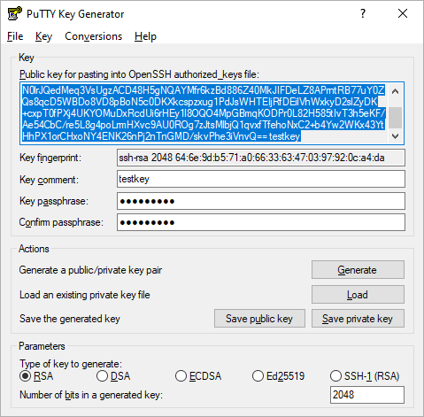

</div>
</div>

---

# Working with SSH agents: Pageant

<div class="columns">
<div>

- Open pageant
   - Pageant starts by default minimized in the system tray

- Click the 'Add Key' button to add the private key

- Check the 'Allow agent forwarding'
   - In PuTTy, under Connection / SSH / Auth

</div>

<div class="center">


</div>
</div>


---


# Adding Public Key to CloudLab

<div class="columns">
<div class="center">


</div>

<div class="center">


</div>
</div>

<div class="columns">
<div class="center">
To a new account
</div>
<div class="center">
To an existing account 
</div>
</div>

<br>

- CloudLab configures server authorized_keys file with public key

---

# Launching a Cloudlab instance 

---

# Launching a CloudLab instance

### “Start Experiment” (the most common)

- Decide your instance type and check its availability
https://www.cloudlab.us/resinfo.php
- Name your experiments with CloudLabLogin-ExperimentName
  - Naming scheme prevents conflicts caused when everyone picks random names 
- The default expiration time is 16 hours.
   - But extensions can be requested.
- Once expired, old data are discarded.
   - Backup data. Write a script to rebuild environment automatically.
   - Or create your own disk image (snapshot).

---

# Launching A Cloudlab Instance 

### “Reserve Nodes”
- For a longer machine time, e.g., one week.
- Most reservations need cloudlab administrator’s approval.

---

# Policies on using CloudLab resources

**Be a good Citizen!**

**Do not leave your CloudLab experiment instantiated unless you are using it!**

**Stick to your own resources and do not access another member's resources.**

---

# Connecting via SSH

---

# Connection Protocols and Software

<div class="columns-three">
<div>

<div class="small center">
Remote Connections: <br>Secure SHell <br>(SSH)
</div>

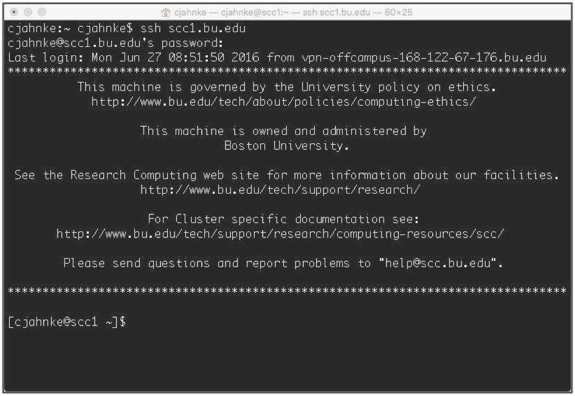

</div>

<div>

<div class="small center">
Remote Graphics: <br>X-Windowing <br>(X, X-Win)
</div>


</div>

<div>

<div class="small center">
Data Transfer: <br>Secure File Transfer Protocol <br>(SFTP)
</div>

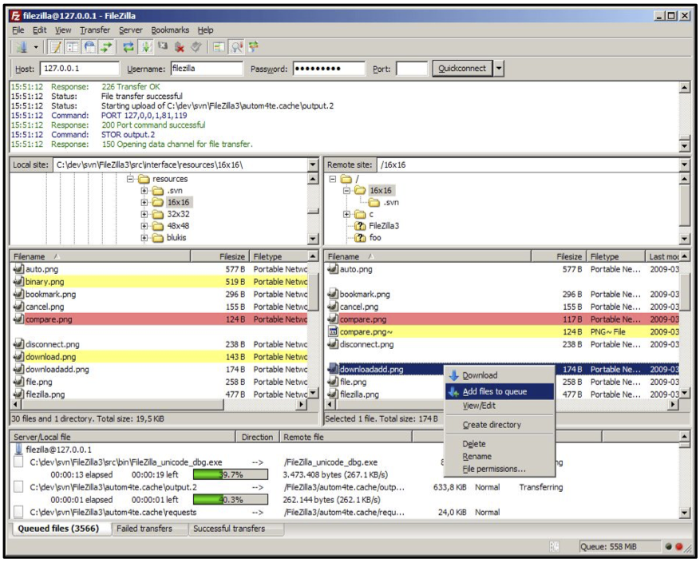

</div>

</div>

---

# Connecting from Different Platforms

<table class="small">
   <thead>
      <tr>
         <th align="center"></th>
         <th align="center">SSH</th>
         <th align="center">X-Win</th>
         <th align="center">SFTP</th>
        </tr>
    </thead>
    <tbody>
        <tr>
            <td align="center" rowspan=3>Microsoft<br> Windows</td>
        </tr>
        <tr>
            <td align="center" colspan=3>MobaXterm<br> <a href="https://mobaxterm.mobatek.net">https://mobaxterm.mobatek.net</a></td>
        </tr>
        <tr>
            <td align="center" colspan=3>PuTTY<br> <a href="https://www.putty.org/">https://www.putty.org/</a></td>
        </tr>
        <tr>
            <td align="center">Apple<br> MacOS</td>
            <td align="center">Terminal<br> (Built in)</td>
            <td align="center">XQuartz<br><a href="https://www.xquartz.org">https://www.xquartz.org</a></td>
            <td align="center">Various<br>(Built in)</td>
        </tr>
        <tr>
            <td align="center">Linux</td>
            <td align="center">Terminal<br>(Built in)</td>
            <td align="center">X11<br>(Built in)</td>
            <td align="center">Various<br>(Built in)</td>
        </tr>
    </tbody>
</table>

---

# Microsoft Windows

You need software that emulates an “X” terminal and that connects using the “SSH” Secure Shell protocol.
- Recommended: PuTTY
   - Download: http://www.putty.org/
- Alternatives:
   - MobaXterm
      http://mobaxterm.mobatek.net/
   - SSH/X-Windows: X-Win32
      https://www.bu.edu/tech/services/support/desktop/distribution/xwindows/
   - SFTP: Filezilla
      https://filezilla-project.org/

---

# Apple macOS

- SSH: Terminal
   - Built in to macOS
     Applications > Utilities > Terminal
- X-Windows: XQuartz
   - Download: https://www.xquartz.org/
   - Note: This install requires a logout.
- SFTP: Your choice
   - Filezilla: https://filezilla-project.org/
   - Cyberduck: https://cyberduck.io
   - Many others

---
# Linux

- SSH: Terminal 
   - Built in to Linux
   Applications > System > Terminal
- X-Windows: X11
   - Built in to Linux
   - Use your package manager.
- SFTP: Your choice
   - Usually has one Built in.
   - Alternate: Filezilla (https://filezilla-project.org/)

---

# Getting SSH command from List View


---

# Connecting via SSH (Linux/MacOS)

To connect via SSH:

```
$ ssh -p 22 alice@amd198.utah.cloudlab.us
```

To enable agent forwarding, add `-A`:

```
$ ssh -p 22 -A alice@amd198.utah.cloudlab.us
```

---

# Connecting via SSH (Windows PuTTY)

Use the `username@hostname` part from the SSH command:

```
alice@amd198.utah.cloudlab.us
```

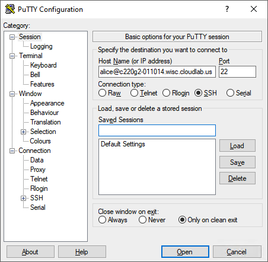

---

# Linux Interaction

## Shell, Prompt, Commands and System Use
 
---

# Linux: The Shell


- Program that *interprets commands* and sends them to the OS
- Provides:
   - Built-in commands
   - Programming control structures
   - Environment variables
- Linux supports multiple shells.
   - The default on CloudLab is Bash
      “Bash” = “Bourne-again Shell”
      (GNU version of ~1977 shell written by Stephen Bourne)

---

# Linux: The “prompt”


<br>
<center> ( In Linux “ ~ ” is a shorthand for your home directory. ) </center>

---

# Linux: Command Basics


- <span style="color:blue">Command: Command/program that does one thing</span>

- <span style="color:green">Options: Change the way a command does that one thing</span>
   - Short form: Single-dash and one letter e.g. ls -a
   - Long form: Double-dash and a word e.g. ls --all

- <span style="color:orange">Argument: Provides the input/output that the command interacts with.</span>

<br>
<center>For more information about any command, use <b>man</b> or <b>info</b> (e.g. “<b>man ls</b>”)</center>

---
#  Commands: Hands-On

After you connect, type

```bash
whoami                           # my login
hostname                         # name of this computer
echo “Hello, world”              # print characters to screen
echo $HOME                       # print environment variable
echo my login is $(whoami)       # replace $(xx) with program output 
date                             # print current time/date
cal                              # print this month’s calendar
shazam                           # bad command
``` 

---

# Commands: Hands-On Options

- Commands have three parts; command, options and arguments/parameters.

- Example: cal –j 3 1999

   ```
   [username@scc1 ~]$ cal -j 3 1999
   ```

   -  `cal` is the command, 
   -  `-j` is an option (or switch)
   -  `3` and `1999` are arguments/parameters.

- What is the nature of the prompt?
- What was the system’s response to the command?

---

# Commands

## "Small programs that do one thing well"

- The Unix Programming Environment, Kernighan and Pike

   ... at its heart is the idea that the power of a system comes more from the <span style="color:green">relationships</span> among programs than from the programs themselves. Many UNIX programs do quite trivial things in isolation, but, combined with other programs, become general and useful tools.
 
---

# Commands: Selected text processing utilities

<div class="footnotesize">
<div class="columns">            
<div> 

|command|description
|:------|:----------
| `wc`  |Line, word and character count
| `awk` | Pattern scanning and processing language
| `cat` | Display file(s)
| `cut` | Extract selected fields of each line of a file
| `diff`| Compare two files
| `grep`| Search text for a pattern
| `head`| Display the first part of files
| `less`| Display files on a page-by-page basis

</div>

<div>

|command|description
|:------|:----------
| `sed` | Stream editor (esp. search and replace)
| `sort` |Sort text files
| `split`|Split files
| `tail` |Display the last part of a file
| `tr`   |Translate/delete characters
| `uniq` |Filter out repeated lines in a file
| `wc`   |Line, word and character count

</div>

---

# Variables and Environment Variables

- *Variables* are named storage locations. 
   - `USER=augustin`
   - `foo="this is foo’s value"`

- *Environment variables* are variables used and shared by the shell
   - For example, `$PATH` tells the system where to find commands.

- Environment variables are **shared with programs** that the shell runs.
 
 ---

# Bash variables

- To create a new variable, use the assignment operator `=` 

   ```
   [username@scc1 ~]$ foo="this is foo’s value"
   ```

- The foo variable can be printed with `echo`
 
   ```
   [username@scc1 ~]$ echo $foo this is foo’s value
   ```

- To make `$foo` visible to programs run by the shell (i.e., make it an “environment variable”), use `export`:

   ```
   [username@scc1 ~]$ export foo
   ```

---

# Environment Variables

To see all currently defined environment variable, use printenv:
 
```  
[username@scc1 ~]$ printenv
HOSTNAME=scc1
TERM=xterm-256color
SHELL=/bin/bash
HISTSIZE=1000
TMPDIR=/scratch
SSH_CLIENT=168.122.9.131 37606 22
SSH_TTY=/dev/pts/191
USER=cjahnke
MAIL=/var/spool/mail/cjahnke 
PATH=/usr3/bustaff/cjahnke/apps/bin:/usr/local/bin:/bin:/usr/bin:/usr/local/sbin:/usr/sbin:/sbin PWD=/usr3/bustaff/cjahnke/linux-materials
LANG=C
MODULEPATH=/share/module/bioinformatics:/share/module/chemistry
SGE_ROOT=/usr/local/ogs-ge2011.11.p1/sge_root
HOME=/usr3/bustaff/cjahnke
```

---

# Command History and Command Line Editing

- Try the `history` command
- Choose from the command history using the up ↑ and down ↓ arrows
- To redo your last command, try `!!`
- To go further back in the command history try `!`, then the number as shown by history (e.g., `!132`). Or, `!ls`, for example, to match the most recent `ls` command.
- What do the left ← and right → arrow do on the command line?
- Try the <b>\<Del></b> and <b>\<Backspace></b> keys

---

#  Help with Commands


- Type
   - `date –-help`
   - `man date`
   - `info date`
- BASH built-ins
   - A little different from other commands
   - Just type the command `help`
   - Or `man bash`
 
