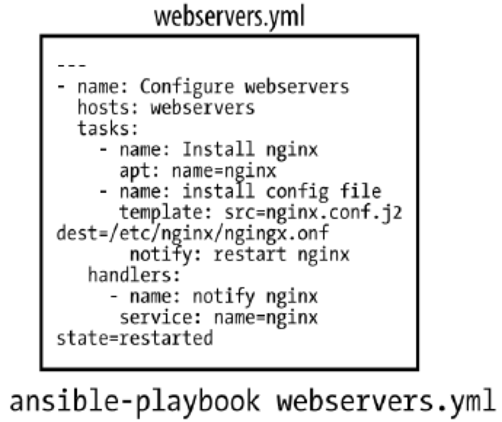
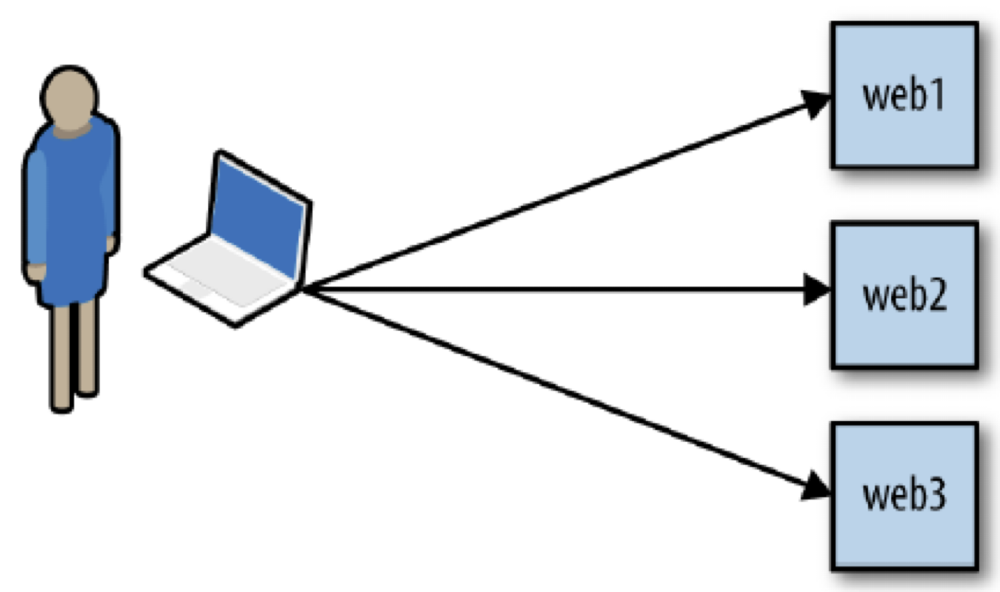
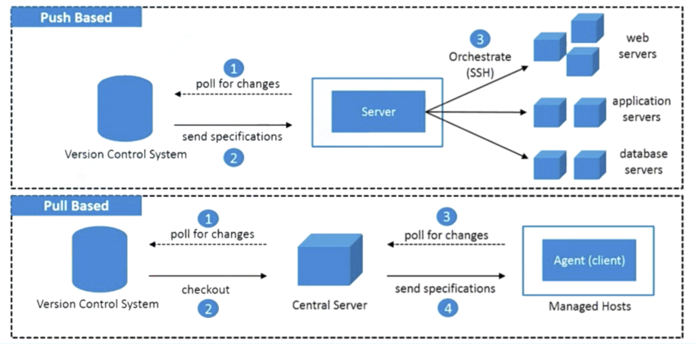

# Essential Tools

- Version control: Git and GitHub
- Configuration management: Ansible
- HTTP Benchmarking: wrk
- Performance monitoring: top, perf
- Text processing: awk
- Plotting: gnuplot

---

# Git and GitHub

---

# Demystifying Git and GitHub

*Git* is the software that allows us to do version control

- Git tracks changes to your source code so that you don’t lose any history of your project

*Github* is an online platform where developers host their source code (and can share it the world)

- You can host remote repositories on https://github.com/
- You edit and work on your content in your local repository on your computer, and then you send your changes to the remote

---

# Why you should use Git

To be kind to yourself

To be kind to your collaborators

To ensure your work is reproducible

## Spillover benefits

👩‍🔬 📐 It imposes a certain discipline to your programming.

🤓 🔥 You can be braver when you code: if your new feature breaks, you can revert back to a version that worked!

---

# Workflow


---

# Working locally

```bash
# create a new directory, and initialize it with git-specific functions
git init my-repo

# change into the `my-repo` directory
cd my-repo

# create the first file in the project
touch README.md

# git isn't aware of the file, stage it
git add README.md

# take a snapshot of the staging area
git commit -m "add README to initial commit"
```

---

# Hosting your source code on GitHub

- Visit https://github.com/new to create a new GitHub repository


---

# Pushing changes to the remote repository

```bash
# set a new remote
git remote add origin git@github.com:YOUR-USERNAME/YOUR-REPOSITORY-NAME.git
# rename your local branch to main
git branch -M main
# push commits made on your local branch to a remote repository
git push -u origin main
```

---

# git pull

Use this to fetch changes from the remote and to merge them in to your local repository

- Your collaborators have been adding some awesome content to the repository, and you want to fetch their changes from the remote and update your local repository

```bash
git pull
```

- What this is doing under-the-hood is running a git fetch and then git merge.

---

# git clone

- Use this to get a copy of an existing Git repository

- To get a copy of the course's repository:

```
git clone https://github.com/ucy-coast/cs499-fa22.git
```

---

# More command line tips

---

# Tell Git who you are

As a first-time set up, you need to tell Git who you are.

```bash
git config --global user.name "Your name"
git config --global user.email "alice@example.com"
```

---

# git status

Use this to check at what stage of the workflow you are at

- You have made some local modifications, but haven't staged your changes yet

```bash
git status
```

```bash
Changes not staged for commit:
  (use "git add <file>..." to update what will be committed)
  (use "git checkout -- <file>..." to discard changes in working directory)
         modified:   penguins.R
no changes added to commit (use "git add" and/or "git commit -a")
```

---

# Adding files

To stage specific files in your repository, you can name them directly

```bash
git add penguins.R other-penguins.R
```

or you can add all of them at once

```bash
git add .
```

---

# Ignoring files

You might want to not track certain files in your local repository, e.g., sensitive files such as credentials. But it might get tedious to type out each file that you do want to include by name.

Use a `.gitignore` file to specify files to always ignore.

Create a file called `.gitignore` and place it in your repo. The content of the file should include the names of the files that you want Git to not track.

---

# git log

Use this to look at the history of your repository.

Each commit has a specific hash that identifies it.

```
git log
commit af58f79bfa4301643025dd6c8767e65349cf407a
Author: Name <Email address>
Date:   DD-MM-YYYY
    Add penguin script
```

You can also find this on GitHub, by going to github.com/user-name/repo-name/commits.

You can go back in time to a specific commit, if you know its reference.

---

# Undoing mistakes

Imagine you did some work, committed the changes, and pushed them to the remote repo. But you'd like to undo those changes.

Running git revert is a "soft undo".

Say you added some plain text by mistake to penguins.R. Running git revert will do the opposite of what you just did (i.e., remove the plain text) and create a new commit. You can then git push this to the remote.

```bash
git revert <hash-of-the-commit-you-want-to-undo>
git push
```

---
# Undoing mistakes

`git revert` is the safest option to use.

It will preserve the history of your commits.

```bash
git log
commit 6634a076212fb7bac16f9525feae1e83e0f200ca
Author: Name <Email address>
Date:   DD-MM-YYYY
     Revert "Add plain text to code by mistake"
     This reverts commit a8cf7c2592273ef6a28920222a92847794275868.
commit a8cf7c2592273ef6a28920222a92847794275868
Author: Name <Email address>
Date:   DD-MM-YYYY
    Add plain text to code by mistake
```

---

# Ansible 

---

# What is the problem?

- Configuration management 
  - CM == Writing some kind of system state description + 
    Using a tool to enforce that the servers are in that state
  - CLI is vendor dependent
- Ansible exposes a domain-specific language (DSL) that you use to describe the state of your servers
- Can also be used for Deployment and Orchestration

---

# What is Ansible?

- IT automation, configuration management and provision tool
- It uses playbooks to 
   - deploy, manage, build, test and configure 
   - anything from full server environments to website to custom compiled source code for application
   - a text file by YAML
      - Human readable

---

# How does it work?

<div class="columns">

<div>


  
</div>

<div>



</div>

</div>

---

# Architecture


---

# Push based vs. Pull based

- Tool like Puppet and Chef are pull based
   - Agents on the server periodically checks for the configuration information from central server (Master)
- Ansible is push based
   - Central server pushes the configuration information on target servers
   - You control when the changes are made on the servers
   - Ansible has official support for pull  mode, using a tool  it ships with called ansible-pull

---

# Push based vs. Pull based (cont'd)



---

# Host inventory

- Ansible can manage only the servers it explicitly knows about
- Information about devices is provided by specifying them in an inventory file
- Each server needs a name that Ansible will use to identify it. You can use the hostname of the server.
- Pass additional arguments to tell Ansible how to connect to it
- Default location is /etc/ansible/hosts

---

# Inventory example

```ini
[webservers]
node1
```

---

# Modules

- Modules (also referred as task plugins or library plugins) are the ones which actually get executed inside playbook
- These are scripts that come packaged with Ansible and preform some kind of action on a host
- Example:
   - `apt`: Installs or removes packages using the apt package manager
   - `copy`: Copies a file from local machine to the hosts
   - `file`: Sets the attribute of a file, symlink, or directory
   - `service`: Starts, stops, or restarts a service

---

# YAML basics

- Start of file: `---`
- Comments: `#`
- List: `- <item>` or `[<item>, <item>]`
- Dictionary/Mapping: `<label>:<value>` or `{<label>:<value>}`
- Line Folding: `>`

---

# YAML example

```yaml
---
# This is a description by YAML
name: Alice
family: NA
Address: Wonderland, >
               Antipodes
ID:1111
Courses:
  - course_name: abc
    course_id: 123
  - course_name: xyz
    course_id: 456
```

---

# Ansible playbook

- Ansible’s configuration, deployment, and orchestration language 
- Written in YAML, declaratively define your configuration
- A playbook describes which hosts (what Ansible calls remote servers) to configure, and an ordered list of tasks to perform on those hosts.
- Command to run the playbook:

   ```
   ansible-playbook file.yml
   ```

---

# Playbook simple example

--- 

```
- name: a test playbook
  hosts: webservers
  tasks:
      - name: check connectivity
        ping:
      - name: just a touch
        command: touch /tmp/123.txt
```

---

# How does it work (in details)?

<div class="columns">

<div>

Ansible will do the following:
1. Generate a Python script that installs Nginx package
2. Copy the script to web1, web2, and web3
3. Execute the script on web1, web2, and web3
4. Wait for the script to complete execution on all hosts

  
</div>

<div>


</div>

</div>

---

# Notes on running playbook 

- Ansible runs each task in parallel across all hosts
- Ansible waits until all hosts have completed a task before moving to the next task
- Ansible runs the tasks in the order that you specify them

---

# Handlers
- Handlers usually run after all of the tasks
- Handlers are triggered by `notify` command
- They run only once, even if they are notified multiple times. 
- If a play contains multiple handlers, the handlers always run in the order that they are defined in the handlers section, not the notification order.
- The official Ansible docs mention that the only common uses for handlers are for restarting services and for reboots

---

# Handler simple example

```yaml
--- 
- name: a test playbook
  hosts: test1
  handlers:
      - name: record new
        command: touch /tmp/new.txt
  tasks:
      - name: check connectivity
        ping:
      - name: just a touch
        command: touch /tmp/123.txt
        notify: record new
```

---

# Variables

- The simplest way to define variables is to put a `vars` section in your playbook with the names and values of variables
- `{{ variable_name }}` is substituted by its value
- To set the value of a variable based on the result of a task, we create a *registered variable* using the register clause when invoking a module.
   - The value of variable is the *dictionary*, we can access its fields

---

# Variables simple example

```yaml
--- 
- name: a test playbook
  hosts: test1
  vars:
      target_file: /tmp/123.txt
      new_file: /tmp/new.txt
  handlers:
      - name: save time
        shell: echo {{ date_var.stdout }} > {{ new_file }}
      - name: get time
        command: date
        register: date_var
        notify: save time
  tasks:
      - name: just a touch
        command: touch {{ target_file }}
        notify: get time
```

---
# Facts

- When Ansible gathers facts, it connects to the host and queries it for all kinds of details about the host
   - CPU architecture
   - operating system
   - IP addresses
   - memory info
   - ...
- This information is stored in variables that are called *facts*, and they behave just like any other variable.

---

# Facts simple example

```yaml
--- 
- name: Test Facts
  hosts: test1
  gather_facts: True
  tasks:
      - debug: var=ansible_distribution
      - debug: var=ansible_architecture
      - debug: var=ansible_bios_date
      - debug: var=ansible_devices
```

---

# Ansible features

- Easy-to-Read Syntax: built on top of YAML
- Agentless: no need for agent installation and management
- Built on top of Python and hence provides a lot of Python’s functionality
- Uses SSH for secure connections
- Follows Push based architecture for sending configurations
- Very easy and fast to setup, minimal requirements
- Built-in Modules
   - Ansible modules are *declarative*; you use them to describe the state you want the server to be in.
   - Modules are also *idempotent*. It means that it’s safe to run an Ansible playbook multiple times against a server

---

# Demo: Configure webserver with nginx

<div class="columns">

<div>

- Open a remote SSH terminal session to `node0`

- Create inventory file `hosts`

   ```
   [webservers]
   node1
   ```
- Create playbook file `nginx.yml`

- Run playbook

   ```
   ansible-playbook -i ./hosts nginx.yml
   ```
  
</div>

<div>

```
---
- name: Configure webserver with nginx
  hosts: webservers
  vars:
    web_root: "{{ ansible_env.HOME }}/static-site"
  tasks:
    - name: install nginx
      apt: 
        name: nginx 
        update_cache: yes
      become: yes
    
    - name: copy the nginx config file
      template:
        src: static_site.cfg.j2
        dest: /etc/nginx/sites-available/static_site.cfg
      become: yes
    
    - name: create symlink
      file:
        src: /etc/nginx/sites-available/static_site.cfg
        dest: /etc/nginx/sites-enabled/default
        state: link
      become: yes

    - name: ensure {{ web_root }} dir exists
      file:
        path: "{{ web_root }}"
        state: directory

    - name: copy index.html
      copy: 
        src: index.html
        dest: "{{ web_root }}/index.html"

    - name: restart nginx
      service: 
        name: nginx 
        state: restarted
      become: yes
```

</div>

</div>

---
# Demo: Configure webserver with nginx (cont'd)

- Visit `http://node1/index.html`

- Web page should look like this:

   ```
   nginx, configured by Ansible
   If you can see this, Ansible successfully installed nginx.
   ```

---

# HTTP Benchmarking with `wrk`

---

# `wrk`

- Modern HTTP benchmarking tool

- Measures the latency of your HTTP services at high loads

---

# Building `wrk` from source

```
git clone https://github.com/wg/wrk.git
cd wrk
make -j
```

Note: Use `-j` for parallel build

---

# Benchmarking nginx

<div class="columns">

<div>


  
</div>

<div>

- Benchmarking machine running `wrk`: `node0`

- Application machine running `nginx`: `node1`

</div>

</div>

---

# Run a simple benchmark test

<div class="columns">

<div>

```
wrk -t2 -c5 -d5s --timeout 2s http://node1/
```

Which means:

- `-t2`: Use two separate threads
- `-c5`: Open six connections (the first client is zero)
- `-d5s`: Run the test for five seconds
- `--timeout 2s`: Define a two-second timeout
- `--latency`: Print latency statistics  
- `http://node1/`: The target application is listening on `node1`
- Benchmark the `/` path of our application
  
</div>

<div>


</div>

</div>

---

# Sample output

```
Running 5s test @ http://node1/
  2 threads and 5 connections
  Thread Stats   Avg      Stdev     Max   +/- Stdev
    Latency   193.80us   54.14us   3.30ms   86.37%
    Req/Sec     9.91k   425.67    10.86k    72.55%
  Latency Distribution
     50%  175.00us
     75%  214.00us
     90%  257.00us
     99%  351.00us
  100509 requests in 5.10s, 43.03MB read
Requests/sec:  19707.66
Transfer/sec:      8.44MB
```

---

# Performance Monitoring

---

# Performance monitoring

- Localizing performance hotspots 
- Profiling: gathering statistics on how the code executes 
- Can be done in two ways: 
   - Software: low precision 
   - Hardware: uses specialized counters on the CPU 
- Hardware method is more efficient and precise 
- Also gives us access to data we can’t record 
otherwise 

---

# Simple monitoring with `top`

- Realtime monitoring of:
   - CPU and memory utilization for each process  
   - Total CPU utilization – average and per core
   - Total Memory utilization (used and free)

- Useful command switches:
   - top –d 1 #set the update interval to 1 second //the default is 3  seconds
   - top –b	#run in	batch mode, top will run until killed, useful for  saving top output in a file
   - top –H # instruct top to show individual threads
   - top –u username # show processes of a specific user only

---

# Run `top` on `node1` while running `wrk` on `node0`

Sample output:

```
top - 06:38:14 up  6:38,  1 user,  load average: 0.35, 0.08, 0.03
Tasks: 474 total,   3 running, 258 sleeping,   0 stopped,   0 zombie
%Cpu(s):  1.7 us,  2.7 sy,  0.0 ni, 94.7 id,  0.0 wa,  0.0 hi,  0.9 si,  0.0 st
KiB Mem : 19670142+total, 19372916+free,   969588 used,  2002672 buff/cache
KiB Swap:  3145724 total,  3145724 free,        0 used. 19447926+avail Mem 

  PID USER      PR  NI    VIRT    RES    SHR S  %CPU %MEM     TIME+ COMMAND   
 6789 www-data  20   0  143800   7124   5296 R  91.7  0.0   0:54.95 nginx    
 6791 www-data  20   0  143800   7072   5248 S  73.9  0.0   0:44.65 nginx    
 6794 www-data  20   0  143800   7072   5248 R  20.8  0.0   0:13.66 nginx    
 6793 www-data  20   0  143800   6452   4732 S   1.3  0.0   0:00.55 nginx    
 2545 root      20   0 3564444  53976  29628 S   1.0  0.0   2:49.56 containerd
 7930 alice     20   0   42240   4224   3120 R   1.0  0.0   0:00.20 top      
    9 root      20   0       0      0      0 I   0.3  0.0   0:00.99 rcu_sched   
 7880 alice     20   0  107992   3756   2744 S   0.3  0.0   0:00.07 sshd     
    1 root      20   0   77832   8884   6528 S   0.0  0.0   0:07.77 systemd     
    2 root      20   0       0      0      0 S   0.0  0.0   0:00.01 kthreadd    
    4 root       0 -20       0      0      0 I   0.0  0.0   0:00.00 kworker/0:0H
    7 root       0 -20       0      0      0 I   0.0  0.0   0:00.00 mm_percpu_wq
    8 root      20   0       0      0      0 S   0.0  0.0   0:00.00 ksoftirqd/0         
```

---

# `top` useful keys in interactive mode

- Press 1 to view per core utilization
- Press Shift+p to sort process from higher CPU utilization to lower
- Press u to view specific user

---

# Perf: More than a profiler

- `perf` : interface to hardware and software events 
- Built in the kernel 
   - With user space utilities for control and reports 
- One command: `perf` 
   - Many subcommands, very git-like 
   - No daemons 
- Requires debugging symbols to be installed  
   - kernel-debuginfo or vmlinux for kernel 
   - Applications compiled with -g 
- Focuses on hardware performance counters but also other events: 
   - Tracepoints 
   - Software counters 
   - Hardware breakpoints 

---

# Perf security

- Perf commands restricted to root by default 
- Security checks can be disabled with 

   ```
   echo 0 > / proc / sys / kernel / perf_event_paranoid 
   ```

- Can be made persistent via sysctl 
- Proper write access to current directory still required 
- Paranoid mode recommended for production environments

---

# Listing perf events: `perf list`

- Lists all events supported by the current architecture
- Any event names in first column can be used
- Hardware events use the PMU (Performance Monitoring Unit)
   - Low overhead
- Software events are triggered by the kernel
- Tracepoints : similar to software events and refer to specific functions
- Many hardware events missing
   - Can be set as a raw event
   - Documented by CPU manufacturers

---

# System overview: `perf stat`

- Provides a standard set of statistics after invoking a command
- Events include:
   - Task-clock ticks
   - Context switches
   - CPU migrations
   - Page faults
   - CPU cycles
   - Stalled cycles
   - Instructions
   - Branches and branch misses
- Uses round-robin to support multiple events
   - Subject to wild extrapolations
   - Can lack precision with short workloads

---

# Recording performance data: `perf record`

- Reads performance data and generates a file in the current directory:
   - `perf.data`
   - Make sure the current directory is writable!
- Can generate a large dataset if profiling the whole system
   - Or if recording with call-graphs (-g)
- Which is event is recorded can be specified with -e:

   ```
   perf record -e instructions sleep 5
   perf record -e LLC-loads ls
   ```

---

# Text Processing with AWK

---

# AWK

- Scripting Language
- Used for pattern scanning and processing

- AWK is actually *A*ho *W*einberger and *K*ernighan ;)

---

# AWK versions

- `awk`: Original Bell Labs awk (Version 7 UNIX, around 1978) + latest POSIX awk
- `nawk`: New awk (released with SVR4 around 1989)
- `gawk`: GNU implementation of awk standard
- `mawk`: Michael’s awk
- ... and the list goes on.

All these are basically same except for some minor differences in features provided

This presentation will assume GNU AWK also called `gawk`

---

# AWK program structure

An awk program is a sequence of statements of the form:

```awk
pattern { action }
pattern { action }
...
```

Awk 

- Scans a file line by line 
- Splits each input line into fields 
- Compares input line/fields to pattern 
- Performs action(s) on matched lines 

---

# Default behavior of Awk

By default Awk prints every line of data from the specified file


```
$ gawk '{print}' employee.txt
```

<div class="columns">

<div>

Input: 

```
ajay manager account 45000
sunil clerk account 25000
varun manager sales 50000
amit manager account 47000
tarun peon sales 15000
deepak clerk sales 23000
sunil peon sales 13000
satvik director purchase 80000 
```
  
</div>

<div>

Output:  

```
ajay manager account 45000
sunil clerk account 25000
varun manager sales 50000
amit manager account 47000
tarun peon sales 15000
deepak clerk sales 23000
sunil peon sales 13000
satvik director purchase 80000 
```

</div>

</div>

---

# Print the lines which match the given pattern

```
$ gawk '/manager/ {print}' employee.txt 
```

<div class="columns">

<div>

Input: 

```
ajay manager account 45000
sunil clerk account 25000
varun manager sales 50000
amit manager account 47000
tarun peon sales 15000
deepak clerk sales 23000
sunil peon sales 13000
satvik director purchase 80000 
```
  
</div>

<div>

Output:  

```
ajay manager account 45000
varun manager sales 50000
amit manager account 47000 
```

</div>

</div>

---

# Split a line into fields

```
$ gawk '{print $1,$4}' employee.txt 
```

<div class="columns">

<div>

Input: 

```
ajay manager account 45000
sunil clerk account 25000
varun manager sales 50000
amit manager account 47000
tarun peon sales 15000
deepak clerk sales 23000
sunil peon sales 13000
satvik director purchase 80000 
```
  
</div>

<div>

Output:  

```
ajay 45000
sunil 25000
varun 50000
amit 47000
tarun 15000
deepak 23000
sunil 13000
satvik 80000 
```

</div>

</div>

---

# Processing `wrk` output using `gawk`

```
BEGIN {
	print "Percentile (%)", "Latency (us)"

	lat2us["us"] = 1
	lat2us["ms"] = 1000
	lat2us["s"] = 10000000
}

/^[[:space:]]+[0-9]+\.?[0-9]*\%/ {
	match ($1, /([0-9]+)\%/, perc)
	match ($2, /([0-9]+\.[0-9]*)([a-z]+)/, lat)
	lat_val = lat[1]
	lat_unit = lat[2]
	print perc[1],  lat_val*lat2us[lat_unit]
}
```

---

# Processing `wrk` output using `gawk` (cont'd)

Run the script on the `wrk` output:

```
wrk -t2 -c5 -d5s --timeout 2s http://node1/ | gawk -f wrk_latency.awk
```

Sample output:

```
Percentile (%) Latency (us)
50 175
75 214
90 257
99 351
```

---

# Plotting with `gnuplot`

---

```
gnuplot -p -e "set terminal dumb size 120, 30; set autoscale; plot '-' using 1:2 with lines notitle"
```

```
360 +--------------------------------------------------------------------+   
    |      +      +      +      +      +     +      +      +      +     *|   
340 |-+                                                               **-|   
    |                                                                *   |   
320 |-+                                                            **  +-|   
    |                                                             *      |   
300 |-+                                                          *     +-|   
    |                                                          **        |   
280 |-+                                                       *        +-|   
    |                                                       **           |   
260 |-+                                                  ***           +-|   
    |                                                ****                |   
240 |-+                                          ****                  +-|   
    |                                        ****                        |   
220 |-+                                  ****                          +-|   
    |                             *******                                |   
200 |-+               ************                                     +-|   
    |     ************                                                   |   
180 |*****                                                             +-|   
    |      +      +      +      +      +     +      +      +      +      |   
160 +--------------------------------------------------------------------+   
    50     55     60     65     70     75    80     85     90     95    100  
```