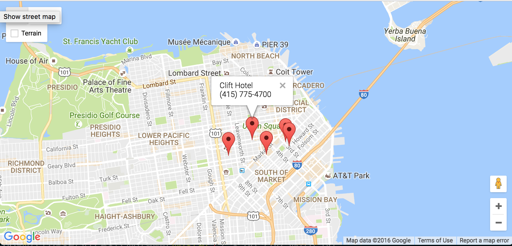

# Lab: Getting Started with Go Web Apps

In this lab tutorial, you'll get a brief introduction to building and deploying web applications with Go.

## Hotel Map

During the course of the labs, you will develop, deploy, and evaluate a Hotel Map application built with Go. The application plots hotel locations on a Google map:

<figure>
  <p align="center"></p>
  <figcaption><p align="center">Figure. Hotel Map application web page</p></figcaption>
</figure>

In this lab, you will start to develop the application following a monolithic architecture. In the following labs, you will gradually refactor the application towards a microservices architecture.

### Monolithic architecture 

Monolithic architecture is the standard way to start application development because it is more straightforward. A monolith application is developed and deployed as a single binary called a monolith that contains all the needed parts.

Typical monolithic applications consist of three layers or tiers: 
- **Frontend tier**: The frontend tier is the user interface and communication layer of the application, where the end user interacts with the application.
- **Business logic tier**: The business logic tier is the heart of the application. It controls the application’s core functionality and performs detailed processing. 
- **Caching and Database tier**: The caching and database tier is where the information processed by the application is stored and managed. 

In monolithic Hotel Map, the application is built as a single deployable binary that comprises different components logically organized into a three-tier architecture as follows.

**Frontend tier**: The frontend tier comprises a single `Frontend` component that exposes an HTTP server to serve the website. 

**Business logic tier**: The application functionality is split into the following components:
- `Search`: Finds nearby hotels available during given time periods.
- `Geo`: Provides all hotels within a given distance.
- `Profile`: Returns the profile for a given hotel.
- `Rate`: Returns rates for hotels available during given time periods.

**Caching and Database tier**. Each component stores its data in memory. In reality, each of the components would store its data in a persistent datastore service, such as [MongoDB](https://www.mongodb.com/), or could even choose its own specialty datastore. The Geo component for example could use [PostGis](https://postgis.net/) or any other database specializing in geospacial queries. In a following lab, you will extend the application to use the Memcached and MonboDB datastore services. 

The diagram below shows the monolithic architecture of Hotel Map, where the different components are tightly coupled with each other in a single deployable binary.

<figure>
  <p align="center"></p>
  <figcaption><p align="center">Figure. Hotel Map monolithic architecture.  </p></figcaption>
</figure>

The diagram below shows the above components logically organized into three tiers. The diagram shows the interactions between the different components, with the dotted arrows showing local function calls between components.

<figure>
  <p align="center"></p>
  <figcaption><p align="center">Figure. Hotel Map monolithic architecture logically organized into three tiers.  </p></figcaption>
</figure>


### Microservices architecture

Microservices are small services that comply with the single responsibility principle (SRP), and they can therefore be scaled and deployed independently. Each service is focused only on one functionality. 

The diagram below shows the microservices architecture of Hotel Map, where each each component runs as a separate microservice. The diagram shows the different microservices logically organized into a three-tier architecture. The diagram also shows the interactions between the different microservices, with the solid arrows showing network communication between microservices.

<figure>
  <p align="center"></p>
  <figcaption><p align="center">Figure. Hotel Map microservices architecture logically organized into three tiers.</p></figcaption>
</figure>

## Introducing the net/http Package

Go is fantastic for building web applications of all shapes and sizes. This is partly due to the fantastic work that has been put into making the standard library clean, consistent, and easy to use.

Perhaps one of the most important packages for any budding Go web developer is the `net/http` package. This package allows you to build HTTP servers in Go with its powerful compositional constructs. Before we start coding, let's do an extremely quick overview of HTTP.

### HTTP Basics

When we talk about building web applications, we usually mean that we are building HTTP servers. HTTP is a protocol that was originally designed to transport HTML documents from a server to a client web browser. Today, HTTP is used to transport a whole lot more than HTML.

<figure>
  <p align="center"></p>
  <figcaption><p align="center">Figure. HTTP request/response</p></figcaption>
</figure>

The important thing to notice in this diagram is the two points of interaction between the *Server* and the *Browser*. The Browser makes an HTTP request with some information, the Server then processes that request and returns a Response.

This pattern of request-response is one of the key focal points in building web applications in Go. In fact, the `net/http` package's most important piece is the `http.Handler` Interface.

### The http.Handler Interface

As you become more familiar with Go, you will notice how much of an impact interfaces make in the design of your programs. The `net/http` interface encapsulates the request-response pattern in one method:

```
type Handler interface {
    ServeHTTP(ResponseWriter, *Request)
}
```

Implementors of this interface are expected to inspect and process data coming from the `http.Request` object and write out a response to the `http.ResponseWriter` object.

The `http.ResponseWriter` interface looks like this:

```
type ResponseWriter interface {
    Header() Header
    Write([]byte) (int, error)
    WriteHeader(int)
}
```

### Composing Web Services

Because much of the `net/http` package is built off of well defined interface types, we can (and are expected to) build our web applications with composition in mind. Each `http.Handler` implementation can be thought of as its own web server.


### Hello world HTTP server example

Here's a full working example of a simple web server:

Create a `hello.go` with our typical go boilerplate and add the following code:

```
package main

import (
    "fmt"
    "log"
    "net/http"
)

func main() {
    http.HandleFunc("/", handler)
    log.Fatal(http.ListenAndServe(":8080", nil))
}

func handler(w http.ResponseWriter, r *http.Request) {
    fmt.Fprintf(w, "Hello, %s!", r.URL.Path[1:])
}
```

The main function begins with a call to `http.HandleFunc`, which tells the http package to handle all requests to the web root (`"/"`) with handler.

It then calls `http.ListenAndServe`, specifying that it should listen on port 8080 on any interface (`":8080"`). (Don't worry about its second parameter, nil, for now.) This function will block until the program is terminated.

`ListenAndServe` always returns an error, since it only returns when an unexpected error occurs. In order to log that error we wrap the function call with log.Fatal.

The function handler is of the type `http.HandlerFunc`. It takes an `http.ResponseWriter` and an `http.Request` as its arguments.

An `http.ResponseWriter` value assembles the HTTP server's response; by writing to it, we send data to the HTTP client.

An `http.Request` is a data structure that represents the client HTTP request. r.URL.Path is the path component of the request URL. The trailing `[1:]` means "create a sub-slice of Path from the 1st character to the end." This drops the leading "/" from the path name.

Let's build and run our hello web program:

```
go build
./hello
```

If you visit the URL:

```
http://localhost:8080/world
```

the program would present a page containing:

```
Hello, world!
```

## Creating the Hotel Map Web App

Now that we are done going over the basics of HTTP, let's create the Hotel Map web application in Go. We already provide you with a partial implementation, which you will complete over the course of this tutorial.

Please go ahead and clone the hotel app repository locally like so:

```
$ git clone git@github.com:ucy-coast/hotel-app.git
$ cd hotel-app
```

The application directory structure follows the [Standard Go Project Layout](https://github.com/golang-standards/project-layout). It's not an official standard defined by the core Go dev team; however, it is a set of common historical and emerging project layout patterns in the Go ecosystem. 
- `/cmd`: Contains the main application for this project. The directory name for each application matches the name of the executable we want to have. In our case, the directory name is `mono` (for monolith).
- `/internal`: Contains the private application and library code. This is the code you don't want others importing in their applications or libraries. In our case, the directory contains the code of the five components. 
- `/pkg`: Contains library code that's ok to use by external applications
- `/test`: Contains additional external test apps and test data. In our case, the directory contains the hotep map data.
- `/tools`: Contains supporting tools for the project. 

### HTML Form

For starters, we will need a basic HTML form for plotting the hotel locations on a Google Map. 

Put this HTML into a file named `index.html` in the "public" folder of our application: ```internal/frontend/static/index.html```

```html
<!DOCTYPE html>
<html dir="ltr">
<head>
    <meta charset="utf-8">
    <title>Go Microservices Example</title>
    <link rel="stylesheet" href="/stylesheets/main.css">
</head>
<body>
    <div id="map"></div>
    <script>
        var points = {};
        points['San Francisco'] = [37.7879, -122.4075]
        points['Los Angeles'] = [37.7879, -122.4075]

        function initMap() {
            var infowindow = new google.maps.InfoWindow();

            var map = new google.maps.Map(document.getElementById('map'), {
                zoom: 13,
                center: new google.maps.LatLng(
                    points['San Francisco'][0], 
                    points['San Francisco'][1]
                )
            });

            google.maps.event.addListener(map, 'click', function () {
                infowindow.close();
            });

            map.data.addListener('click', function (event) {
                infowindow.setContent(event.feature.getProperty('name') + "<br>" + event.feature.getProperty('phone_number'));
                infowindow.setPosition(event.latLng);
                infowindow.setOptions({ pixelOffset: new google.maps.Size(0, -34) });
                infowindow.open(map);
            });

            map.data.loadGeoJson('/hotels?inDate=2015-04-09&outDate=2015-04-10');

        }
    </script>
    <script type="text/javascript" src="http://maps.google.com/maps/api/js?sensor=false&callback=initMap" async defer></script>
</body>
</html>
```

This HTML document uses the Google Maps JavaScript API to display a map centered on San Francisco, CA and plot on that map available hotels. The HTML constructs a `Map` object and uses the `loadGeoJSON()` method, which takes a URL to a GeoJSON file, to load geospatial data into the map data layer.
GeoJSON is a common standard for sharing geospatial data on the internet.
The URL points to the `/hotel` API method of the Hotel Map service, which returns a GeoJSON document that encodes the locations of available hotels in a given time period.
https://developers.google.com/maps/documentation/javascript/datalayer

### The "/hotels" route

You will now implement the code to handle the `/hotels` route and serve the public index.html file.

In services/frontend/frontend.go, fill in the `Run` function so that it looks like the following:

```
func (s *Frontend) Run(port int) error {
	http.Handle("/", http.FileServer(http.Dir("services/frontend/static")))
	http.Handle("/hotels", http.HandlerFunc(s.searchHandler))
	return http.ListenAndServe(fmt.Sprintf(":%d", port), nil)
}
```

This code is very similar to the simple hello world web server you implemented above. In this code, we are using the `http.Handle` method to define some simple routing for our application. It is important to note that calling `http.Handle` on the "/" pattern will act as a catch-all route, so we define that route last. 
The `http.FileServer` function builds an `http.Handler` that will serve an entire directory of files and figure out which file to serve based on the request path. We told the FileServer to serve the application "public" folder specifying the path relative to the current working directory with `http.Dir("services/frontend/static")`.
Finally, it calls `http.ListenAndServe` to start the server, specifying that the server should listen on a given `port`.

Next, you will implement the searchHandler. In internal/frontend/frontend.go, fill in the `searchHandler` function so that it looks like the following:

```go
func (s *Frontend) searchHandler(w http.ResponseWriter, r *http.Request) {
	w.Header().Set("Access-Control-Allow-Origin", "*")

	// in/out dates from query params
	inDate, outDate := r.URL.Query().Get("inDate"), r.URL.Query().Get("outDate")
	if inDate == "" || outDate == "" {
		http.Error(w, "Please specify inDate/outDate params", http.StatusBadRequest)
		return
	}

	// lan/lon from query params
	sLat, sLon := r.URL.Query().Get("lat"), r.URL.Query().Get("lon")
	if sLat == "" || sLon == "" {
		http.Error(w, "Please specify location params", http.StatusBadRequest)
		return
	}

	Lat, _ := strconv.ParseFloat(sLat, 32)
	lat := float32(Lat)
	Lon, _ := strconv.ParseFloat(sLon, 32)
	lon := float32(Lon)

	log.Infof("searchHandler [lat: %v, lon: %v, inDate: %v, outDate: %v]", lat, lon, inDate, outDate)
	// search for best hotels
	searchResp, err := s.search.Nearby(&search.NearbyRequest{
		Lat:     lat,
		Lon:     lon,
		InDate:  inDate,
		OutDate: outDate,
	})
	if err != nil {
		http.Error(w, err.Error(), http.StatusInternalServerError)
		return
	}

	// grab locale from query params or default to en
	locale := r.URL.Query().Get("locale")
	if locale == "" {
		locale = "en"
	}

	// hotel profiles
	profileResp, err := s.profile.GetProfiles(&profile.Request{
		HotelIds: searchResp.HotelIds,
		Locale:   locale,
	})
	if err != nil {
		log.Error("SearchHandler GetProfiles failed")
		http.Error(w, err.Error(), http.StatusInternalServerError)
		return
	}

	json.NewEncoder(w).Encode(geoJSONResponse(profileResp.Hotels))
}
```

Let's break it down into smaller pieces to get a better idea of what is going on.

The `searchHandler` function handler implements the standard `http.HandlerFunc` interface. It takes an `http.ResponseWriter` and an `http.Request` as its arguments. An `http.ResponseWriter` value assembles the HTTP server's response; by writing to it, we send data to the HTTP client. An `http.Request` is a data structure that represents the client HTTP request. 

```go
func (s *Frontend) searchHandler(w http.ResponseWriter, r *http.Request)
```

It is very common to get input from the `http.Request` object that the `http.HandlerFunc` receives as an argument. Some examples of input are the r.Header, r.Body, and r.URL members. In our case, we use the `r.URL` to extract certain predefined query parameters from the request URL in order to read the values.

We then use the rest of the web app components to find nearby hotels and construct a response that includes the profiles of those hotels. We use a helper function `geoJSONResponse` to encode the locations of the hotels into a GeoJSON document. We finalize the request by writing it out to our `http.ResponseWriter`. Notice that we don't explicitly send a response code. If we write out to the response without a code, the `net/http` package will assume that the response is a `200` OK. This means that if something did happen to go wrong, we should set the response code via the `w.WriteHeader()` method or `http.Error` method.

And that is all you need to be able to generate a service in Go. It is a surprisingly small amount of code for the amount of heavy lifting it does. 

## Building 

Having completed the implementation of our Hotel Map app, we are now ready to build and run our app. For this lab tutorial, we will do a single node deployment. 

Build the Hotel Map service:

```
$ go mod init github.com/ucy-coast/hotel-app
$ go build -tags memdb ./cmd/...
```

Run the Hotel Map application:

```
$ ./cmd/mono/mono
```

## Testing

Test the Hotel Map by visiting the URL: 

```
http://node0-public:8080
```

where you replace `node0-public` with the public DNS of `node0`, which you can get from the CloudLab dashboard.

The application should present a web page that plots hotel locations on a Google map:

<figure>
  <p align="center"></p>
  <figcaption><p align="center">Figure. Hotel Map application web page</p></figcaption>
</figure>

As another test, you can try sending a search query directly to the web application:

```
http://node0-public:8080/hotels?inDate=2015-04-09&outDate=2015-04-10&lat=37.7749&lon=-122.4194
```

The web application should respond with a JSON document that lists the hotels available during the given time period.

```json
{"features":[{"geometry":{"coordinates":[-122.4005,37.7854],"type":"Point"},"id":"2","properties":{"name":"W San Francisco","phone_number":"(415) 777-5300"},"type":"Feature"},{"geometry":{"coordinates":[-122.4112,37.7867],"type":"Point"},"id":"1","properties":{"name":"Clift Hotel","phone_number":"(415) 775-4700"},"type":"Feature"},{"geometry":{"coordinates":[-122.4071,37.7834],"type":"Point"},"id":"3","properties":{"name":"Hotel Zetta","phone_number":"(415) 543-8555"},"type":"Feature"}],"type":"FeatureCollection"}
```

## Benchmarking

Having established that our web app is running correctly, we will now evaluate its performance using a synthetic workload. We will use a workload generator based on the [wrk2](https://github.com/giltene/wrk2) HTTP benchmarking tool.

The workload generator is an open-loop load generator; requests are sent out according to the schedule no matter what.

Let's build our workload generator. Open another terminal session to `node0`, change into the web app root directory, and run the following commands to build the benchmarking tool:

```
$ sudo apt-get install luarocks
$ sudo luarocks install luasocket
```

```
$ cd wrk2
$ make
```

```
./wrk -t2 -c100 -d30s -R2000 -L -s ./scripts/hotel-reservation/mixed-workload_type_1.lua http://127.0.0.1:8080
```

This runs a benchmark for 30 seconds, using 2 threads, keeping 100 HTTP connections open, and a constant throughput of 2000 requests per second (total, across all connections combined).

Output:

```
Running 30s test @ http://127.0.0.1:8080/index.html
  2 threads and 100 connections
  Thread calibration: mean lat.: 0.188ms, rate sampling interval: 10ms
  Thread calibration: mean lat.: 0.188ms, rate sampling interval: 10ms
  Thread Stats   Avg      Stdev     99%   +/- Stdev
    Latency   189.65us   80.56us 319.00us   72.88%
    Req/Sec     1.04k    83.30     1.22k    81.84%
  59896 requests in 30.00s, 5.94MB read
Requests/sec:   1996.57
Transfer/sec:    202.78KB
```