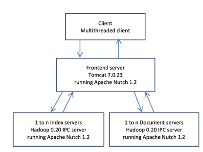

# Lab: Web Search

The purpose of this lab tutorial is to give you hands on experience with the Nutch Web Search benchmark of [CloudSuite](http://cloudsuite.ch/).

## Background

The Nutch Web Search benchmark is part of [CloudSuite](http://cloudsuite.ch/).

[CloudSuite](http://cloudsuite.ch/) is a benchmark suite for cloud services. CloudSuite covers a broad range of application categories commonly found in today’s datacenters, including data analytics, data serving, media streaming, large-scale and computation-intensive tasks, web search, and web serving.

The Nutch Web Search benchmark relies on the [Apache Nutch](https://nutch.apache.org/) search engine framework. The benchmark includes a client machine that simulates real-world clients that send requests to the index nodes. The index nodes contain an index of the text and fields found in a set of crawled websites.

### Architecture 

The Nutch Web Search benchmark consists of four main components: the client, frontend server, and multiple index and document servers. These components are illustrated in the figure below with a diagram that describes the overall architecture and information flow.

<figure>
  <p align="center"></p>
  <figcaption><p align="center">Figure. Nutch Web Search 3-tier architecture.</p></figcaption>
</figure>

The index is partitioned across the index servers so that each index server
gets to hold a disjoint part of the index. Documents servers hold the actual documents and they are used for fetching the summaries of the search results. 

We next provide a more detailed per component description.

#### Client
The Client is a multithreaded process with each thread sending queries to the frontend. The client threads can send queries based on some inter-arrival distribution trying to mimic real users or queries can be sent in a stress test manner. In the stress test scenario a client thread sends a new query as soon as it receives the response for the previous query sent.
Analysis of the performance while increasing the number of clients can be used to determine the maximum throughput capabilities of the system under test. 

#### Frontend Server 
The frontend is a Tomcat web server running the Nutch application. Tomcat is multithreaded and spawns a new thread for handling a new query request. 
Frontend coordinates the entire query execution and it is the component which acts as a link between the client and the nodes which do the actual job: the index and the document servers.

#### Index Server 
The index server is a Hadoop 0.2 IPC (Inter Process Communication) server process running Lucene 3.0.31 search engine. The Hadoop IPC server consists of a listening thread which listens for incoming requests from the frontend server, the handler threads which actually perform the search or retrieve the details of a document and a
responder thread for sending the responses to the frontend. The handler threads number can be set by the user and it's recommended to be slightly higher than the number of available cores.

The Nutch benchmark uses document partitioning, which means each index server holds an index for a disjoint set of documents. Another partitioning technique is term partitioning. In term partitioning each index server holds a disjoint set of terms. In term partitioning only the index servers that have query terms are involved in the search procedure.
The index structure which holds the terms is usually a tree structure or HashMap. Each term points to a list of documents that contain the term. This list is usually called a posting list and each document is called a posting. The postings can be ordered by a score, for example the PageRank. Sorting the docs by score is beneficial both for performance and for relevance of results. It provides quick access to the most popular documents which are most likely to fit the user's information needs. In the Nutch benchmark the documents are sorted by DocId. Sorting docs by ID is useful for performing efficient merging of posting list for Boolean AND queries.

The Nutch benchmark uses for the search procedure a combination of Boolean retrieval, vector space model for representing documents and tf.idf weighting scheme for ranking documents. Nutch allows only conjunctive queries (AND) for multi-term queries. The actual search procedure goes like this: first Nutch tries to find all documents which contain all terms of a multi-term query; then for each document found, a tf.idf score is calculated. The tf.idf weighting scheme gives high scores to documents which have many occurrences of the query terms and also to documents that contain many occurrences of rare terms. Web search engines usually perform an early termination of the search procedure either by using a cut-off latency or perform an early termination when the quality of results is unlikely to improve with further searching. Early termination is used to avoid having an index server to search for too long. The Nutch benchmark provides the option to stop searching based on cut-off latency or after a number of matching documents is found.

Two other parameters which are important for the index search are: 1) the amount of index dataset an index server holds, and (2) the number of index servers used. The larger the dataset an index server holds the longer its search time. However, by increasing the number of index servers we can reduce response time. Doing so increases the degree of partitioning which means each index server will get smaller index part thus will need less amount of time to respond to a query. Index partitioning can be done across server or inside the same server (intra server partitioning). Intra server partitioning can be applied by running multiple index search contexts on the same server machine with each context working on a different index part. The intra server partitioning represents a trade-off between throughput and response time latency. Having many index searchers on a CPU socket speedups the execution of a query but reduces the number of available cores for handling parallel requests. 

#### Document Server 
The Document server, like the Index server, is also an instance of Hadoop ICP server with a listening, a responder thread and many handler threads. The document server contains the actual copies of the documents.
The document server is used for fetching the summaries of web pages. In web search engines the web pages summaries can be dynamic or static. Static summaries are preloaded and they are always the same regardless of the query that hit the document, while dynamic summaries are query dependent and they attempt to explain to the user why the document is retrieved for the query. The Nutch benchmark uses a dynamic summarizer. The document server dataset is partitioned in many parts. Each part contains a disjoint set of documents. For expediting the access to the documents content, the document server uses a partitioning function (which takes as input the document url) for determining in which partition the document is located.

### Query Execution 
The flow of executing a query goes like this:
1. The client sends a query to the frontend server.
2. The frontend receives the query and asks from each index server to return the most relevant to the query documents. 
3. The index servers perform the search and respond to frontend with the document Ids and the relevance scores of the top-k relevant matching documents.
4. The frontend collects the results and sorts the documents according to their relevance score. In this step the fronted performs a check for duplicate results. The default configuration of the Nutch benchmark allows no more than two results from the same site. Depending on the query, steps 2 to 4 may repeat multiple times until the frontend is satisfied with the number of duplicates per site. At each repetition the server asks two times more search results from each index server. These subsequent searches are referred to as optimization searches.
5. After the frontend has the final top-k results, it sends a detail request to each index server whose search results are in the current top-k list. The index server responds to a detail request with the title and the url for each request.
6. As soon as the frontend has all the title and urls of the top-k results, it asks from the document servers the summaries of the top-k results. The frontend is aware of which documents each document server holds. Consequently, only the document servers which hold the documents that are in the top-k results are being asked for summaries.
7. The document servers generate the summaries and send them to the frontend.
8. When the frontend receives the summaries it assembles the final html response and sends it to the client.

## Module 1: Web Search Setup

We will configure the Web Search benchmark to run a single client, a single frontend server, and up to two index servers on a test cluster, using the scripts available in the accompanied git repository. Note, the tutorial skips running the document server to keep things simple.

We will first configure the benchmark to run a single index server, then run two index servers as part of a scalability study in the second module.

### Creating a Test Cluster on CloudLab

For this tutorial, you will be using a CloudLab image that already has the necessary server-side packages installed.

Start a new experiment on CloudLab using the `websearch` profile in the `UCY-CS499-DC` project, configured with at least four physical machine nodes. Note, it can take upwards of ten minutes for the cluster to fully initialize. Thank you for your patience!

### Setting up the Frontend and Index Servers

Connect via SSH to `node0` of the cluster with your CloudLab credentials. You can use the list view tab in the CloudLab status page to find the identity of the manager node and the full ssh command line to connect to it. For example:

```
ssh -p 22 alice@ms1019.utah.cloudlab.us
```

Clone the git repository and change into the scripts directory. 

```
git clone https://github.com/ucy-coast/cs499.git
cd labs/websearch/scripts
```

We will first configure the benchmark to run a single index server, using the configuration file `hosts-1-index`. 

Let's take a look at the configuration file:

```
[all:vars]
websearch_home=/local/websearch
index_parts_src_dir=/mydata/4GBindex/indexes
index_parts_count=8
index_partition_base_dir=/local/websearch/test_out
index_server_threads_count=16

[frontend]
node1

[index]
node2
```

The configuration file is in fact an Ansible inventory file written in the INI format. The first section `all:vars` assigns variables to all hosts. For example, `websearch_home` defines the Web Search benchmark installation directory at each node. The meaning of the rest of the variables will become more evident as we work through the tutorial. The remaining two sections `frontend` and `index` define the hosts for the frontend and index servers, respectively. For example, this configuration file runs a single frontend server on `node1` and a single index server on `node2`.

We will use the scripts named `index.sh` and `frontend.sh` to set up the index and frontend servers, respectively. These two scripts are wrappers around a bunch of Ansible scripts that do the heavy lifting with configuring each server node.  

Because the frontend server depends on the index server, we continue with configuring and running the index server first.

#### Index server

As a first step in setting up the index server, we need to partition and distribute the index among the available index servers. Since the index is already split into multiple index parts available in the directory `index_parts_src_dir`, partitioning the index among the index servers simply entails copying into the directory `index_partition_base_dir` at each index node the index parts that correspond to the index server. The variable `index_parts_count` defines the total number of index parts to partition among the index servers.

You can deploy the index parts by simply running the following command:

```
./index.sh -i hosts-1-index deploy
```

After deploying the index, you can launch the index server process on the index node:

```
./index.sh -i hosts-1-index start
```

The index server process runs with `index_server_threads_count` threads. 

#### Frontend server

Before we can run the frontend, we first need to configure it. This includes two sets of configurations (i) listing in `webapps/ROOT/WEB-INF/classes/nutch-site.xml` the hostname and port of each index server that the frontend needs to talk to, and (ii) setting in `/conf/server.xml` the ports that a client can use to connect to the frontend. 

You can automatically configure the frontend by simply running the following:

```
./frontend.sh -i hosts-1-index config
```

After configuring the frontend, you can start the frontend server process:

```
./frontend.sh -i hosts-1-index start
```

You can test that the frontend server has launched successfully using the following: 

```
./frontend.sh -i hosts-1-index test
```

The test output should look similar to this:

```
Test frontend server instance node1:8080...

55877

</body>
</html>
```

The test above uses `curl` to issue a search query to the frond-end server. You can also do this test manually by visiting the following URL through your web browser:

```
http://c220g1-030830.wisc.cloudlab.us:8080/onlyHits.jsp?query=google
```

In the URL above, `c220g1-030830.wisc.cloudlab.us` corresponds to the externally visible hostname of the frontend node, namely `node1`, which you can find through the CloudLab dashboard.

#### Configuration file summary

Here is a summary of the configuration variables described above, for easy reference:

- `websearch_home`: Web Search benchmark installation directory
- `index_parts_src_dir`: Index parts directory containing all the index parts to be partitioned among index servers 
- `index_partition_base_dir`: Index parts directory holding the index parts that correspond to the index partition at each index node
- `index_parts_count`: Number of index parts to partition among the index servers
- `index_server_threads_count`: Number of threads per index server process

### Running the Client Workload

The Client is a multithreaded process with each thread sending queries to the frontend. The client threads can send queries based on an inter-arrival distribution trying to mimic real users or queries can be sent in a stress test manner. In the stress test scenario a client thread sends a new query as soon as it receives the response for the previous query sent.

Let's first build the client program:

```
cd client
make
```

Then run the client program as follows:

```
./client node1 8080 /local/websearch/ISPASS_PAPER_QUERIES_100K 1000 1 onlyHits.jsp 1 1 /tmp/out 1
```

The first and second argument sets the frontend hostname (node1) and port number (8080), respectively. The third argument sets the file containing the search queries. The fourth argument sets the number of queries to issue (1000) and the fifth argument sets the number of client threads to use (1). For full usage information, you can run the client without arguments.

The client output should include a latency and throughput report (stdout) and a bunch of query responses (stderr). To discard the query responses, you can redirect `stderr` to `/dev/null`: 

```
./client node1 8080 /local/websearch/ISPASS_PAPER_QUERIES_100K 1000 1 onlyHits.jsp 1 1 /tmp/out 1 2> /dev/null
```

### Tearing down the Frontend and Index Servers

To shut down the frontend server:

```
./frontend.sh -i hosts-1-index stop
```

To shut down the index server and cleanup the partitions:

```
./frontend.sh -i hosts-1-index stop
./frontend.sh -i hosts-1-index clear
```

## Module 2: Web Search Characterization

In this module, we conduct a characterization and analysis of the web search benchmark. This includes, among other,
query and latency analysis, benchmark throughput and response time characterization, processing time in relation to
input dataset analysis, intra-server partitioning exploration and analysis of response times that compares processors with high and low performance. 

### Single- vs Multi-threaded Client

For this part, you should configure the web search benchmark to run a single frontend server and a single index server, following the instructions from Module 1. You should configure the index server to run with as many threads as available cores in a single socket (as reported via `lscpu`).

We begin with one client thread sending requests. We do this to isolate the response times from the effects of queuing, contentions on shared resources etc. This way the analysis is focused only on the time actually needed to process the query. 

```
./client node1 8080 /local/websearch/ISPASS_PAPER_QUERIES_100K 1000 1 onlyHits.jsp 1 1 /tmp/out 1
```

We next perform an investigation into how the number of client threads affects the system performance. We recommend to run the client with up to 128 threads. For example, the following runs 8 client threads on an eight-core machine:

```
./client node1 8080 /local/websearch/ISPASS_PAPER_QUERIES_100K 1000 8 onlyHits.jsp 1 1 /tmp/out 1
```

For a small number of client threads (<8), you should observe that the performance scales well. At that range the throughput should scale nearly linearly and response times should not worsen much. A small degradation in response times is caused by increased contentions of shared resources as the number of active cores increases. 

As the number of client threads increases to a larger number (>8 and <128), you should observe that trends change. Throughput should remain constant or increase slightly and response times should continuously increase (get worse) due to increase queuing delay (query simply waiting to be served). Measuring the index server CPU utilization should reveal that CPU utilization is strongly correlated with throughput. 

### Intra-server Partitioning 

We now compare the response times of a setup using partitioning with two index servers working on different index
parts and a configuration without partitioning. The queries are executed sequentially one at a time.

For this part, you should configure the web search benchmark to run a single frontend server and a two index servers using the configuration file `hosts-2-index`.

You should observe that partitioning improves the index search times which yields an end to end response time improvement. 

A machine running an index server can have multiple index server processes, with each process working on a separate
index part. Using many index server processes naturally reduces the response latency but at the expense of executing
less independent queries in parallel. 

We next study two different configurations of how to run the index server on a two-socket CPU. 
1. one index server process and two sockets per index server using the configuration file `hosts-1-index-2-socket`
2. two index server processes and one socket per index server process using the configuration file `hosts-2-index-1-socket`

The configuration scripts use the [numactl](https://linux.die.net/man/8/numactl) command to pin processes to specific socket cores and also to force the process to use only the CPU’s own DRAM. 

In the first configuration, the single server process spans both two sockets and serves index parts that reside in both two socket's memory. This may introduce non-uniform memory access latencies when serving a query, which may negatively impact index service latency and end-to-end service latency in turn. 

In the alternative configuration, each server process is pinned on a single socket and only serves index parts that reside in that socket's memory. This avoids non-uniform memory accesses, and helps improve index service latency and end-to-end service latency in turn. However, since the index latency improvement is offset by the extra time to merge the index results at the frontend, the index latency improvement may translate to a smaller improvement in end-to-end service latency.

## Acknowledgements

The tutorial is based on material from: 

- [Characterization and analysis of a web search benchmark](http://ieeexplore.ieee.org/document/7095818/) by Zacharias Hadjilambrou, Marios Kleanthous, and Yanos Sazeides, and 
- [Performance characterization of simultaneous multi-threading and index partitioning for an online document search application](https://ieeexplore.ieee.org/document/9238607) by Georgia Antoniou, Zacharias Hadjilambrou, and Yiannakis Sazeides.
