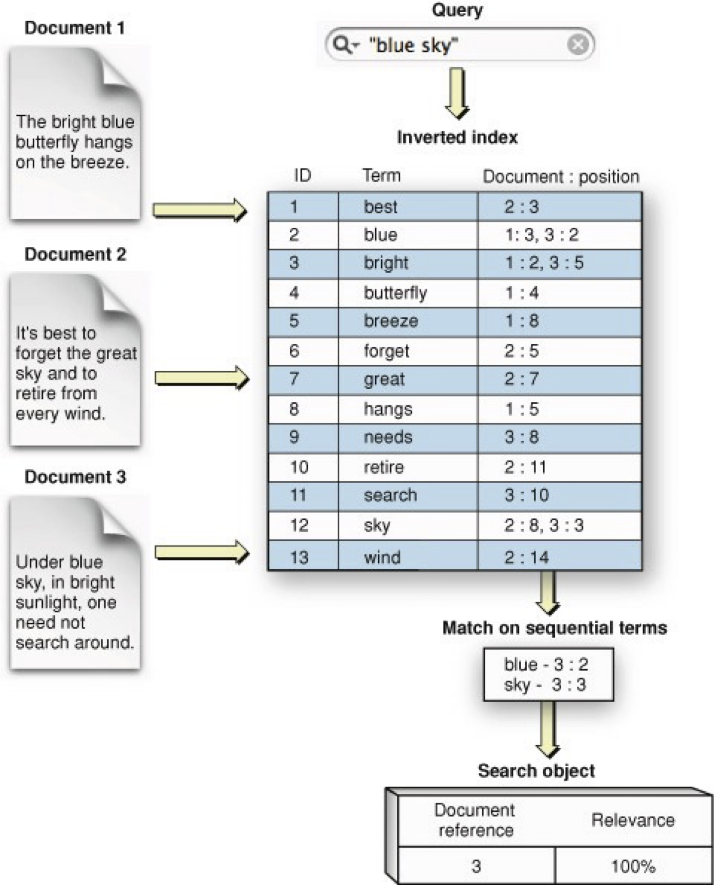
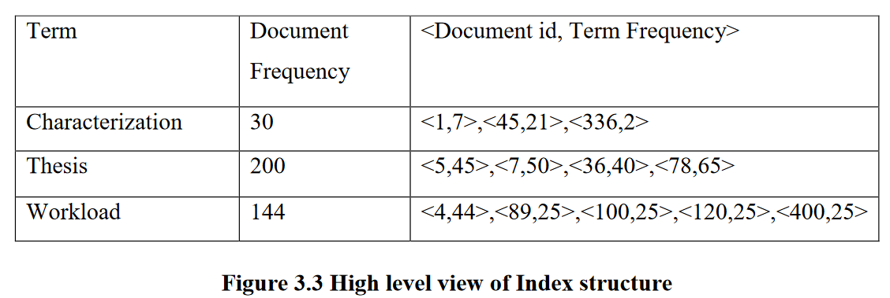
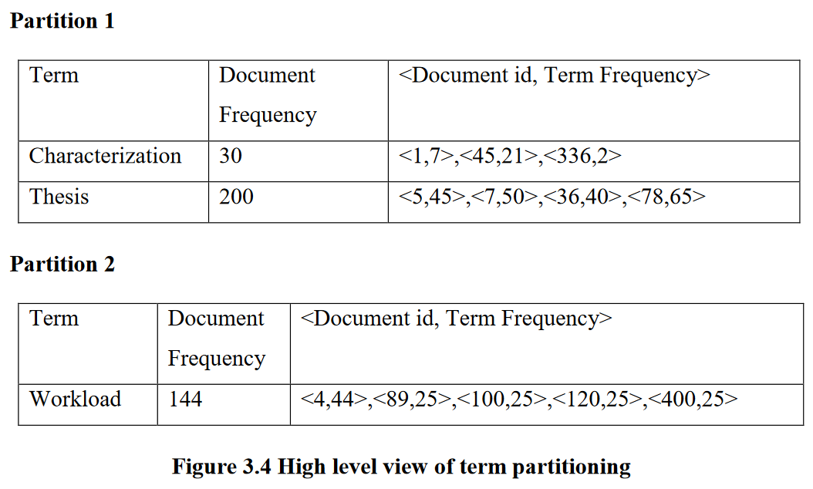
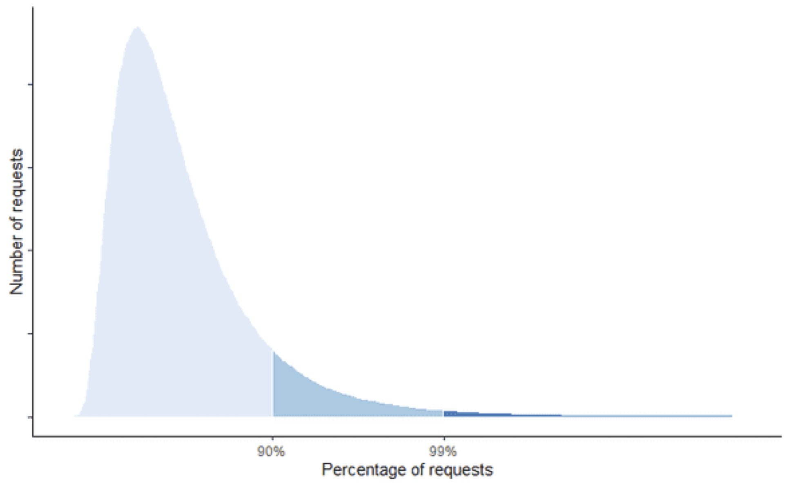

# Web Search CloudSuite benchmark

- CloudSuite
  - Benchmark suite for cloud services

- Web Search
  - Based on Apache Nutch
    - Java-based
    - Open source

---

# Nutch Architecture
- Nutch: crawler + searcher

- Crawler: fetches pages, creates inverted index

- Indexer/Searcher: uses inverted index to answer queries

- Crawler and Searcher are highly decoupled, enabling independent scaling on separate hardware platforms
&nbsp;

- ### We will focus on the Indexer/Searcher

---

# Indexer/Searcher

- Uses Lucene for indexing

- Builds *inverted index* of all of the pages the system has retrieved

---

# Inverted index

<div class="columns">

<div>

- For each word: set of documents where it occurs

</div>

<div>



</div>

</div>

---

# Websearch benchmark three-tier architecture

<div class="columns">

<div>


</div>

<div class="footnotesize">

- Client
  - Issues search requests 
- Frontend servers
  - Tomcat web server running the nutch application 
  - Serves query by aggregating top-k results from index/document servers
- Index servers
  - Hadoop IPC server running Lucene search engine
  - Holds a disjoint part of the index 
    - Index is partitioned across the index servers
  - Performs the search
- Documents servers
  - Hadoop IPC server
  - Holds the actual documents 
  - Fetches the summaries of the search results

</div>

</div>

---

# Index Partitioning



How to partition index among index servers

- Document partitioning
- Term partitioning

---

# Document partitioning

Each index server holds an index for a disjoint set of documents (used by Nutch)


---

# Term partitioning

Each index server holds an index for a disjoint set of terms



---
# Processing a query

<div class="columns">

<div>

<div class="img-overlay-wrap">
   <svg xmlns="http://www.w3.org/2000/svg" viewBox="0 0 500 500">
	  <svg>
        <circle cx="160" cy="114" r="3.5%" fill="red" />
        <text x="153" y="123" fill="white">1</text>
    </svg>
	  <svg>
        <circle cx="120" cy="230" r="3.5%" fill="red" />
        <text x="113" y="239" fill="white">2</text>
    </svg>
	  <svg>
        <circle cx="240" cy="290" r="3.5%" fill="red" />
        <text x="233" y="299" fill="white">3</text>
    </svg>
   
</div>

</div>

<div>

1. The client sends a query to the frontend server
1. The frontend receives the query and asks from each index server to return the most relevant to the query documents 
1. The index servers perform the search and respond to frontend with the document Ids and the relevance scores of the top-k relevant matching documents. 

</div>

</div>

---

# Processing a query

<div class="columns">

<div>

<div class="img-overlay-wrap">
   <svg xmlns="http://www.w3.org/2000/svg" viewBox="0 0 500 500">
	  <svg>
        <circle cx="190" cy="164" r="3.5%" fill="red" />
        <text x="183" y="173" fill="white">4</text>
    </svg>
	  <svg>
        <circle cx="120" cy="230" r="3.5%" fill="red" />
        <text x="113" y="239" fill="white">5</text>
    </svg>
	  <svg>
        <circle cx="310" cy="240" r="3.5%" fill="red" />
        <text x="303" y="249" fill="white">6</text>
    </svg>
   
</div>

</div>

<div>

4. The frontend collects the results and sorts the documents according to their relevance score
4. After the frontend has the final top-k results, it sends a detail request to each index server whose search results are in the current top-k list 
4. As soon as the frontend has all the title and urls of the top-k results, it asks from the document servers the summaries of the top-k results

</div>

</div>

---

# Processing a query

<div class="columns">

<div>

<div class="img-overlay-wrap">
   <svg xmlns="http://www.w3.org/2000/svg" viewBox="0 0 500 500">
	  <svg>
        <circle cx="400" cy="240" r="3.5%" fill="red" />
        <text x="393" y="249" fill="white">7</text>
    </svg>
	  <svg>
        <circle cx="350" cy="164" r="3.5%" fill="red" />
        <text x="343" y="173" fill="white">8</text>
    </svg>
   
</div>

</div>

<div>

7. The document servers generate the summaries and send them to the frontend
7. When the frontend receives the summaries it assembles the final html response and sends it to the client

</div>

</div>

---
# Start a Websearch experiment

- Go to your CloudLab dashboard
- Click on the Experiments tab
- Select Start Experiment
- Click on Change Profile
  - Select `websearch` profile in the `UCY-CS499-DC` project
  - Use two nodes with the Ubuntu 18.04 image from the Wisconsin cluster
- Name your experiments with CloudLabLogin-ExperimentName
  - Prevents everyone from picking random names 

---

# Set up the Frontend and Index Servers

Connect via SSH to `node0`:

```
$ ssh -p 22 alice@ms1019.utah.cloudlab.us
```

Clone the labs repo:

```
$ git clone https://github.com/ucy-coast/cs499.git
$ cd labs/websearch/scripts
```

---
# Set up a single Index server

Use the configuration file `hosts-1-index`

```
[all:vars]
websearch_home=/local/websearch
index_parts_src_dir=/mydata/4GBindex/indexes
index_parts_count=8
index_partition_base_dir=/local/websearch/test_out
index_server_threads_count=16

[frontend]
node1

[index]
node2
```

---
# Configuration file summary

- `websearch_home`: Web Search benchmark installation directory
- `index_parts_src_dir`: Index parts directory containing all the index parts to be partitioned among index servers
- `index_partition_base_dir`: Index parts directory holding the index parts that correspond to the index partition at each index node
- `index_parts_count`: Number of index parts to partition among the index servers
- `index_server_threads_count`: Number of threads per index server process

---

# Set up a single Index server

Deploy the index parts:

```
./index.sh -i hosts-1-index deploy
```

Launch the index server:

```
./index.sh -i hosts-1-index start
```

---

# Set up a single Frontend server

Configure the frontend:

```
./frontend.sh -i hosts-1-index config
```

Launch the frontend server:

```
./frontend.sh -i hosts-1-index start
```

---

# Test 

Test the frontend server:

```
./frontend.sh -i hosts-1-index test
```

Output should look similar:

```html
Test frontend server instance node1:8080...

55877

</body>
</html>
```

---

# Running the client workload

Client sends queries based on an inter-arrival distribution trying to mimic real users

Build the client:

```
cd client
make
```

Run the client:

```
./client node1 8080 /local/websearch/ISPASS_PAPER_QUERIES_100K 1000 1 onlyHits.jsp 1 1 /tmp/out 1 2> /dev/null
```

---
# Running the client workload

<div class="img-overlay-wrap">
   <svg xmlns="http://www.w3.org/2000/svg" viewBox="0 0 350 100">
   <defs>
      <marker id="arrowhead" markerWidth="10" markerHeight="7" 
      refX="0" refY="2" orient="auto" fill="red">
         <polygon points="0 0, 5 2, 0 4" />
      </marker>
   </defs>
   <text x="157" y="60" font-size="small" fill="red"># queries</text>
   <text x="214" y="60" font-size="small" fill="red"># clients</text>
   <line x1="202" y1="65" x2="202" y2="90" stroke="red" 
   stroke-width="2" marker-end="url(#arrowhead)" />
   <line x1="216" y1="65" x2="216" y2="90" stroke="red" 
   stroke-width="2" marker-end="url(#arrowhead)" />
   </svg>

</div>

Client sends queries based on an inter-arrival distribution trying to mimic real users

Build the client:

```
cd client
make
```

Run the client:

```
./client node1 8080 /local/websearch/ISPASS_PAPER_QUERIES_100K 1000 1 onlyHits.jsp 1 1 /tmp/out 1 2> /dev/null
```

---
# Sample output

```bash
ops/sec 250               # Throughput
average 8.18261           # Average request latency
50th 6.25                 # Median request latency
90th 15.5862              # Tail latency (90th percentile)
99th 41.127               # Tail latency (99th percentile)
succeded_queries 1000
```

---

# Request latency and throughput

- Request latency
  - Amount of time it takes from when a request is made by the user to the time it takes for the response to get back to that user
&nbsp;
- Throughput
  - Total requests serviced per unit time
    (NOT the inverse of request latency)

---

# Request tail latency

<div class="columns">

<div>



</div>

<div>

- Tail latency: refers to high latencies that clients see fairly infrequently

- P99: 99th latency percentile: 99% of requests will be faster than the given latency number 

- Even though a small fraction of requests experiences these extreme latencies, it tends to affect your most profitable users

- To avoid losing users, you have to keep upper percentile response times in check 

</div>

</div>


---


# Tear down the Frontend and Index servers

Shut down the frontend server:

```
./frontend.sh -i hosts-1-index stop
```

Shut down the index server and cleanup the partitions:

```
./index.sh -i hosts-1-index stop
./index.sh -i hosts-1-index clear
```
