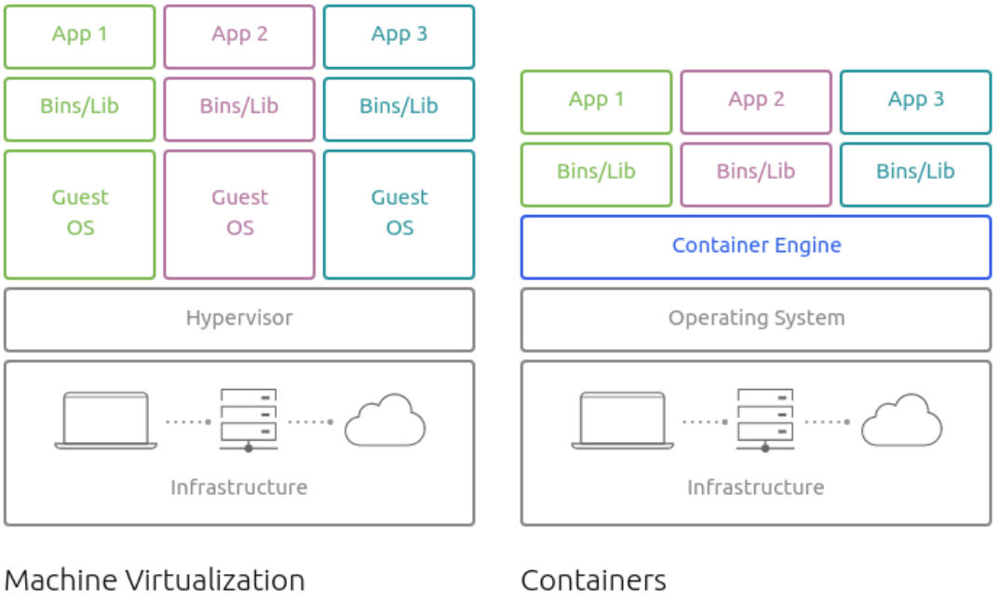

# Lab: Docker Containers

This tutorial aims to be the one-stop shop for getting your hands dirty with Docker. Apart from demystifying the Docker landscape, it'll give you hands-on experience with building and deploying  webapps as containers. 

## Background

### What is Docker?

Docker is a tool that allows developers, sys-admins etc. to easily deploy their applications in a sandbox (called containers) to run on the host operating system i.e. Linux. The key benefit of Docker is that it allows users to package an application with all of its dependencies into a standardized unit for software development. Unlike virtual machines, containers do not have high overhead and hence enable more efficient usage of the underlying system and resources.

### What are containers?

The industry standard today is to use Virtual Machines (VMs) to run software applications. VMs run applications inside a guest Operating System, which runs on virtual hardware powered by the server’s host OS.

<figure>
  <p align="center"></p>
  <figcaption><p align="center">Figure. Virtualization vs. Containers</p></figcaption>
</figure>

VMs are great at providing full process isolation for applications: there are very few ways a problem in the host operating system can affect the software running in the guest operating system, and vice-versa. But this isolation comes at great cost — the computational overhead spent virtualizing hardware for a guest OS to use is substantial.

Containers take a different approach: by leveraging the low-level mechanics of the host operating system, containers provide most of the isolation of virtual machines at a fraction of the computing power.

### Why use containers?

Containers offer a logical packaging mechanism in which applications can be abstracted from the environment in which they actually run. This decoupling allows container-based applications to be deployed easily and consistently, regardless of whether the target environment is a private data center, the public cloud, or even a developer’s personal laptop. This gives developers the ability to create predictable environments that are isolated from the rest of the applications and can be run anywhere.

From an operations standpoint, apart from portability containers also give more granular control over resources giving your infrastructure improved efficiency which can result in better utilization of your compute resources.

Due to these benefits, containers (& Docker) have seen widespread adoption. Companies like Google, Facebook, Netflix and Salesforce leverage containers to make large engineering teams more productive and to improve utilization of compute resources. In fact, Google credited containers for eliminating the need for an entire data center.

### Terminology

We will use a lot of Docker-specific jargon which might be confusing to some. So before we go further, let me clarify some terminology that is used frequently in the Docker ecosystem.

- *Images* - The blueprints of our application which form the basis of containers. In the demo above, we used the ``docker pull`` command to download the busybox image.
- *Containers* - Created from Docker images and run the actual application. We create a container using ``docker run`` which we did using the busybox image that we downloaded. A list of running containers can be seen using the ``docker ps`` command.
- *Docker Daemon* - The background service running on the host that manages building, running and distributing Docker containers. The daemon is the process that runs in the operating system which clients talk to.
- *Docker Client* - The command line tool that allows the user to interact with the daemon. More generally, there can be other forms of clients too - such as Kitematic which provide a GUI to the users.
- *Docker Hub* - A [registry](https://hub.docker.com/explore/) of Docker images. You can think of the registry as a directory of all available Docker images. If required, one can host their own Docker registries and can use them for pulling images.

## Setting up your computer

Getting all the tooling setup on your computer can be a daunting task, but thankfully as Docker has become stable, getting Docker up and running on your favorite OS has become very easy. The getting started guide on Docker has detailed instructions for setting up Docker on [Mac](https://docs.docker.com/docker-for-mac/install), [Linux](https://docs.docker.com/install/linux/docker-ce/ubuntu) and [Windows](https://docs.docker.com/docker-for-windows/install).

### CloudLab

For this tutorial, you can use a CloudLab image that already has the Docker Engine installed.

Start a new experiment on CloudLab using the `multi-node-cluster` profile in the `UCY-CS499-DC` project, configured with a single physical machine node. 

When your experiment is ready to use, log into the machine, and verify that Docker Engine is installed correctly by running the hello-world image.

```
$ sudo docker run hello-world
Unable to find image 'hello-world:latest' locally
latest: Pulling from library/hello-world
03f4658f8b78: Pull complete
a3ed95caeb02: Pull complete
Digest: sha256:8be990ef2aeb16dbcb9271ddfe2610fa6658d13f6dfb8bc72074cc1ca36966a7
Status: Downloaded newer image for hello-world:latest

Hello from Docker.
This message shows that your installation appears to be working correctly.
...
```

## Docker Containers

### Running your first container

Now that we have everything setup, it's time to get our hands dirty. We are going to run a [Busybox](https://en.wikipedia.org/wiki/BusyBox) container on our system and get a taste of the docker run command. Busybox is typically used in embedded systems (e.g. , phones, routers).

To get started, let's run the following in our terminal:

```
$ docker run busybox echo hello world
Unable to find image 'busybox:latest' locally
latest: Pulling from library/busybox
50783e0dfb64: Pull complete 
Digest: sha256:ef320ff10026a50cf5f0213d35537ce0041ac1d96e9b7800bafd8bc9eff6c693
Status: Downloaded newer image for busybox:latest
hello world
```

That was our first container! We used one of the smallest, simplest images available: `busybox`. 

We see a lot of stuff happened. When you call run, the Docker client looks for the `busybox` image. Since the `busybox` image is missing, the client first downloads the image, then
loads up the container, dutifully runs the `echo` command in our busybox container, and finally exits. If you've noticed, all of that happened pretty quickly. 

### A more useful container

Great! Let's now run a more exciting container:

```
$ docker run -it ubuntu
root@04c0bb0a6c07:/#
```

This fires up a brand new container. The container runs a bare-bones, no-frills `ubuntu` system. Running the run command with the `-it` flags attaches us to an interactive tty in the container. The `-it` is shorthand for `-i -t`. The `-i` flag tells Docker to connect us to the container's stdin and the `-t` flag tells Docker that we want a pseudo-terminal.

Let's do something in our container. Try to run `figlet` in our container:

```
root@04c0bb0a6c07:/# figlet hello
bash: figlet: command not found
```

The shell complains it cannot find the command `figlet`. 

We want `figlet`, so let's install it:

```
root@04c0bb0a6c07:/# apt-get update
...
Fetched 1514 kB in 14s (103 kB/s)
Reading package lists... Done
```

```
root@04c0bb0a6c07:/# apt-get install figlet
Reading package lists... Done
...
```

One minute later, `figlet` is installed!

Let's try to run our freshly installed program. The `figlet` program takes a message as parameter.

```
root@04c0bb0a6c07:/# figlet hello
 _          _ _       
| |__   ___| | | ___  
| '_ \ / _ \ | |/ _ \ 
| | | |  __/ | | (_) |
|_| |_|\___|_|_|\___/
```

This time we get a beautiful greetings message!

Let's check how many packages are installed there.

```
root@04c0bb0a6c07:/# dpkg -l | wc -l
107
```

Here, we use `dpkg -l` to list the packages installed in our container. We then pipe the output to `wc -l` to count those packages.

Exit the container by logging out of the shell, like you would usually do. For example, you can hit `^D` or type `exit`.

```
root@04c0bb0a6c07:/# exit
```

Now, let's run `dpkg -l | wc -l` and `figlet` again.

```
$ dpkg -l | wc -l
778
$ figlet
Command 'figlet' not found, ...
```

Wait, we get a different number of packages and the shell again complains it cannot find the command `figlet`. Is that a bug? Well, no. Host and containers are independent things. We ran an `ubuntu` container on an `ubuntu` host, but they have different, independent packages. Installing something on the host doesn't expose it to the container, and vice-versa.

What if we start a new container, and try to run figlet again?

```
$ docker run -it ubuntu
root@b13c164401fb:/# figlet
bash: figlet: command not found
```

We started a *brand new container*. The basic Ubuntu image was used, and `figlet` is not here.

### Running a container in the background

Our first containers were interactive. We will now see how to run a non-interactive container and how to run a container in the background. We will also see how to list running containers, check the logs of a container, stop a container, and list stopped containers

Let's run a small custom container. This container is non-interactive; it just displays the time every second.

```
$ docker run jpetazzo/clock
Fri Feb 20 00:28:53 UTC 2015
Fri Feb 20 00:28:54 UTC 2015
Fri Feb 20 00:28:55 UTC 2015
...
```

Docker has automatically downloaded the image `jpetazzo/clock`. This image is a user image, created by `jpetazzo`. We will cover more about user images later.

This container will run forever. To stop it, press `^C`.

Let's run a similar container in the background. Containers can be started in the background, with the `-d` flag (daemon mode):

```
$ docker run -d jpetazzo/clock
47d677dcfba4277c6cc68fcaa51f932b544cab1a187c853b7d0caf4e8debe5ad
```

Docker starts our container the same as before but this time “detaches” from the container and returns us to the terminal prompt. Docker gives us the ID of the container. Naturally, we don't see the output of the container. But don't worry: Docker collects that output and logs it! 

### Listing running containers

We can check that our container is still running with `docker ps`. Just like the UNIX `ps` command, `docker ps` shows you all containers that are currently running.

```
$ docker ps
CONTAINER ID  IMAGE           ...  CREATED        STATUS        ...
47d677dcfba4  jpetazzo/clock  ...  2 minutes ago  Up 2 minutes  ...
```

Docker tells us the (truncated) ID of our container, the image used to start the container, that our container has been running (`Up`) for a couple of minutes, and includes other information (COMMAND, PORTS, NAMES) that we will explain later.

Let's start two more containers.

```
$ docker run -d jpetazzo/clock
57ad9bdfc06bb4407c47220cf59ce21585dce9a1298d7a67488359aeaea8ae2a
```

```
$ docker run -d jpetazzo/clock
068cc994ffd0190bbe025ba74e4c0771a5d8f14734af772ddee8dc1aaf20567d
```

Check that docker ps correctly reports all 3 containers.

When many containers are already running, it can be useful to see only the last container that was started.

This can be achieved with the -l ("Last") flag:

```
$ docker ps -l
CONTAINER ID  IMAGE           ...  CREATED        STATUS        ...
068cc994ffd0  jpetazzo/clock  ...  2 minutes ago  Up 2 minutes  ...
```

Many Docker commands will work on container IDs, such as `docker stop` and `docker rm`. If we want to list only the IDs of our containers (without the other columns or the header line), we can use the `-q` ("Quiet", "Quick") flag:

```
$ docker ps -q
068cc994ffd0
57ad9bdfc06b
47d677dcfba4
```

We can also combine `-l` and `-q` to see only the ID of the last container started:

```
$ docker ps -lq
068cc994ffd0
```

At a first glance, it looks like this would be particularly useful in scripts. However, if we want to start a container and get its ID in a reliable way, it is better to use `docker run -d`.

### Viewing logs

We told you that Docker was logging the container output. Let's see that now.

```
$ docker logs 47d
Fri Feb 20 00:39:52 UTC 2015
Fri Feb 20 00:39:53 UTC 2015
...
```

We specified a *prefix* of the full container ID, but you can, of course, specify the full ID. The `logs` command outputs the *entire* logs of the container, but sometimes that will be too much.

To avoid being spammed with eleventy pages of output, we can use the `--tail` option:

```
$ docker logs --tail 3 068
Fri Feb 20 00:55:35 UTC 2015
Fri Feb 20 00:55:36 UTC 2015
Fri Feb 20 00:55:37 UTC 2015
```

The parameter is the number of lines that we want to see.

Just like with the standard UNIX command `tail -f`, we can follow the logs of our container:

```
$ docker logs --tail 1 --follow 068
Fri Feb 20 00:57:12 UTC 2015
Fri Feb 20 00:57:13 UTC 2015
^C
```

This will display the last line in the log file. Then, it will continue to display the logs in real time. You can use `^C` to exit.

### Stopping containers

Let's stop one of those containers:

```
$ docker stop 47d6
47d6
```

This will take 10 seconds: Docker sends the `TERM` signal; the container doesn't react to this signal as it's a simple shell script with no special signal handling; 10 seconds later, since the container is still running, Docker sends the `KILL` signal; this terminates the container.

Let's be less patient with the two other containers:

```
$ docker kill 068 57ad
068
57ad
```

Those containers will be terminated immediately (without the 10 seconds delay)

The `stop` and `kill` commands can take multiple container IDs

Let's check that our containers don't show up anymore:

```
$ docker ps
```

Since no containers are running, we see a blank line. Let's try a more useful variant: `docker ps -a`

```
$ docker ps -a
CONTAINER ID  IMAGE           ...  CREATED      STATUS
068cc994ffd0  jpetazzo/clock  ...  21 min. ago  Exited (137) 3 min. ago
57ad9bdfc06b  jpetazzo/clock  ...  21 min. ago  Exited (137) 3 min. ago
47d677dcfba4  jpetazzo/clock  ...  23 min. ago  Exited (137) 3 min. ago
5c1dfd4d81f1  jpetazzo/clock  ...  40 min. ago  Exited (0) 40 min. ago
b13c164401fb  ubuntu          ...  55 min. ago  Exited (130) 53 min. ago
```

So what we see above is a list of all containers that we ran. Do notice that the STATUS column shows that these containers exited a few minutes ago.

Nice - finally we see some output. In this case, the Docker client dutifully ran the echo command in our busybox container and then exited it. If you've noticed, all of that happened pretty quickly. Imagine booting up a virtual machine, running a command and then killing it. Now you know why they say containers are fast! Ok, now it's time to see the ``docker ps`` command. The ``docker ps`` command shows you all containers that are currently running.

```
$ docker ps
CONTAINER ID        IMAGE               COMMAND             CREATED             STATUS              PORTS               NAMES
```

### Restarting and attaching to containers

So far we have started containers in the foreground, and in the background. We will see how to put a container in the background, attach to a background container to bring it to the foreground, and restart a stopped container.

The distinction between foreground and background containers is arbitrary. From Docker's point of view, all containers are the same. All containers run the same way, whether there is a client attached to them or not. It is always possible to detach from a container, and to reattach to a container. Analogy: attaching to a container is like plugging a keyboard and screen to a physical server

If you have started an *interactive container* (with option `-it`), you can detach from it. The "detach" sequence is `^P^Q`. Otherwise you can detach by killing the Docker client, but not by hitting `^C`, as this would deliver `SIGINT` to the container. 

You can attach to a running container:

```
$ docker attach <containerID>
```

The container must be running. There can be multiple clients attached to the same container.

You should use `docker attach` if you intend to send input to the container. If you just want to see the output of a container, use `docker logs`.

When a container has exited, it is in stopped state. It can then be restarted with the `start` command.

```
$ docker start <yourContainerID>
```

The container will be restarted using the same options you launched it with.

### Removing containers

Before we move ahead though, let's quickly talk about deleting containers. We saw above that we can still see remnants of the container even after we've exited by running ``docker ps -a``. Throughout this tutorial, you'll run ``docker run`` multiple times and leaving stray containers will eat up disk space. Hence, as a rule of thumb, I clean up containers once I'm done with them. To do that, you can run the ``docker rm`` command. Just copy the container IDs from above and paste them alongside the command.

```
$ docker rm 068cc994ffd0 57ad9bdfc06b
068cc994ffd0
57ad9bdfc06b
```

On deletion, you should see the IDs echoed back to you. If you have a bunch of containers to delete in one go, copy-pasting IDs can be tedious. In that case, you can simply run:

```
$ docker rm $(docker ps -a -q -f status=exited)
```

This command deletes all containers that have a status of ``exited``. In case you're wondering, the ``-q`` flag, only returns the numeric IDs and ``-f`` filters output based on conditions provided. One last thing that'll be useful is the ``--rm`` flag that can be passed to ``docker run`` which automatically deletes the container once it's exited from. For one off docker runs, ``--rm`` flag is very useful.

In later versions of Docker, the ``docker container prune`` command can be used to achieve the same effect.

```
$ docker container prune
WARNING! This will remove all stopped containers.
Are you sure you want to continue? [y/N] y
Deleted Containers:
5b4cc273f5384097fa726607ff1e31b55f232c65106b8ed35bc279299d38f420
ed3c4c1161ca558aebabd04af40c13051b2507b5b495c14400c763b90709fd67
8066017b4c2759df78e88b156584b885a0554ed15d5ce615c7a0ae698111e87c

Total reclaimed space: 15B
```

## Docker Images

In this section we'll dive deeper into what Docker images are and build our own image! Lastly, we'll also use that image to run our application locally. Excited? Great! Let's get started.

### Understanding Docker Images

Docker images are the basis of containers. In the previous example, we silently pulled the Busybox image from the registry and asked the Docker client to run a container based on that image. To see the list of images that are available locally, use the ``docker images`` command.

```
$ docker images
REPOSITORY       TAG       IMAGE ID       CREATED         SIZE
ubuntu           latest    07c86167cdc4   4 days ago      188 MB
busybox          latest    3240943c9ea3   2 weeks ago     1.114 MB
jpetazzo/clock   latest    12068b93616f   12 months ago   2.433 MB
```

The above gives a list of images that I've pulled from the registry, along with ones that I've created myself (we'll shortly see how). The ``TAG`` refers to a particular snapshot of the image and the ``IMAGE ID`` is the corresponding unique identifier for that image.

A Docker image is a collection of files, plus metadata. These files form the root filesystem of our container. The metadata can indicate a number of things, such as the author of the image, the command to execute in the container when starting it, and environment variables to be set.

Images are made of layers, conceptually stacked on top of each other. Each layer can add, change, and remove files and/or metadata. Images can share layers to optimize disk usage, transfer times, and memory use. 

<figure>
  <p align="center"></p>
  <figcaption><p align="center">Figure. Image Layers</p></figcaption>
</figure>

For simplicity, you can think of an image akin to a git repository - images can be [committed](https://docs.docker.com/engine/reference/commandline/commit/) with changes and have multiple versions. If you don't provide a specific version number, the client defaults to ``latest``. For example, you can pull a specific version of ``ubuntu`` image

```
$ sudo docker pull ubuntu:18.04
```

To get a new Docker image you can either get it from a registry (such as the Docker Hub) or create your own. There are tens of thousands of images available on Docker Hub. You can also search for images directly from the command line using ``docker search``.

An important distinction to be aware of when it comes to images is the difference between base and child images.
- Base images are images that have no parent image, usually images with an OS like ubuntu, busybox or debian.
- Child images are images that build on base images and add additional functionality.

Then there are official and user images, which can be both base and child images.
- Official images are images that are officially maintained and supported by the folks at Docker. These are typically one word long. In the list of images above, the ``python``, ``ubuntu``, ``busybox`` and ``hello-world`` images are official images.
- User images are images created and shared by users like you and me. They build on base images and add additional functionality. Typically, these are formatted as ``user/image-name``.

### Our First Image

Now that we have a better understanding of images, it's time to create our own. Our goal in this section will be to create an image that sandboxes the figlet application. 

We will build the image with a `Dockerfile`. 

A [Dockerfile](https://docs.docker.com/engine/reference/builder/) is a simple text file that contains a list of commands that the Docker client calls while creating an image. It's a simple way to automate the image creation process. The best part is that the [commands](https://docs.docker.com/engine/reference/builder/#from) you write in a Dockerfile are *almost* identical to their equivalent Linux commands. This means you don't really have to learn new syntax to create your own dockerfiles.

Create a directory to hold our `Dockerfile`.

```bash
$ mkdir myimage
```

Create a new blank file in your favorite text-editor and save it in this directory by the name of ``Dockerfile``.

```bash
$ cd myimage
$ vim Dockerfile
```

Type this into our Dockerfile:

```dockerfile
FROM ubuntu
RUN apt-get update
RUN apt-get install figlet
```

`FROM` indicates the base image for our build.

Each `RUN` line will be executed by Docker during the build. Our `RUN` commands **must be non-interactive**, that is no input can be provided to Docker during the build. In many cases, we will add the `-y` flag to `apt-get`.

Now that we have our Dockerfile, we can build our image. The docker build command does the heavy-lifting of creating a Docker image from a Dockerfile. 

The docker build command is quite simple - it takes an optional tag name with `-t` and a location of the directory containing the Dockerfile.

```bash
$ docker build -t figlet .
Sending build context to Docker daemon 2.048 kB
Sending build context to Docker daemon 
Step 0 : FROM ubuntu
 ---> e54ca5efa2e9
Step 1 : RUN apt-get update
 ---> Running in 840cb3533193
 ---> 7257c37726a1
Removing intermediate container 840cb3533193
Step 2 : RUN apt-get install figlet
 ---> Running in 2b44df762a2f
 ---> f9e8f1642759
Removing intermediate container 2b44df762a2f
Successfully built f9e8f1642759
```

The resulting image is not different from the one produced manually:

```
$ docker run -ti figlet
root@91f3c974c9a1:/# figlet hello
 _          _ _       
| |__   ___| | | ___  
| '_ \ / _ \ | |/ _ \ 
| | | |  __/ | | (_) |
|_| |_|\___|_|_|\___/
```

## Deploying Web Applications with Docker 

Great! We now have a good basic understanding of containers and images. Armed with all this knowledge, we are now ready to get to the real-stuff, i.e. deploying web applications with Docker! 

### Build Hotel Map image

Our goal in this section will be to create an image that sandboxes our Hotel Map Go application. 

If you haven't already, please go ahead and clone the repository locally like so:

```
$ git clone https://github.com/ucy-coast/cs499-fa22.git
$ cd cs499-fa22/labs/06-docker/hotelapp
```

> This should be cloned on the machine where you are running the docker commands and not inside a docker container.

The next step now is to create an image with this web app. As mentioned above, all user images are based on a base image. Since our application is written in Go, the base image we're going to use will be [Go (golang)](https://hub.docker.com/_/golang).

The application directory does contain a Dockerfile but since we're doing this for the first time, we'll create one from scratch. To start, create a new blank file in our favorite text-editor and save it in the same folder as the flask app by the name of ``Dockerfile``.

We start with specifying our base image. Use the ``FROM`` keyword to do that

```
FROM golang:1.18.4
```

The next step usually is to write the commands of copying the files and installing any dependencies. First, we set a working directory and then copy all the files for our app.

```
# set a working directory for the app
WORKDIR /go/src/github.com/ucy-coast/hotel-app

# copy all the files to the container
COPY . .
```

Now, that we have the files, we can build and install the app.

```
# install app
RUN go mod init github.com/ucy-coast/hotel-app
RUN go mod tidy
RUN go install -tags ${DB} -ldflags="-s -w" ./cmd/...
```

The next thing we need to specify is the port number that needs to be exposed. Since our hotel app is running on port ``8080``, that's what we'll indicate.

```
EXPOSE 8080
```

The last step is to write the command for running the application, which is simply - ``mono``. We use the CMD command to do that -

```
CMD ["mono"]
```

The primary purpose of ``CMD`` is to tell the container which command it should run when it is started. With that, our ``Dockerfile`` is now ready. This is how it looks -

```dockerfile
FROM golang:1.18.4

# set a build-time vriable 
ARG DB=memdb

# set a working directory for the app
WORKDIR /go/src/github.com/ucy-coast/hotel-app

# copy all the files to the container
COPY . .

# build and install app
RUN go mod init github.com/ucy-coast/hotel-app
RUN go mod tidy
RUN go install -tags ${DB} -ldflags="-s -w" ./cmd/...

# define the port number the container should expose
EXPOSE 8080

# run the command
CMD ["mono"]
```

Now that we have our Dockerfile, we can build our image:

```
$ docker build -t hotelapp .
Step 1/7 : FROM golang:1.18.4
1.18.4: Pulling from library/golang
Digest: sha256:8a62670f5902989319c4997fe21ecae7fe5aaec8ee44e4e663cfed0a3a8172fc
Status: Downloaded newer image for golang:1.18.4
 ---> e3c0472b1b62
Step 2/7 : ARG DB=memdb
 ---> Running in 6070096f4397
Removing intermediate container 6070096f4397
 ---> 96d916290589
Step 3/7 : WORKDIR /go/src/github.com/ucy-coast/hotel-app
 ---> Running in 737ea9a4e27b
Removing intermediate container 737ea9a4e27b
 ---> a908abc5803b
Step 4/7 : COPY . .
 ---> 95eb8926dec3
Step 5/7 : RUN go install -tags ${DB} -ldflags="-s -w" ./cmd/...
 ---> Running in 3825b59cef85
go: downloading github.com/sirupsen/logrus v1.9.0
go: downloading github.com/hailocab/go-geoindex v0.0.0-20160127134810-64631bfe9711
go: downloading golang.org/x/sys v0.0.0-20220715151400-c0bba94af5f8
Removing intermediate container 3825b59cef85
 ---> 739cb82009c1
Step 6/7 : EXPOSE 8080
 ---> Running in 13d3fb496dfd
Removing intermediate container 13d3fb496dfd
 ---> ea56f39ce00f
Step 7/7 : CMD ["mono"]
 ---> Running in 8cafc2853ce4
Removing intermediate container 8cafc2853ce4
 ---> 179d36c89a74
Successfully built 179d36c89a74
Successfully tagged hotelapp:latest
```

If you don't have the ``golang:1.18.4`` image, the client will first pull the image and then create your image. Hence, your output from running the command will look different from mine. If everything went well, your image should be ready! Run ``docker images`` and see if your image shows.

### Run Hotel Map container

The last step in this section is to run the image and see if it actually works.

```
$ docker run hotelapp
time="2022-08-10T13:15:50Z" level=info msg="Start Frontend server. Addr: 0.0.0.0:8080"
```

If all goes well, you should see a ``Start Frontend server...`` message in your terminal. Okay now that the server is running, how to see the website? What port is it running on? And more importantly, how do we access the container directly from our host machine? Hit Ctrl+C to stop the container.

Well, in this case, the client is not exposing any ports so we need to re-run the ``docker run`` command to publish ports. While we're at it, we should also find a way so that our terminal is not attached to the running container. This way, you can happily close your terminal and keep the container running. This is called detached mode.

```
$ docker run -d -P hotelapp
e1978de1b3e9cf3288c441aca4f29c8946f27fbdf0584bbfcebc8659ab8c21aa
```

In the above command, ``-d`` will detach our terminal, ``-P`` will publish all exposed ports to random ports and finally ``--name`` corresponds to a name we want to give. Now we can see the ports by running the ``docker port [CONTAINER]`` command

```
$ docker port e19
8080/tcp -> 0.0.0.0:49153
8080/tcp -> :::49153
```

More specifically, what the above run command does is start a new container based on the `hotelapp` image. Docker sets up its own internal networking (with its own set of IP addresses) to allow the Docker daemon to communicate with the host and to allow containers within Docker to communicate with one another. This internal network is illustrated below:

<figure>
  <p align="center"></p>
  <figcaption><p align="center">Figure. Default network</p></figcaption>
</figure>


As shown above, each container, like our static-site container, has its own IP address. On this container, the Nginx web server is running and serves a static website. The web server on the container opens port 8080 for non-secure (http) connections. This port, 8080, is not accessible from outside the Docker (i.e. from the machine which is the Docker Host). So basically, what you're doing with the ``-P`` flag is to connect Docker's internal network with the "external" network, that is the ``-P`` option maps an external port on the host to an internal port on the container. The docker port command reveals that the external host port 49153 forwards requests (connects) to internal port 443 and the external port 49154 to internal port 80 on the container.

You can now open ``http://<YOUR_IPADDRESS>:[YOUR_PORT_FOR 8080/tcp]`` to see your site live! You can use ``hostname`` to find your IP address:

```
$ hostname -i
```

You can also specify a custom port to which the client will forward connections to the container.

```
$ docker run -p 8888:8080 hotelapp
time="2022-08-10T13:15:50Z" level=info msg="Start Frontend server. Addr: 0.0.0.0:8080"
```

The command we just ran used port 8080 for the server inside the container and exposed this externally on port 8888. Head over to the URL with port 8888, where your app should be live.

<figure>
  <p align="center"></p>
  <figcaption><p align="center">Figure. Hotel Map</p></figcaption>
</figure>

Congratulations! You have successfully deployed your first docker web application.

## Acknowledgements

This lab tutorial is adapted from [Docker for Beginners](https://docker-curriculum.com/), written and developed by Prakhar Srivastav.
