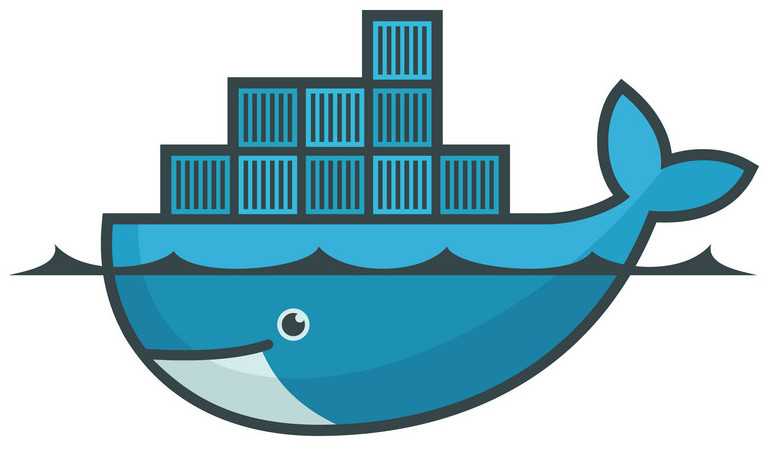
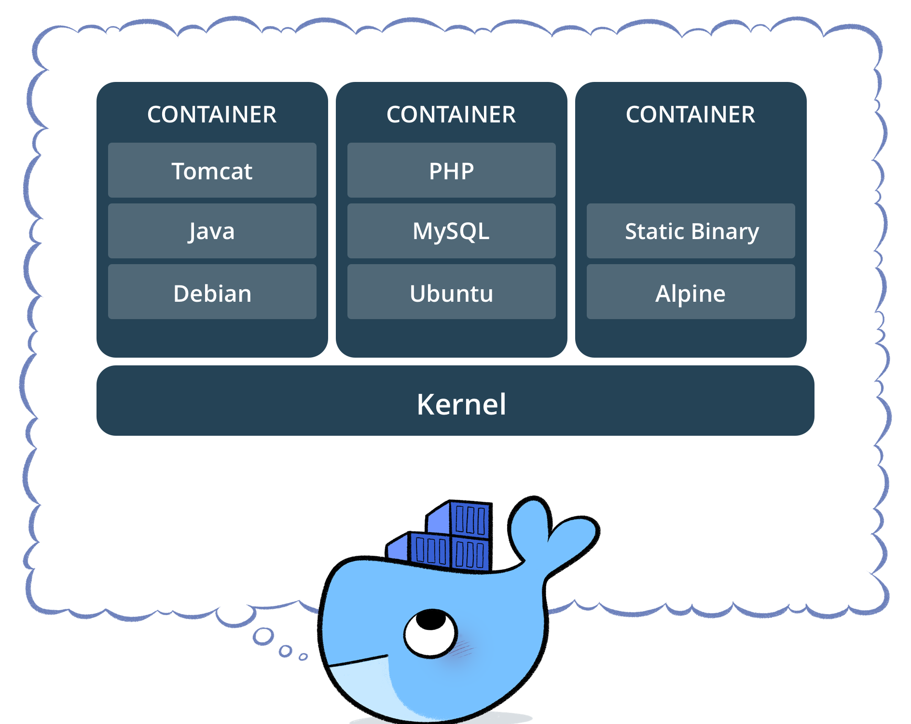
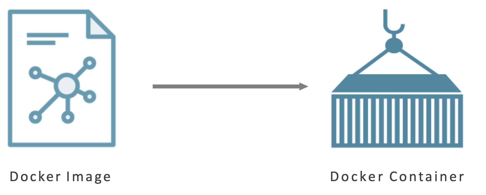
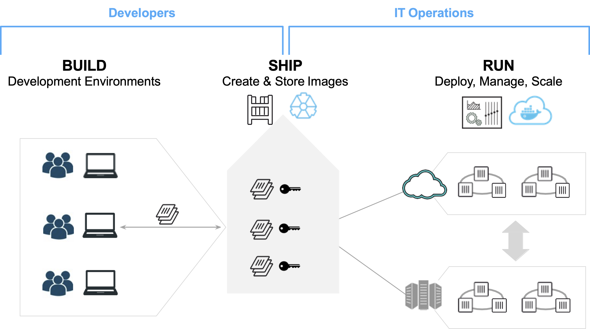
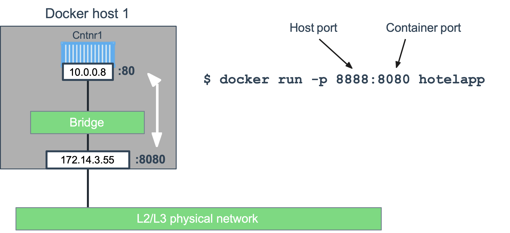

<span class="footnotesize">Source: https://github.com/collabnix/dockerlabs</span>

---

# Start a CloudLab experiment

- Go to your CloudLab dashboard
- Click on the Experiments tab
- Select Start Experiment
- Click on Change Profile
  - Select `multi-node-cluster` profile in the `UCY-CS499-DC` project
- Name your experiments with CloudLabLogin-ExperimentName
  - Prevents everyone from picking random names 

---

# What is Docker?


<div class="columns">

<div>



</div>

- Lightweight, open, secure platform

- Simplifies building, shipping, running apps

- Runs natively on Linux and Windows

- Runs on MacOS development machines (with a virtual machine)

- Relies on "images" and "containers"

<div>

</div>

---

# What is a Container?

<div class="columns">

<div>



</div>

- Standardized packaging for software and dependencies

- Isolate apps from each other

- Share the same OS kernel

  - and sometimes bins/libs

<div>

</div>

---

# The role of Images and Containers



<div class="columns">

<div class="center">

Example: Ubuntu with Go and application code

</div>

<div>

<div class="center">

Created by using an image. <br>Runs your application.

</div>

</div>

</div>

<!-- Image: standalone, executable package that includes everything needed to run
a piece of software (code, runtime libraries, configuration files). Provides the
filesystem and metadata (e.g. environment variables, initial working directory) for
a container.

Container: a process isolated from the rest of the system through abstractions
created by the OS. The level of isolation can be controlled, allowing access to
host resources. Its filesystem content comes from an image.

Container can be thought as the runtime instance of an image: what the image becomes in memory
when actually executed. -->

---

# Docker Containers are NOT Virtual Machines

- Easy connection to make

- Fundamentally different architectures

- Fundamentally different benefits

---

# Docker Containers vs. Virtual Machines


---

# Using Docker: Build, Ship, Run Workflow



---

# Some Docker vocabulary

- **Docker Image**
  The basis of a Docker container. Represents a full application

- **Docker Container**
  The standard unit in which the application service resides and executes

- **Docker Engine**
  Creates, ships and runs Docker containers deployable on a physical or  virtual, host locally, in a datacenter or cloud service provider

- **Registry Service**
  Cloud or server based storage and distribution service for your images
  Examples: Docker Hub (Public) or Docker Trusted Registry (Private)

---

# Basic Docker commands

```bash
$ docker image pull node:latest

$ docker image ls
$ docker container run –d –p 5000:5000 –-name node node:latest

$ docker container ps

$ docker container stop node(or <container id>)

$ docker container rm node (or <container id>)

$ docker image rmi (or <image id>)

$ docker build –t node:2.0 .

$ docker image push node:2.0

$ docker --help
```
---

# Our first containers

---

# Hello World

In your Docker environment, just run the following command:

```bash
$ docker run busybox echo hello world
hello world
```

(If your Docker install is brand new, you will also see a few extra lines, corresponding to the download of the busybox image.)

---

# That was our first container!

- We used one of the smallest, simplest images available: `busybox`.

- `busybox` is typically used in embedded systems (phones, routers...)

- We ran a single process and echo'ed `hello world`.

---

# A more useful container

Let's run a more exciting container:

```
$ docker run -it ubuntu
root@04c0bb0a6c07:/#
```

- This is a brand new container

- It runs a bare-bones, no-frills `ubuntu` system

- `-it` is shorthand for `-i -t`.

  - `-i` tells Docker to connect us to the container's stdin

  - `-t` tells Docker that we want a pseudo-terminal

---

# Do something in our container

Try to run `figlet` in our container.

```
root@04c0bb0a6c07:/# figlet hello
bash: figlet: command not found
```

Alright, we need to install it.

---

# Install a package in our container

We want `figlet`, so let's install it:

```
root@04c0bb0a6c07:/# apt-get update
...
Fetched 1514 kB in 14s (103 kB/s)
Reading package lists... Done
```

```
root@04c0bb0a6c07:/# apt-get install figlet
Reading package lists... Done
...
```

One minute later, `figlet` is installed!

---

# Try to run our freshly installed program

The `figlet` program takes a message as parameter.

```
root@04c0bb0a6c07:/# figlet hello
 _          _ _       
| |__   ___| | | ___  
| '_ \ / _ \ | |/ _ \ 
| | | |  __/ | | (_) |
|_| |_|\___|_|_|\___/
```

Beautiful! 😍

---

# Counting packages in the container

Let's check how many packages are installed there.

```
root@04c0bb0a6c07:/# dpkg -l | wc -l
190
```

- `dpkg -l` lists the packages installed in our container

- `wc -l` counts them

How many packages do we have on our host?

---

# Counting packages on the host

Exit the container by logging out of the shell, like you would usually do

(E.g. with ^D or exit)

```
root@04c0bb0a6c07:/# exit
```

Now, try to:

- run `dpkg -l | wc -l`. How many packages are installed?

- run `figlet`. Does that work?

---

# Host and containers are independent things

- We ran an `ubuntu` container on an `ubuntu` host

- But they have different, independent packages

- Installing something on the host doesn't expose it to the container

- And vice-versa

- We can run *any container on any host*

---

# Where's our container?

- Our container is now in a stopped state

- It still exists on disk, but all compute resources have been freed up

- We will see later how to get back to that container

---

# Starting another container

What if we start a new container, and try to run figlet again?

```
$ docker run -it ubuntu
root@b13c164401fb:/# figlet
bash: figlet: command not found
```

- We started a *brand new container*

- The basic Ubuntu image was used, and `figlet` is not here

<!-- - We will see in the next chapters how to bake a custom image with `figlet`. -->

---

# Background containers

---

# Objectives

Our first containers were interactive.

We will now see how to:

- Run a non-interactive container
- Run a container in the background
- List running containers
- Check the logs of a container
- Stop a container
- List stopped containers

---

# A non-interactive container

We will run a small custom container

This container just displays the time every second

```
$ docker run jpetazzo/clock
Fri Feb 20 00:28:53 UTC 2015
Fri Feb 20 00:28:54 UTC 2015
Fri Feb 20 00:28:55 UTC 2015
...
```

- This container will run forever
- To stop it, press `^C`
- Docker has automatically downloaded the image `jpetazzo/clock`
- This image is a user image, created by `jpetazzo`
- We will hear more about user images (and other types of images) later

---

# Run a container in the background

Containers can be started in the background, with the -d flag (daemon mode):

```
$ docker run -d jpetazzo/clock
47d677dcfba4277c6cc68fcaa51f932b544cab1a187c853b7d0caf4e8debe5ad
```

- We don't see the output of the container
- But don't worry: Docker collects that output and logs it!
- Docker gives us the ID of the container

---

# How can we check that our container is still running?

With `docker ps`, just like the UNIX `ps` command, lists running processes.

```
$ docker ps
CONTAINER ID  IMAGE           ...  CREATED        STATUS        ...
47d677dcfba4  jpetazzo/clock  ...  2 minutes ago  Up 2 minutes  ...
```

Docker tells us:
- The (truncated) ID of our container
- The image used to start the container
- That our container has been running (`Up`) for a couple of minutes
- Other information (COMMAND, PORTS, NAMES) that we will explain later

---

# Starting more containers

Let's start two more containers.

```
$ docker run -d jpetazzo/clock
57ad9bdfc06bb4407c47220cf59ce21585dce9a1298d7a67488359aeaea8ae2a
```

```
$ docker run -d jpetazzo/clock
068cc994ffd0190bbe025ba74e4c0771a5d8f14734af772ddee8dc1aaf20567d
```

Check that docker ps correctly reports all 3 containers.

---

# View only the IDs of the containers

Many Docker commands will work on container IDs: `docker stop`, `docker rm`...

If we want to list only the IDs of our containers (without the other columns or the header line), we can use the `-q` ("Quiet", "Quick") flag:

```
$ docker ps -q
068cc994ffd0
57ad9bdfc06b
47d677dcfba4
```

---

# View the logs of a container

We told you that Docker was logging the container output.

Let's see that now.

```
$ docker logs 47d
Fri Feb 20 00:39:52 UTC 2015
Fri Feb 20 00:39:53 UTC 2015
...
```

- We specified a *prefix* of the full container ID
- You can, of course, specify the full ID
- The `logs` command will output the *entire* logs of the container
  (Sometimes, that will be too much. Let's see how to address that.)

---

# Stop our container

There are two ways we can terminate our detached container.

- Killing it using the `docker kill` command
- Stopping it using the `docker stop` command

The first one stops the container immediately, by using the `KILL` signal

The second one is more graceful. It sends a `TERM` signal, and after 10 seconds, if the container has not stopped, it sends `KILL`

Reminder: the `KILL` signal cannot be intercepted, and will forcibly terminate the container

---

# Stopping our containers

Let's stop one of those containers:

```
$ docker stop 47d6
47d6
```

This will take 10 seconds:

- Docker sends the `TERM` signal
- the container doesn't react to this signal (it's a simple Shell script with no special signal handling)
- 10 seconds later, since the container is still running, Docker sends the `KILL` signal
- this terminates the container

---

# Killing the remaining containers

Let's be less patient with the two other containers:

```
$ docker kill 068 57ad
068
57ad
```

The `stop` and `kill` commands can take multiple container IDs

Those containers will be terminated immediately (without the 10 seconds delay)

Let's check that our containers don't show up anymore:

```
$ docker ps
```

---

# List stopped containers

We can also see stopped containers, with the -a (--all) option.

```
$ docker ps -a
CONTAINER ID  IMAGE           ...  CREATED      STATUS
068cc994ffd0  jpetazzo/clock  ...  21 min. ago  Exited (137) 3 min. ago
57ad9bdfc06b  jpetazzo/clock  ...  21 min. ago  Exited (137) 3 min. ago
47d677dcfba4  jpetazzo/clock  ...  23 min. ago  Exited (137) 3 min. ago
5c1dfd4d81f1  jpetazzo/clock  ...  40 min. ago  Exited (0) 40 min. ago
b13c164401fb  ubuntu          ...  55 min. ago  Exited (130) 53 min. ago
```

---

# Restarting and attaching to containers

---

# Restarting and attaching to containers

We have started containers in the foreground, and in the background.

We will see how to:

- Put a container in the background
- Attach to a background container to bring it to the foreground
- Restart a stopped container

---

# Background and foreground

The distinction between foreground and background containers is arbitrary

From Docker's point of view, all containers are the same

All containers run the same way, whether there is a client attached to them or not

It is always possible to detach from a container, and to reattach to a container

Analogy: attaching to a container is like plugging a keyboard and screen to a physical server

---

# Detaching from a container

- If you have started an *interactive container* (with option `-it`), you can detach from it

- The "detach" sequence is `^P^Q`

- Otherwise you can detach by killing the Docker client

  (But not by hitting `^C`, as this would deliver `SIGINT` to the container)

What does `-it` stand for?

- `-t` means "allocate a terminal"
- `-i` means "connect stdin to the terminal"

---

# Attaching to a container

You can attach to a container:

```
$ docker attach <containerID>
```

- The container must be running
- There can be multiple clients attached to the same container

---

# Detaching from non-interactive containers

- **Warning**: if the container was started without `-it`...
  - You won't be able to detach with `^P^Q`
  - If you hit `^C`, the signal will be proxied to the container

- Remember: you can always detach by killing the Docker client.

---

# Checking container output

Use `docker attach` if you intend to send input to the container

If you just want to see the output of a container, use `docker logs`

```bash
$ docker logs --tail 1 --follow <containerID>
```

---

# Restarting a container

When a container has exited, it is in stopped state.

It can then be restarted with the `start` command.

```bash
$ docker start <yourContainerID>
```

The container will be restarted using the same options you launched it with.

---

# Understanding Docker images
---

# Understanding Docker images

We will explain:

- What is an image

- What is a layer

- How to search and download images

---

# What is an image?

<div class="columns">

<div style="font-size: 24px">

- Image = files + metadata
- These files form the root filesystem of our container.
- The metadata can indicate a number of things, e.g.:
  - the author of the image
  - the command to execute in the container when starting it
  - environment variables to be set
  - etc.
- Images are made of layers, conceptually stacked on top of each other
- Each layer can add, change, and remove files and/or metadata
- Images can share layers to optimize disk usage, transfer times, and memory use

</div>


<div>

</div>

---

# Differences between containers and images

- An image is a read-only filesystem.

- A container is an encapsulated set of processes running in a read-write copy of that filesystem.

- To optimize container boot time, copy-on-write is used instead of regular copy.

- `docker run` starts a container from a given image.

<!-- Let's give a couple of metaphors to illustrate those concepts. -->

---

# Wait a minute...

If an image is read-only, how do we change it?

- We don't

- We create a new container from that image

- Then we make changes to that container

- When we are satisfied with those changes, we transform them into a new layer

- A new image is created by stacking the new layer on top of the old image

---

# Images namespaces

There are three namespaces:

- Official images

    e.g. `ubuntu`, `busybox` ...

- User (and organizations) images

    e.g. `jpetazzo/clock`

- Self-hosted images

    e.g. `registry.example.com:5000/my-private/image`

Let's explain each of them.

---

# Root namespace

The root namespace is for official images.

They are gated by Docker Inc.

They are generally authored and maintained by third parties.

Those images include:

- Small, "swiss-army-knife" images like busybox.

- Distro images to be used as bases for your builds, like ubuntu, fedora...

- Ready-to-use components and services, like redis, postgresql...

- Over 150 at this point!

---

# User namespace

The user namespace holds images for Docker Hub users and organizations.

For example:

```bash
jpetazzo/clock
```

The Docker Hub user is:

```bash
jpetazzo
```

The image name is:

```bash
clock
```

---

# Self-hosted namespace

This namespace holds images which are not hosted on Docker Hub, but on third
party registries.

They contain the hostname (or IP address), and optionally the port, of the
registry server.

For example:

```bash
localhost:5000/wordpress
```

* `localhost:5000` is the host and port of the registry
* `wordpress` is the name of the image

---

# How do you store and manage images?

Images can be stored:

* On your Docker host
* In a Docker registry

You can use the Docker client to download (pull) or upload (push) images

To be more accurate: you can use the Docker client to tell a Docker Engine
to push and pull images to and from a registry

---

# Showing current images

Let's look at what images are on our host now.

```bash
$ docker images
REPOSITORY       TAG       IMAGE ID       CREATED         SIZE
ubuntu           latest    07c86167cdc4   4 days ago      188 MB
busybox          latest    3240943c9ea3   2 weeks ago     1.114 MB
jpetazzo/clock   latest    12068b93616f   12 months ago   2.433 MB
```

---

# Searching for images

We cannot list *all* images on a remote registry, but
we can search for a specific keyword:

```bash
$ docker search marathon
NAME                     DESCRIPTION                     STARS  OFFICIAL  AUTOMATED
mesosphere/marathon      A cluster-wide init and co...   105              [OK]
mesoscloud/marathon      Marathon                        31               [OK]
mesosphere/marathon-lb   Script to update haproxy b...   22               [OK]
tobilg/mongodb-marathon  A Docker image to start a ...   4                [OK]
```


- "Stars" indicate the popularity of the image.

- "Official" images are those in the root namespace.

- "Automated" images are built automatically by the Docker Hub.
  <br/>(This means that their build recipe is always available.)

---

# Downloading images

There are two ways to download images.

- Explicitly, with `docker pull`.

- Implicitly, when executing `docker run` and the image is not found locally.

---

# Pulling an image

```bash
$ docker pull debian:jessie
Pulling repository debian
b164861940b8: Download complete
b164861940b8: Pulling image (jessie) from debian
d1881793a057: Download complete
```

- As seen previously, images are made up of layers.

- Docker has downloaded all the necessary layers.

- In this example, `:jessie` indicates which exact version of Debian
  we would like.

  It is a *version tag*.

---

# Image and tags

- Images can have tags.

- Tags define image versions or variants.

- `docker pull ubuntu` will refer to `ubuntu:latest`.

- The `:latest` tag is generally updated often.

---

# When to (not) use tags

Don't specify tags:

- When doing rapid testing and prototyping.
- When experimenting.
- When you want the latest version.

Do specify tags:

- When recording a procedure into a script.
- When going to production.
- To ensure that the same version will be used everywhere.
- To ensure repeatability later.

This is similar to what we would do with `pip install`, `npm install`, etc.

---

# Building Docker images with a Dockerfile

---

# Building Docker images with a Dockerfile

We will build a container image automatically, with a `Dockerfile`

You will:

- Write a `Dockerfile`

- Build an image from a `Dockerfile`

---

# `Dockerfile` overview

- A `Dockerfile` is a build recipe for a Docker image

- It contains a series of instructions telling Docker how an image is constructed

- The `docker build` command builds an image from a `Dockerfile`

---

# Writing our first `Dockerfile`

Our Dockerfile must be in a **new, empty directory**

1. Create a directory to hold our `Dockerfile`

```bash
$ mkdir myimage
```

2. Create a `Dockerfile` inside this directory

```bash
$ cd myimage
$ vim Dockerfile
```

Of course, you can use any other editor of your choice

---

# Type this into our Dockerfile...

```dockerfile
FROM ubuntu
RUN apt-get update
RUN apt-get install figlet
```

- `FROM` indicates the base image for our build.

- Each `RUN` line will be executed by Docker during the build.

- Our `RUN` commands **must be non-interactive.**
  <br/>(No input can be provided to Docker during the build.)

- In many cases, we will add the `-y` flag to `apt-get`.

---

# Build it!

Save our file, then execute:

```bash
$ docker build -t figlet .
```

- `-t` indicates the tag to apply to the image.

- `.` indicates the location of the *build context*.

We will talk more about the build context later.

To keep things simple for now: this is the directory where our Dockerfile is located.

---

# What happens when we build the image?

The output of docker build looks like this:

```
$ docker build -t figlet .
Sending build context to Docker daemon 2.048 kB
Sending build context to Docker daemon 
Step 0 : FROM ubuntu
 ---> e54ca5efa2e9
Step 1 : RUN apt-get update
 ---> Running in 840cb3533193
 ---> 7257c37726a1
Removing intermediate container 840cb3533193
Step 2 : RUN apt-get install figlet
 ---> Running in 2b44df762a2f
 ---> f9e8f1642759
Removing intermediate container 2b44df762a2f
Successfully built f9e8f1642759
```

- The output of the RUN commands has been omitted.

---

# Running the image

The resulting image is not different from the one produced manually

```
$ docker run -ti figlet
root@91f3c974c9a1:/# figlet hello
 _          _ _       
| |__   ___| | | ___  
| '_ \ / _ \ | |/ _ \ 
| | | |  __/ | | (_) |
|_| |_|\___|_|_|\___/
```

Yay! 🎉

---

# Deploying Web Applications with Docker 

---

# Deploying Web Applications with Docker 

We will deploy a container of Hotel Map

You will:

- Write a `Dockerfile`

- Build an image from a `Dockerfile`

- Run your image as a container

---

# Clone the Hotel Map repo

```
$ git clone https://github.com/ucy-coast/cs499-fa22.git
$ cd cs499-fa22/labs/06-docker/hotel-app
```

---

# Write Hotel Map Dockerfile 

```dockerfile
FROM golang:1.18.4

# set a build-time variable 
ARG DB=memdb

# set a working directory for the app
WORKDIR /go/src/github.com/ucy-coast/hotel-app

# copy all the files to the container
COPY . .

# build and install app
RUN go mod init github.com/ucy-coast/hotel-app
RUN go mod tidy
RUN go install -tags ${DB} -ldflags="-s -w" ./cmd/...

# define the port number the container should expose
EXPOSE 8080

# run the command
CMD ["mono"]
```

<!-- ``EXPOSE`` specifies the port number that needs to be exposed

``CMD`` tells the container which command it should run when it is started  -->

---

# Build Hotel Map image

```
$ docker build -t hotelapp .
Step 1/7 : FROM golang:1.18.4
1.18.4: Pulling from library/golang
Digest: sha256:8a62670f5902989319c4997fe21ecae7fe5aaec8ee44e4e663cfed0a3a8172fc
Status: Downloaded newer image for golang:1.18.4
 ---> e3c0472b1b62
Step 2/7 : ARG DB=memdb
...
```

---

# Run Hotel Map container

```
$ docker run -p 8888:8080 hotelapp
time="2022-08-10T13:15:50Z" level=info msg="Start Frontend server. Addr: 0.0.0.0:8080"
```

Exposes port 8080 of the server inside the container externally on port 8888

---

# Docker Bridge Networking and Port Mapping



---

# Visit Hotel Map

```
http://c220g1-030621.wisc.cloudlab.us:8888
```

<span style="font-size: 24px">Note: `c220g1-030621.wisc.cloudlab` is the public URL of `node0`</span>

