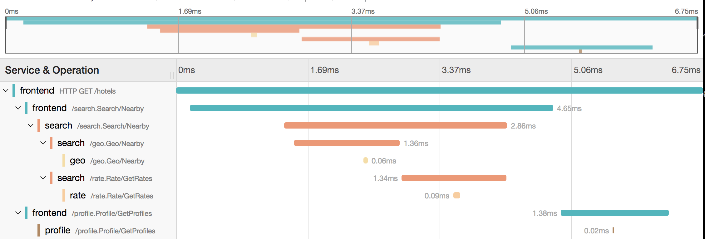

# Lab: Deploying Microservices with Go and Docker Compose

This tutorial takes a hands-on look at microservices using Go and Docker Compose. You'll learn how Go and gRPC can be used to quickly prototype and build microservices, as well as how to use Docker Compose to host and deploy them. Each module contains some background information on major concepts and includes an interactive online tutorial. The tutorial decomposes the Hotel Map application into multiple microservices.

## Microservices 

[Microservices](https://martinfowler.com/articles/microservices.html) is an architectural style and pattern that structures an application as a collection of coherent services. Each service is highly maintainable, testable, loosely coupled, independently deployable, and precisely focused.

[Docker Compose](https://github.com/docker/compose) is a tool for running multi-container applications on Docker. 

[gRPC](https://grpc.io/) a modern open source high performance Remote Procedure Call (RPC) framework that can run in any environment. It can efficiently connect services in and across data centers with pluggable support for load balancing, tracing, health checking and authentication. See [Introduction to gRPC](https://grpc.io/docs/what-is-grpc/introduction/) for an introduction to gRPC and protocol buffers.

## Splitting HotelMap into Microservices

We split Hotel Map into five microservices and corresponding containers:

1. `frontend`: Exposes an HTTP server to serve the website.
1. `search`: Finds nearby hotels available during given time periods.
1. `geo`: Provides all hotels within a given distance.
1. `profile`: Returns the profile for a given hotel.
1. `rate`: Returns rates for hotels available during given time periods.

The diagram below shows the interactions between the five microservices.

<figure>
  <p align="center"></p>
  <figcaption><p align="center">Figure. Hotel Map application structure</p></figcaption>
</figure>

As in the monolith app, the `frontend` serves incoming requests by glueing functionality provided by the rest of the microservices. However, communication is through remote procedure calls (RPC) instead of local function calls.

## Part 1: Deploying and Running Hotel Map Microservices with Docker Compose

If you haven't already, please go ahead and clone the repository locally like so:

```
$ git clone git@github.com:ucy-coast/cs499-fa22.git
$ cd cs499-fa22/labs/07-compose/hotelapp
```

### Defining Services

The directory contains a `docker-compose.yml` file, defined using the Docker Compose file format. 
A Compose file is used to define how the one or more containers that make up your application are configured. 

Let's now have a quick look at the `docker-compose.yml` file:

```yaml
version: "3"
services:
  frontend:
    build: .
    image: ${REGISTRY-127.0.0.1:5000}/hotel_app_frontend_single_node_memdb
    entrypoint: frontend
    container_name: 'hotel_app_frontend'
    ports:
      - "8080:8080"
    restart: always

  profile:
    build: .
    image: ${REGISTRY-127.0.0.1:5000}/hotel_app_profile_single_node_memdb
    entrypoint: profile
    container_name: 'hotel_app_profile'
    ports:
      - "8081:8081"
    restart: always

  search:
    build: .
    image: ${REGISTRY-127.0.0.1:5000}/hotel_app_search_single_node_memdb
    entrypoint: search
    container_name: 'hotel_app_search'
    ports:
      - "8082:8082"
    restart: always

  geo:
    build: .
    image: ${REGISTRY-127.0.0.1:5000}/hotel_app_geo_single_node_memdb
    container_name: 'hotel_app_geo'
    entrypoint: geo
    ports:
      - "8083:8083"
    restart: always

  rate:
    build: .
    image: ${REGISTRY-127.0.0.1:5000}/hotel_app_rate_single_node_memdb
    container_name: 'hotel_app_rate'
    entrypoint: rate
    ports:
      - "8084:8084"
    restart: always

  jaeger:
      image: jaegertracing/all-in-one:latest
      container_name: 'hotel_app_jaeger'
      ports:
        - "14269"
        - "5778:5778"
        - "14268:14268"
        - "14267"
        - "16686:16686"
        - "5775:5775/udp"
        - "6831:6831/udp"
        - "6832:6832/udp"
      restart: always
```

The compose file defines a bunch of services each of them corresponding to one container. For each service, it specifies the following:
- `build`: Specifies the directory containing the Dockerfile that builds the profile image.
- `image`: Specifies the image to start the container from. Since the service specifies an `image` as well as `build`, Docker Compose names the built image with the name specified in image.
- `entrypoint`: Sets the command and parameters that will be executed first when a container is run.
- `container_name`: Sets the actual name of the container when it runs, rather than letting Docker Compose generate it. 
- `ports`: Exposes specified container ports.
- `restart`: Specifies the container restart policy.

For each service, we can have an image statement and/or a build statement. An image statement specifies the image to start the container from. For example, we have a jaeger service that uses an existing image `jaegertracing/all-in-one:latest` from a container registry. A build statement specifies the build configuration for creating container image from source, using a Dockerfile contained in the directory indicated by the build statement. For example, for the `frontend` service, we have a `build: .`, which means the current working directory contains a Dockerfile that specifies how to build the `frontend` image. When the service specifies an image as well as a build, Docker Compose names the built image with the name specified in image. For example, for the `frontend` service, we have an `image: hotel_app_frontend_single_node_memdb` in addition to `build: .`, which means Docker Compose will name the built image as `hotel_app_frontend_single_node_memdb`.

The `frontend`, `search`, `geo`, `rate`, and `profile` services correspond to our application microservices.

The `jaeger` service creates a distributed tracing backend based on [Jaeger](https://www.jaegertracing.io/) that receives telemetry data from our microservices. 

Both name of the service (`profile`) and the name of the container (`hotel_app_profile`) are usable as DNS names for inter-container communication.

Once you have a Compose file, you can create and start your application with a single command `docker-compose up`.  

### Deploying and Running Services 

For now, we will use prebuilt images of the microservices available through DockerHub. 

Define the environment variable `REGISTRY`:

```
export REGISTRY=hvolos01
```

Then, pull the images like so:

```
docker-compose pull
```

We are now ready to run our app by invoking:

```
docker-compose up
```

Compose tells Docker to start all the containers and displays aggregated logs.

```
Creating hotel_app_search ... 
Creating hotel_app_profile ... 
...
Attaching to hotel_app_search, hotel_app_rate, hotel_app_geo, hotel_app_profile, hotel_app_frontend, hotel_app_jaeger
hotel_app_search | 2022/08/04 08:48:54 Connect to geo:8083
hotel_app_search | 2022/08/04 08:48:54 Connect to rate:8084
hotel_app_rate | 2022/08/04 08:48:55 Start Rate server. Addr: 0.0.0.0:8084
hotel_app_search | 2022/08/04 08:48:54 Start Search server. Addr: 0.0.0.0:8082
...
hotel_app_frontend | time="2022-08-04T08:49:50Z" level=info msg="searchHandler [lat: 37.7749, lon: -122.4194, inDate: 2015-04-09, outDate: 2015-04-10]"
...
```

### Tracing Requests

While logs are exciting and fun, no one really enjoys reading them. The `jaeger` container exposes a web dashboard that you can use to view gRPC requests between services. To view the dashboard, open a web browser and connect to `node0` on port 16686:

```
http://node0:16686/search
```

Remember, the `nodeX` aliases are valid only on the nodes themselves, so you can either use the externally visible IP address or URL of your node available from the CloudLab dashboard.

<figure>
  <p align="center"></p>
  <figcaption><p align="center">Figure. Jaeger dashboard</p></figcaption>
</figure>

To view a trace, select a service and then click **Find Traces**. 

### Shutting Down the App

When we interrupt Compose (with ^C), it will politely ask the Docker Engine to stop the app.
The Docker Engine will send a TERM signal to the containers.
If the containers do not exit in a timely manner, the Engine sends a KILL signal.
So, stop the application by hitting ^C.
Some containers exit immediately, others take longer. 
The containers that do not handle SIGTERM end up being killed after a 10s timeout. 
If we are very impatient, we can hit ^C a second time!

## Part 2: Implementing the `profile` microservice

In the remaining of this lab, you will build your own images for the various microservices. We provide you with a partial implementation that you will need to complete. 

You will implement the `profile` service using Go and gRPC, and extend the `frontend` to call the new microservice. 

The code implementing each microservice is spread into two subdirectories, `/cmd` and `/internal`, following the [Standard Go Project Layout](https://github.com/golang-standards/project-layout). For the `profile` microservice, the code is split as follows:
- `/cmd/profile`: Contains the main microservice code.
- `/internal/profile`: Contains the private library code.

### Defining the gRPC service

Our first step is to define the gRPC service and the method request and response types using protocol buffers. 

To define a service, you specify a named service in your `.proto` file:

```
service Profile {
   ...
}
```

Then you define rpc methods inside your service definition, specifying their request and response types. gRPC lets you define four kinds of service method: a simple RPC, a server-side streaming RPC, a client-side streaming RPC, and a bidirectional streaming RPC.

With a simple RPC, the client sends a request to the server using the stub and waits for a response to come back, just like a normal function call.

Add the following to `internal/profile/proto/profile.proto`:

```proto
service Profile {
  rpc GetProfiles(Request) returns (Result);
}
```

Our `.proto` file will also contain protocol buffer message type definitions for all the request and response types used in our service methods.

Add the following to `internal/profile/proto/profile.proto`:

```proto
message Request {
  repeated string hotelIds = 1;
  string locale = 2;
}

message Result {
  repeated Hotel hotels = 1;
}

message Hotel {
  string id = 1;
  string name = 2;
  string phoneNumber = 3;
  string description = 4;
  Address address = 5;
  repeated Image images = 6;
}

message Address {
  string streetNumber = 1;
  string streetName = 2;
  string city = 3;
  string state = 4;
  string country = 5;
  string postalCode = 6;
  float lat = 7;
  float lon = 8;
}

message Image {
  string url = 1;
  bool default = 2;
}
```

### Generating client and server stubs

Next we need to generate the gRPC client and server interfaces from our .proto service definition. 

From the `internal/profile/proto` directory, run the following command:

```
protoc --go_out=plugins=grpc:. profile.proto
```

Running this command generates the `profile.pb.go` file, which contains all the protocol buffer code to populate, serialize, and retrieve request and response message types.

### Creating the server 

First let’s look at how we create a `Profile` server. 

There are two parts to making our `Profile` service do its job:

- Implementing the service interface generated from our service definition: doing the actual “work” of our service.
- Running a gRPC server to listen for requests from clients and dispatch them to the right service implementation.

In `internal/profile/profile.go` there is partial implementation of the `Profile` server. Let’s take a closer look and fill in the remaining implementation.

#### Implementing the interface

As you can see, our server has a `Profile` struct type that implements the generated `Server` interface:

```go
type Profile struct {
        ...
}
...

func (s *Profile) GetProfiles(ctx context.Context, req *pb.Request) (*pb.Result, error) {
        ...
}
```

Let’s implement `GetProfiles`, which just gets hotels from the client in a `Request` and returns the corresponding profiles from its database in a `Result`.

The method is passed a context object for the RPC and the client’s `Request` protocol buffer request. It returns a `Result` protocol buffer object with the response information and an error. In the method we populate the `Result` with the appropriate information, and then return it along with an nil error to tell gRPC that we’ve finished dealing with the RPC and that the `Result` can be returned to the client.

```go
func (s *Profile) GetProfiles(ctx context.Context, req *pb.Request) (*pb.Result, error) {
	var err error
	res := new(pb.Result)
	res.Hotels, err = s.dbsession.GetProfiles(req.HotelIds)
	return res, err
}
```

#### Running the gRPC server 

Once we’ve implemented all our methods, we also need to start up a gRPC server so that clients can actually use our service. The following snippet shows how we do this for our Profile service:

```go
func (s *Profile) Run() error {
	if s.port == 0 {
		return fmt.Errorf("server port must be set")
	}

	opts := []grpc.ServerOption{
		grpc.KeepaliveParams(keepalive.ServerParameters{
			Timeout: 120 * time.Second,
		}),
		grpc.KeepaliveEnforcementPolicy(keepalive.EnforcementPolicy{
			PermitWithoutStream: true,
		}),
		grpc.UnaryInterceptor(
			otgrpc.OpenTracingServerInterceptor(s.tracer),
		),
	}

	// Create an instance of the gRPC server
	srv := grpc.NewServer(opts...)

	// Register our service implementation with the gRPC server
	pb.RegisterProfileServer(srv, s)

	// Register reflection service on gRPC server.
	reflection.Register(srv)

	// Listen for client requests
	lis, err := net.Listen("tcp", fmt.Sprintf(":%d", s.port))
	if err != nil {
		log.Fatalf("failed to listen: %v", err)
	}

	// Accept and serve incoming client requests 
	log.Printf("Start Profile server. Addr: %s:%d\n", s.addr, s.port)
	return srv.Serve(lis)
```

To build and start a server, we:

1. Create an instance of the gRPC server using `grpc.NewServer(...)`.
2. Register our service implementation with the gRPC server.
3. Specify the port we want to use to listen for client requests using:
   `lis, err := net.Listen(...)`.
4. Call `Serve()` on the server with our port details to do a blocking wait until the process is killed or `Stop()` is called.

### Creating the client

In this section, we’ll look at creating a Go client for our Profile service. We will extend the Frontend service to use our Profile service.

#### Creating a stub
To call service methods, we first need to create a gRPC channel to communicate with the server. We create this by passing the server address and port number to the dialer function `dialer.Dial()`. The function is provided by the local `dialer` package (`/pkg/dialer`) and it is just a wrapper around the `grpc.Dial()` function. 

Once the gRPC channel is setup, we need a client stub to perform RPCs. We get it using the `NewProfileClient` method provided by the profile proto buffer package generated from the `.proto` file.

```go
func (s *Frontend) initProfileClient() error {
	conn, err := dialer.Dial(s.profileAddr, s.tracer)
	if err != nil {
		return fmt.Errorf("did not connect to profile service: %v", err)
	}
	s.profileClient = profile.NewProfileClient(conn)
	return nil
}
```

#### Calling service methods
Now let’s look at how we call our service methods. Note that in gRPC-Go, RPCs operate in a blocking/synchronous mode, which means that the RPC call waits for the server to respond, and will either return a response or an error.

Calling the simple RPC `GetProfiles` is nearly as straightforward as calling a local method.

```go
// hotel profiles
profileResp, err := s.profileClient.GetProfiles(ctx, &profile.Request{
  HotelIds: searchResp.HotelIds,
  Locale:   locale,
})
if err != nil {
  http.Error(w, err.Error(), http.StatusInternalServerError)
  return
}
```

As you can see, we call the method on the stub we got earlier. In our method parameters we create and populate a request protocol buffer object (in our case `Request`). We also pass a `context.Context` object which lets us change our RPC’s behavior if necessary, such as time-out/cancel an RPC in flight. If the call doesn’t return an error, then we can read the response information from the server from the first return value and generate the JSON document:

```go
json.NewEncoder(w).Encode(geoJSONResponse(profileResp.Hotels))
```

### Building Images

Having completed the implementation of the `profile` service, the final step is to extend the `docker-compose.yml` file to build the `frontend` and `profile` service:

```yaml
  frontend:
    build: .
    image: hotel_app_frontend_single_node_memdb
    entrypoint: frontend
    container_name: 'hotel_app_frontend'
    ports:
      - "8080:8080"
    restart: always
```

```yaml
  profile:
    build: .
    image: hotel_app_profile_single_node_memdb
    entrypoint: profile
    container_name: 'hotel_app_profile'
    ports:
      - "8081:8081"
    restart: always
```

To ask Compose to build the `frontend` image:

```
docker-compose build frontend
```

To ask Compose to build the `profile` image:

```
docker-compose build profile
```

### Running Services

We are now ready to run our app by invoking:

```
docker-compose up
```
