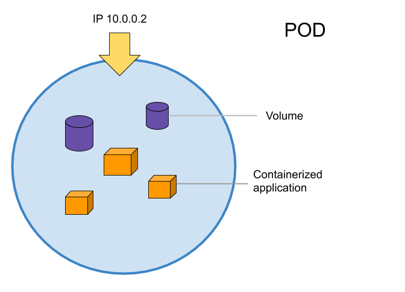

# Lab: Container Orchestration with Kubernetes

This tutorial provides a walkthrough of the basics of the Kubernetes cluster orchestration system.

## Background

With modern web services, users expect applications to be available 24/7, and developers expect to deploy new versions of those applications several times a day. Containerization helps package software to serve these goals, enabling applications to be released and updated without downtime. 

[Kubernetes](https://kubernetes.io/) (also known as k8s or “kube”) is a production-ready, open source container orchestration platform that automates many of the manual processes involved in deploying, managing, and scaling containerized applications. Kubernetes is designed with Google's accumulated experience in container orchestration, combined with best-of-breed ideas from the community.

### Kubernetes Cluster Architecture  

Kubernetes coordinates a highly available cluster of computers that are connected to work as a single unit. Kubernetes allows you to deploy containerized applications to a cluster without tying them specifically to individual machines. Kubernetes automates the distribution and scheduling of application containers across a cluster in a more efficient way.

<figure>
  <p align="center"></p>
  <figcaption><p align="center">Figure. Kubernetes Architecture</p></figcaption>
</figure>

A Kubernetes cluster is divided into two components:
- *Control plane*: coordinates the cluster.
- *Nodes*: run your application workloads.

#### Control plane

The [control plane](https://kubernetes.io/docs/concepts/overview/components/#control-plane-components) is responsible for managing the cluster. The control plane coordinates all activities in your cluster, such as scheduling applications, maintaining applications' desired state, scaling applications, and rolling out new updates.

The control plane includes the following core Kubernetes components:

- *kube-apiserver*:	The API server is how the underlying Kubernetes APIs are exposed. This component provides the interaction for management tools, such as kubectl or the Kubernetes dashboard.
- *kube-controller-manager*: The Controller Manager oversees a number of smaller controllers that perform actions such as replicating pods and handling node operations.
- *etcd*:	To maintain the state of a Kubernetes cluster and configuration, the highly available etcd is a key value store within Kubernetes.
- *kube-scheduler*:	When you create or scale applications, the Scheduler determines what nodes can run the workload and starts them.

Control plane components can be run on any machine in the cluster. However, for simplicity, set up scripts typically start all control plane components on the same machine, and do not run user containers on this machine. See [Creating Highly Available clusters with kubeadm](https://kubernetes.io/docs/setup/production-environment/tools/kubeadm/high-availability/) for an example control plane setup that runs across multiple machines.

#### Nodes

A Kubernetes cluster consists of a set of worker machines, called [nodes](https://kubernetes.io/docs/concepts/architecture/nodes/), that run containerized applications. A worker node may be either a virtual or a physical machine, depending on the cluster. Each worker node is managed by the control plane. Every cluster has at least one worker node.

Each node runs the following components:

- *kubelet*: The Kubernetes agent that processes the orchestration requests from the control plane along with scheduling and running the requested containers.
- *kube-proxy*: Handles virtual networking on each node. The proxy routes network traffic and manages IP addressing for services and pods.
- *container runtime*: Allows containerized applications to run and interact with additional resources, such as the virtual network and storage. Docker is the default container runtime.

#### Putting it all together

The control plane manages the cluster and the nodes that are used to host the running applications.

When you deploy applications on Kubernetes, you tell the control plane to start the application containers. The control plane schedules the containers to run on the cluster's nodes. The nodes communicate with the control plane using the Kubernetes API, which the control plane exposes. End users can also use the Kubernetes API directly to interact with the cluster.

### Kunernetes Abstractions

Kubernetes uses different abstractions to represent the state of the system, such as pods, deployments, services, namespaces, and volumes.

#### Pods

A pod is a collection of containers sharing a network, acting as the basic unit of deployment in Kubernetes. All containers in a pod are scheduled on the same node.

Kubernetes uses pods to run an instance of your application. A pod represents a single instance of your application.

Pods typically have a 1:1 mapping with a container. In advanced scenarios, a pod may contain multiple containers. Multi-container pods are scheduled together on the same node, and allow containers to share related resources.

<figure>
  <p align="center"></p>
  <figcaption><p align="center">Figure. Kubernetes Pod</p></figcaption>
</figure>


#### Deployments

A deployment is a supervisor for pods, giving you fine-grained control over how and when a new pod version is rolled out as well as rolled back to a previous state.  

#### Services

A service is an abstraction for pods, providing a stable, so called virtual IP (VIP) address. While pods may come and go and with it their IP addresses, a service allows clients to reliably connect to the containers running in the pod using the VIP. The "virtual" in VIP means it is not an actual IP address connected to a network interface, but its purpose is purely to forward traffic to one or more pods. Keeping the mapping between the VIP and the pods up-to-date is the job of kube-proxy, a process that runs on every node, which queries the API server to learn about new services in the cluster.

<figure>
  <p align="center"></p>
  <figcaption><p align="center">Figure. Kubernetes Service</p></figcaption>
</figure>

#### Namespaces

Namespaces provide a scope for Kubernetes resources, carving up your cluster in smaller units. You can think of it as a workspace you're sharing with other users. Many resources such as pods and services are namespaced. Others, such as nodes, are not namespaced, but are instead treated as cluster-wide. As a developer, you'll usually use an assigned namespace, however admins may wish to manage them, for example to set up access control or resource quotas.

#### Volumes

A Kubernetes volume is essentially a directory accessible to all containers running in a pod. In contrast to the container-local filesystem, the data in volumes is preserved across container restarts. The medium backing a volume and its contents are determined by the volume type:  

## Prerequisites

### Creating a Kubernetes Test Cluster on CloudLab

If you already have a Kubernetes cluster that you will use, you can skip this step. Otherwise, please, start a new experiment on CloudLab using the `kubernetes` profile in the `UCY-CS499-DC` project. Note, it can take upwards of ten minutes for the cluster to fully initialize. Thank you for your patience! 

### Connecting to the Kubernetes Test Cluster

Great! You now have a running Kubernetes cluster in your online terminal. CloudLab started a set of machines for you, and a Kubernetes cluster is now running on those machines.

Connect via SSH to the manager (control-plane) node of the Kubernetes cluster with your CloudLab credentials. The manager node is the one whose hostname starts with `kube1`. You can use the list view tab in the CloudLab status page to find the identity of the manager node and the full ssh command line to connect to it. For example: 

```
ssh -p 22 alice@ms1019.utah.cloudlab.us
```

### Interacting with the Kubernetes Test Cluster

To interact with Kubernetes during this tutorial we’ll use the Kubernetes command-line tool, `kubectl`. 

Check that kubectl is configured to talk to your cluster, by running the `kubectl version` command:

```
kubectl version
```

You should see both the version of the client and as well as the server. 

You can also view the cluster details, by running the `kubectl cluster-info` command:

```
kubectl cluster-info
```

### Viewing your Personal Namespace

Namespaces isolate different applications on a Kubernetes cluster. In this tutorial, you will use a namespace created especially for you. 

Verify that your personal namespace has been created:

```
kubectl get namespaces | grep ${USER}
```

Verify that the kubectl's preferred namespace is set to your personal namespace:

```
kubectl config view --minify | grep namespace:
```

### Creating your Personal Namespace (Optional)

If your personal namespace has not been created and you have admin access, then you can create this namespace yourself. If you don’t have admin access to the kubernetes cluster, you cannot create this namespace yourself -- in that case please ask your instructor to create a namespace for you after they have given you kubernetes access.

To create a namespace, use `kubectl create namespace` command.

```
kubectl create namespace <insert-namespace-name-here>
```

Permanently save the namespace for all subsequent kubectl commands in that context.

```
kubectl config set-context --current --namespace=<insert-namespace-name-here>
```

## First contact with kubectl

To interact with Kubernetes during this tutorial we’ll use the Kubernetes command-line tool, `kubectl`. Kubectl communicates with a Kubernetes cluster's control plane using the Kubernetes API. We can use kubectl to deploy applications, inspect and manage cluster resources, and view logs. 

The most common operations can be done with the following kubectl commands:

- **kubectl get** - list resources
- **kubectl describe** - show detailed information about a resource
- **kubectl logs** - print the logs from a container in a pod
- **kubectl exec** - execute a command on a container in a pod
- **kubectl apply** -  apply a configuration to a resource by filename or stdin

### kubectl get nodes

To view the nodes in the cluster, run the ```kubectl get nodes``` command:

```
kubectl get nodes
```

This command shows all nodes that can be used to host our applications. Now we have only one node, and we can see that its status is ready (it is ready to accept applications for deployment).


## Running our first containers on Kubernetes

First things first: we cannot run a container. We are going to run a pod, and in that pod there will be a single container. In that container in the pod, we are going to run a simple `ping` command.

### Starting a simple pod

We can use `kubectl run` to start a single pod. We need to specify at least a *name* and the *image* we want to use. Optionally, we can specify the command to run in the pod.

Let's ping the address of `localhost`, the loopback interface:

```bash
kubectl run pingpong --image alpine ping 127.0.0.1
```

The output tells us that a Pod was created:

```
$ pod/pingpong created
```

Anything that the application would normally send to STDOUT becomes logs for the container within the Pod. We can retrieve these logs using the `kubectl logs` command.

Let's use the `kubectl logs` command to view our container's output. It takes a pod name as argument. Unless specified otherwise, it will only show logs of the first container in the pod.

View the result of our ping command:

```
kubectl logs pingpong
```

Using standalone pods is generally frowned upon except for quick testing, as there is nothing in place to monitor the health of the pod.

### Scaling our application

We can use `kubectl scale` to scale a workload. The command takes the type of resource and the desired number of replicas as arguments: `kubectl scale TYPE NAME --replicas=HOWMANY`

Let's try it on our Pod, so that we have more Pods!

```
kubectl scale pod pingpong --replicas=3
```

Alas, we get the following cryptic error:

```
Error from server (NotFound): the server could not find the requested resource
```

What's the meaning of that error? When we execute `kubectl scale THAT-RESOURCE --replicas=THAT-MANY`, it is like telling Kubernetes: go to `THAT-RESOURCE` and set the scaling button to position `THAT-MANY`. However, pods do not have a "scaling button". If we try to execute the `kubectl scale pod` command with `-v6`, we will see a PATCH request to /scale: that's the "scaling button". Technically it's called a subresource of the Pod.

As we see, we cannot "scale a Pod", although that's not completely true; we could give it more CPU/RAM. If we want more Pods, we need to create more Pods, that is execute `kubectl run` multiple times. There must be a better way!

There is a better way, indeed! We will create a ReplicaSet; a set of replicas is a set of identical pods. In fact, we will create a Deployment, which itself will create a ReplicaSet

Let's create a Deployment instead of a single Pod. 

```
kubectl create deployment pingpong --image=alpine -- ping 127.0.0.1
```

When you create the Deployment, pay attention to the `--`. The `--` is used to separate the "options/flags of `kubectl create` and the command to run in the container.

Let's check the resources that were created. When you run `kubectl get all`, you will notice that a total of three new objects have been created. 

```
kubectl get all
```

```
NAME                           READY   STATUS    RESTARTS   AGE
pod/pingpong                   1/1     Running   0          33s
pod/pingpong-fc7cf666d-5chdk   1/1     Running   0          7s

NAME                       READY   UP-TO-DATE   AVAILABLE   AGE
deployment.apps/pingpong   1/1     1            1           8s

NAME                                 DESIRED   CURRENT   READY   AGE
replicaset.apps/pingpong-fc7cf666d   1         1         1       8s
```

We have the following resources:
- `deployment.apps/pingpong`. This is the Deployment that we just created.
- `replicaset.apps/pingpong-xxxxxxxxxx`. This is a Replica Set created by this Deployment.
- `pod/pingpong-xxxxxxxxxx-yyyyy`. This is a pod created by the Replica Set.

When you created a Deployment, Kubernetes created a [Pod](https://kubernetes.io/docs/concepts/workloads/pods/) to host your application instance. A pod is a collection of containers sharing a network, acting as the basic unit of deployment in Kubernetes. All containers in a pod are scheduled on the same node. Our deployment controller manages a [ReplicaSet](https://kubernetes.io/docs/concepts/workloads/controllers/replicaset/), which it turn manages the pods, and ensures that the desired number are running.

Kubernetes Pods are mortal. Pods in fact have a lifecycle. When a worker node dies, the Pods running on the Node are also lost. A ReplicaSet might then dynamically drive the cluster back to desired state via creation of new Pods to keep your application running. As another example, consider an image-processing backend with 3 replicas. Those replicas are exchangeable; the front-end system should not care about backend replicas or even if a Pod is lost and recreated. That said, each Pod in a Kubernetes cluster has a unique IP address, even Pods on the same Node, so there needs to be a way of automatically reconciling changes among Pods so that your applications continue to function.

<figure>
  <p align="center"></p>
  <figcaption><p align="center">Figure. Deploying your first app on Kubernetes</p></figcaption>
</figure>

Let's try kubectl scale again, but on the Deployment. Scale our `pingpong` deployment:

```
kubectl scale deployment pingpong --replicas 3
```

Check that we now have multiple pods:

```
kubectl get pods
```

### Resilience

The deployment `pingpong` watches its replica set. The replica set ensures that the right number of pods are running. What happens if pods disappear?

In a separate window, watch the list of pods:
  
```
watch kubectl get pods
```

Destroy the pod currently shown by kubectl logs:

```
kubectl delete pod pingpong-xxxxxxxxxx-yyyyy
```

The command `kubectl delete pod` terminates the pod gracefully, meaning that it sends to the pod the TERM signal and waits for the pod to shutdown. 

As soon as the pod is in "Terminating" state, the Replica Set replaces it. But we can still see the output of the "Terminating" pod in `kubectl logs` until 30 seconds later, when the grace period expires. The pod is then killed, and `kubectl logs` exits

What happens if we delete a standalone pod, like the first `pingpong` pod that we created? Let's find out, delete the pod:

```
kubectl delete pod pingpong
```

We find that no replacement Pod gets created because there is no controller watching it. That's why we will rarely use standalone Pods in practice.

### Labels and selectors

[Labels and selectors](https://kubernetes.io/docs/concepts/overview/working-with-objects/labels) is a grouping primitive that allows logical operation on objects in Kubernetes. 

Labels are key/value pairs attached to objects and can be used in any number of ways:
- Designate objects for development, test, and production
- Embed version tags
- Classify an object using tags

Labels are arbitrary strings, with some limitations. The key must start and end with a letter or digit, can also have `.` `-` `_` (but not in first or last position), and can be up to 63 characters, or 253 + `/` + 63. The label *value* is up to 63 characters, with the same restrictions. 

Labels can be attached to objects at creation time or later on. They can be modified at any time. 

When we created the `pingpong` Deployment, the deployment creation generated automatically a label for our Deployment and related Pods. 

With `kubectl describe deployment` command, you can see the label for our deployment:

```
kubectl describe deployment pingpong
```

We see one label, `Labels: app=pingpong`, which is added by `kubectl create deployment`. 

With the `kubectl describe pod` command, you can see the label for our pods:

```
kubectl describe pod pingpong-xxxxxxxxxx-yyyyy
```

We see two labels:

```
Labels: app=pingpong
        pod-template-hash=xxxxxxxxxx
```

The `app=pingpong` label comes from `kubectl create deployment` too, while the `pod-template-hash` label was assigned by the Replica Set. 

We can use label selectors to identify a set of objects. A *selector* is an expression matching labels. It will restrict a command to the objects matching at least all these labels.

For example, we can list all the pods with at least `app=pingpong`:

```
kubectl get pods --selector=app=pingpong
```

We can also list all the pods with a label `app`, regardless of its value:

```
kubectl get pods --selector=app
```

You can do the same to list the existing deployments:

```
kubectl get deployments --selector=app=pingpong
```

To apply a new label, we use the `kubectl label` command followed by the object type, object name and the new label:

```
kubectl label deployment pingpong version=v1
```

This will apply a new label to our deployment (we pinned the application version to the Pod), and we can check it with the describe pod command:

```
kubectl describe deployment pingpong
```

We see here that the label is attached now to our deployments. And we can query now the list of deployments using the new label:

```
kubectl get deployments --selector=version=v1
```

`kubectl get` gives us a couple of useful flags to check labels. `kubectl get --show-labels` shows all labels. `kubectl get -L xyz` shows the value of label `xyz`

List all the labels that we have on pods:

```
kubectl get pods --show-labels
```

List the value of label app on these pods:

```
kubectl get pods -L app
```

If a selector has multiple labels, it means "match at least these labels", for example: `--selector=app=frontend,release=prod`

The `--selector` flag can be abbreviated as `-l` (for labels):

```
kubectl get pods -l=app=pingpong
```

We can also use negative selectors, for example: `--selector=app!=clock`

Selectors can be used with most `kubectl` commands. Examples: `kubectl delete`, `kubectl label`, ...


## Running Hotel Map on Kubernetes

Once you have a running Kubernetes cluster, you can deploy your containerized applications on top of it. To do so, you create a Kubernetes [Deployment](https://kubernetes.io/docs/concepts/workloads/controllers/deployment/) configuration. The Deployment instructs Kubernetes how to create and update instances of your application. Once you've created a Deployment, the Kubernetes control plane schedules the application instances included in that Deployment to run on individual Nodes in the cluster.

Once the application instances are created, a Kubernetes Deployment Controller continuously monitors those instances. If the Node hosting an instance goes down or is deleted, the Deployment controller replaces the instance with an instance on another Node in the cluster. This provides a self-healing mechanism to address machine failure or maintenance.

### Deploying our app

Let’s deploy our Hotel Map app on Kubernetes with the `kubectl create deployment` command. We need to provide the deployment name and app image location (include the full repository url for images hosted outside Docker hub). 

In previous labs, our multi-container application was running on a single node. We didn't need to ship images because we built and ran on the same machine node. However, now we want to run on a cluster, so we need to have the same image on all the nodes of the cluster, and therefore we need to ship these images. The easiest way to ship container images is to use a container registry. For now, we will use pre-built Hotel Map images available from DockerHub. We will later show you how you can build and ship your own images.

Let's create Deployments using the Hotel Map images available from DockerHub:

```
kubectl create deployment frontend --image=hvolos01/hotel_app_frontend_single_node_memdb:latest -- frontend
kubectl create deployment profile --image=hvolos01/hotel_app_frontend_single_node_memdb:latest -- profile
kubectl create deployment search --image=hvolos01/hotel_app_frontend_single_node_memdb:latest -- search
kubectl create deployment geo --image=hvolos01/hotel_app_frontend_single_node_memdb:latest -- geo
kubectl create deployment rate --image=hvolos01/hotel_app_frontend_single_node_memdb:latest -- rate
```

Pay attention to the `--`. The `--` is used to separate options/flags of `kubectl create` and command to run in the container.

If we wanted to deploy images from another registry or with a different tag, we could use the following snippet:

```bash
REGISTRY=hvolos01
TAG=latest
for SERVICE in frontend profile search geo rate; do
  kubectl create deployment $SERVICE --image=$REGISTRY/$SERVICE:$TAG -- ${SERVICE}
done
```

After waiting for the deployment to complete, let's look at the logs!

```
kubectl logs deploy/profile
kubectl logs deploy/frontend
```
 
### Exposing containers through services

Pods that are running inside Kubernetes are running on a private, isolated network. By default they are visible from other pods and services within the same kubernetes cluster, through their IP address. However, we then need to figure out a lot of things, including how to look up the IP address of the pod(s), how to connect from outside the cluster, how to load balance traffic, and how to handle pod failures. Kubernetes has a resource type named *Service*, which addresses all these questions!

A Service in Kubernetes is an abstraction which defines a logical set of Pods and a policy by which to access them. Services enable a loose coupling between dependent Pods. A Service is defined using YAML (preferred) or JSON, like all Kubernetes objects. The set of Pods targeted by a Service is usually determined by a LabelSelector (see below for why you might want a Service without including selector in the spec).

A Service routes traffic across a set of Pods. Services are the abstraction that allows pods to die and replicate in Kubernetes without impacting your application. Discovery and routing among dependent Pods (such as the frontend and backend components in an application) are handled by Kubernetes Services.

Although each Pod has a unique IP address, those IPs are not exposed outside the cluster without a Service. Services allow your applications to receive traffic. Services can be exposed in different ways by specifying a type in the ServiceSpec:

- ClusterIP (default) - Exposes the Service on an internal IP in the cluster. This type makes the Service only reachable from within the cluster.
- NodePort - Exposes the Service on the same port of each selected Node in the cluster using NAT. Makes a Service accessible from outside the cluster using \<NodeIP>:\<NodePort>. Superset of ClusterIP.
- LoadBalancer - Creates an external load balancer in the current cloud (if supported) and assigns a fixed, external IP to the Service. Superset of NodePort.
- ExternalName - Maps the Service to the contents of the externalName field (e.g. foo.bar.example.com), by returning a CNAME record with its value. No proxying of any kind is set up. This type requires v1.7 or higher of kube-dns, or CoreDNS version 0.0.8 or higher.

More information about the different types of Services can be found in the [Using Source IP](https://kubernetes.io/docs/tutorials/services/source-ip/) tutorial. Also see [Connecting Applications with Services](https://kubernetes.io/docs/concepts/services-networking/connect-applications-service/).

Additionally, note that there are some use cases with Services that involve not defining `selector` in the spec. A Service created without `selector` will also not create the corresponding Endpoints object. This allows users to manually map a Service to specific endpoints. Another possibility why there may be no selector is you are strictly using `type: ExternalName`.

#### Exposing services for internal access

To create a new service and expose it to internal traffic we’ll use the `kubectl expose` command with the right port as parameter.

```
kubectl expose deployment profile --port 8081
kubectl expose deployment search --port 8082
kubectl expose deployment geo --port 8083
kubectl expose deployment rate --port 8084
```

#### Exposing services for external access

To create a new service and expose it to external traffic we’ll use the expose command with NodePort as parameter.

Expose the `frontend` service:

```
kubectl expose deployment frontend --type="NodePort" --port 8080
```

Let’s list the current Services from our cluster:

```
kubectl get services
```

```
NAME       TYPE        CLUSTER-IP       EXTERNAL-IP   PORT(S)          AGE
frontend   NodePort    10.100.229.126   <none>        8080:31885/TCP   46m
geo        ClusterIP   10.105.199.248   <none>        8083/TCP         46m
profile    ClusterIP   10.109.223.198   <none>        8081/TCP         46m
rate       ClusterIP   10.103.137.111   <none>        8084/TCP         46m
search     ClusterIP   10.101.219.117   <none>        8082/TCP         46m
```

We have now five runnings services, all of which received a unique cluster-IP. We see that the `frontend` service received the external port 31885, in addition to a cluster-IP.

To find out what port was opened externally (by the NodePort option), we can also run the `describe service` command:

```
kubectl describe services/frontend
```

To connect to the service, we need the Public IP address of one of the worker nodes and the NodePort of the Service. You can use a bash processor called `jq` to parse JSON from command line.

```
export PUBLIC_HOSTNAME=$(kubectl get nodes -o wide -o json | jq -r '.items[0].status.addresses | .[] | select( .type=="Hostname" ) | .address ')
echo $PUBLIC_HOSTNAME

export NODE_PORT=$(kubectl get svc frontend --output json | jq -r '.spec.ports[0].nodePort' )
echo $NODE_PORT
```

We can now connect to the external IP address using the worker public hostname and allocated node port to view the web UI. Open the web UI in your browser at http://${PUBLIC_HOSTNAME}:${NODE_PORT}/

#### Deleting a service

To delete Services you can use the delete service command. 

```
kubectl delete service frontend
```

Confirm that the service is gone:

```
kubectl get services
```

This confirms that our `frontend` Service was removed. To confirm that route is not exposed anymore you can curl the previously exposed IP and port:

```
curl 10.10.1.1:$NODE_PORT
```

This proves that the app is not reachable anymore from outside of the cluster. You can confirm that the app is still running with a curl inside the pod:

```
kubectl exec -ti frontend-xxxxxxxxxx-yyyyy -- curl localhost:8080
```

We see here that the application is up. This is because the Deployment is managing the application. To shut down the `frontend`, you would need to delete the Deployment as well.

```
kubectl delete deployment frontend
```

## Deploying Hotel Map with YAML Manifests

So far, we created resources with the following commands: `kubectl run`, `kubectl create deployment`, and `kubectl expose`.

We can also create resources directly with manifests. A manifest is a YAML file that describes each component or resource of your deployment and the state you want your cluster to be in once applied.

When using YAML manifests, you can create resources with kubectl create or kubectl apply. 

`kubectl create` creates resources if they don't exist. If resources already exist, it doesn't alter them and displays an error message.

`kubectl apply` creates resources if they don't exist. If resources already exist, it updates them to match the definition provided by the YAML file.

### Create deployment

Let's create a deployment by defining a manifest file in the YAML format.

Create a YAML file `hotel-app-mono-deployment.yaml` for the hotel map application with the following configuration:

```yaml
apiVersion: apps/v1
kind: Deployment
metadata:
  name: hotel-app-mono-deployment
  labels:
    app: mono
spec:
  replicas: 3
  selector:
    matchLabels:
      app: mono
  template:
    metadata:
      labels:
        app: mono
    spec:
      containers:
        - name: hotel-app-mono
          image: hvolos01/hotel_app_mono_single_node
          command:
            - mono
          ports:
            - containerPort: 8080
```

In this example:
- A Deployment named `hotel-app-mono-deployment` is created, indicated by the `.metadata.name` field.
- The Deployment creates three replicated Pods, indicated by the `.spec.replicas` field.
- The `.spec.selector` field defines how the Deployment finds which Pods to manage. In this case, you select a label that is defined in the Pod template (`app: mono`). However, more sophisticated selection rules are possible, as long as the Pod template itself satisfies the rule.

  > **Note**: The `.spec.selector.matchLabels` field is a map of {key,value} pairs. A single {key,value} in the `matchLabels` map is equivalent to an element of `matchExpressions`, whose `key` field is "key", the `operator` is "In", and the `values` array contains only "value". All of the requirements, from both `matchLabels` and `matchExpressions`, must be satisfied in order to match.

- The template field contains the following sub-fields:
  - The Pods are labeled `app: mono` using the `.metadata.labels` field.
  - The Pod template's specification, or `.template.spec` field, indicates that the Pods run one container, `hotel-app-mono`, which runs the `hvolos01/hotel_app_mono_single_node` Docker Hub image.

Deploy the application on the workload cluster:

```
kubectl apply -f hotel-app-mono-deployment.yaml
```

### Create service

Let's create a service by defining a manifest file in the YAML format. 

Create a YAML file `hotel-app-mono-service.yaml` for the hotel map application with the following configuration. Replace EXTERNAL_IP with the IP address of the control node.

```yaml
apiVersion: v1 
kind: Service 
metadata:
  name: hotel-app-mono-service
  labels:
    app: mono
spec:
  type: NodePort 
  externalIPs:
    - EXTERNAL_IP  
  ports:
    - port: 8080
      targetPort: 8080
  selector:
    app: mono
```
  
Create a service object to expose the application’s external IP address so you can access the application from a browser:

```
$ kubectl apply -f hotel-app-service.yaml
```
  
## Shipping Images with a Registry

So far, we haved used container images available from DockerHub to deploy our Hotel Map app.

In this part, we will build images for our Hotel Map app, ship these images with a registry, and run deployments using these images. 

### Picking a registry to use

We need to choose a registry to use to ship our images. We can use Docker Hub or a service offered by a cloud provider (e.g., GCR, ECR). Alternatively, we can choose to self-host the registry as a more generic solution. 

#### Option 1: Using Docker Hub

You need to login with your Docker ID to push and pull images from Docker Hub:

```
$ docker login
Login with your Docker ID to push and pull images from Docker Hub. If you don't have a Docker ID, head over to https://hub.docker.com to create one.
Username: *****
Password: *****
```

You also need to set the environment variable `REGISTRY` to the respective registry:

```
export REGISTRY=<registry>
```

#### Option 2: Deploying a self-hosted registry

To run our own local registry it's pretty easy, we just need to run the `registry` container. By default, it will store the image layers on the local file system. If we want a production rate deployment we can just add a small config file that will define a storage back-end for the registry such as Amazon S3 or Google Object Store. 

By default, Docker requires TLS when communicating with the registry. TLS ensures authenticity of the registry endpoint and that traffic to/from registry is encrypted. 
Docker makes an exception to the TLS rule when you connect to a local host, as there is no risk for someone remote to snoop traffic that's going to local host. Therefore, we will publish the registry container on a NodePort, so that's available through 127.0.0.1:XXXXX on each node.

> **Note**: Since CloudLab experiments are ephemeral, any persistent state stored on the local file system of our CloudLab cluster including our self-hosted registry is lost when the experiment is terminated.

To deploy our local registry, we first create the registry service:

```bash
kubectl create deployment registry --image=registry
```

And then expose it on a NodePort:

```bash
kubectl expose deploy/registry --port=5000 --type=NodePort
```

To avoid hardcoding the registry address and port in our application configuration files, a convenient way is to get the port number programmatically:

```bash
export NODEPORT=$(kubectl get svc/registry -o json | jq .spec.ports[0].nodePort)
export REGISTRY=127.0.0.1:$NODEPORT
```

To test our registry, a convenient Docker registry API route to remember is `/v2/_catalog`. We can use this route to view the repositories currently held in our registry:

```bash
curl $REGISTRY/v2/_catalog
```

We should see:

```json
{"repositories":[]}
```

We can retag a small image, and push it to the registry. Make sure we have the busybox image, and retag it:

```bash
docker pull busybox
docker tag busybox $REGISTRY/busybox
```

Push it:

```bash
docker push $REGISTRY/busybox
```

Let's check again what's on our local registry using the same endpoint as before

```bash
curl $REGISTRY/v2/_catalog
```

The curl command should now show that our busybox image is now in the local registry:

```json
{"repositories":["busybox"]}
```

We now have a self-hosted container registry where we can upload our application container images. 

### Shipping images

Having chosen a container registry where we can upload our application container images, we are now going to build and ship our images. To that we are going to use a conventient feature of Docker Compose. Compose can easily build, tag, and push all the images for us with just two commands:

```bash
export REGISTRY
export TAG=v0.1
docker-compose -f docker-compose.yml build
docker-compose -f docker-compose.yml push
```

While Docker Compose is building and pushing these images, let's have a look at the `docker-compose.yml` file. Just in case you are wondering, Docker services below are not Kubernetes services.

```yaml
version: "3"

services:
  frontend:
    build: .
    image: ${REGISTRY-127.0.0.1:5000}/hotel_app_frontend_single_node_memdb
    entrypoint: frontend
    container_name: 'hotel_app_frontend'
    ports:
      - "8080:8080"
    restart: always
  ...
  jaeger:
    image: jaegertracing/all-in-one:latest
```

Here, for the image name we use standard Bash environment variable substitution syntax, so this means `$REGISTRY/frontend:$TAG`. If we don't set values for REGISTRY then by default we will use `127.0.0.1:5000`. Likewise, if we don't set a value for `$TAG`, we are going to use `latest`. In other words, with this Compose file, if you have a local registry on the default port 5000, you can just do `docker compose build` and `docker compose push` and it's going to build the images and push them to the local registry. If you are using another registry, you can just export the `REGISTRY` environment variable to the address of the registry, build, and push. If you want to use a different tag because for example you might want to tag your images with versions (e.g. v0.1), you just set the `TAG` environment variable, build, and push.

After the image build process finishes, run the `curl` command to check that all our images are in our local registry.

```bash
curl $REGISTRY/v2/_catalog
```

### Deploying containers

We provide YAML manifest templates with all the resources for the Hotel Map microservices. These templates include several configuration placeholders that can be set through environment variables.
 
To generate the YAML manifests:

```
kubernetes/envsubst.sh 
```

To apply the YAML manifests:

```
kubectl apply -f kubernetes
```