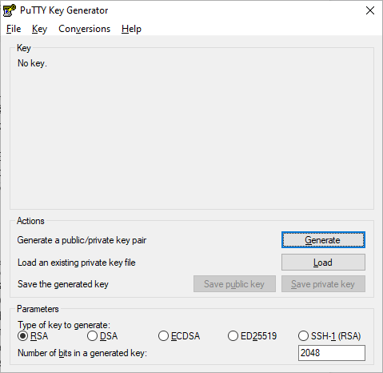
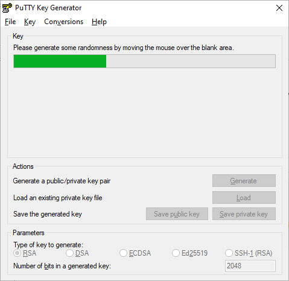
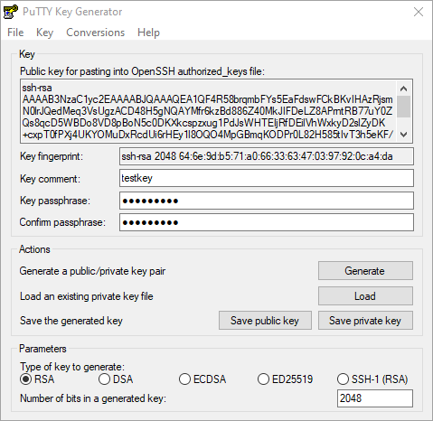
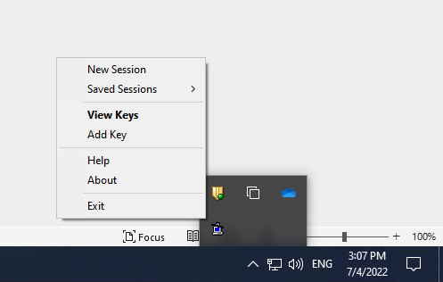
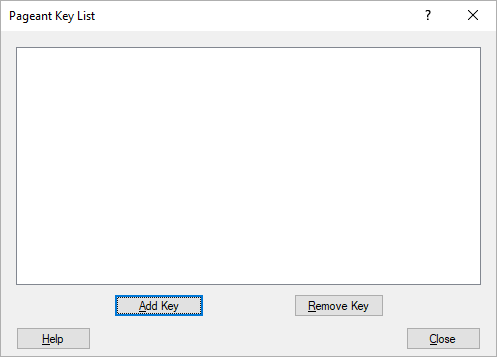
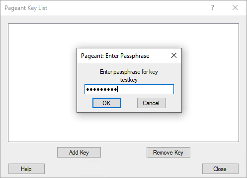

# Generating a new SSH key and adding it to pageant

After you've checked for existing SSH keys, you can generate a new SSH key to use for authentication, then add it to pageant.

## About SSH key generation

If you don't already have an SSH key, you must generate a new SSH key to use for authentication. If you're unsure whether you already have an SSH key, you can check for existing keys. For more information, see [Checking for existing SSH keys](existing-windows-putty.md).

If you don't want to reenter your passphrase every time you use your SSH key, you can add your key to the PuTTY authentication agent, which manages your SSH keys and remembers your passphrase.

## Generating a new SSH key

1. Open PuTTYgen.

<figure>
  

  <figcaption>
Figure. Initial PuTTYgen window.
</figcaption>
</figure>

2. Click the Generate button. You will be prompted to move the mouse over the blank area to generate some randomness. Do so. Shortly thereafter, the program will generate the key and display the result.

<figure>
  

  <figcaption>
Figure. While keys are being generated.
</figcaption>
</figure>

<figure>
  

  <figcaption>
Figure. After keys have been generated.
</figcaption>
</figure>

3. Enter a passphrase in the `Key passphrase` and `Confirm passphrase` boxes. 

For more information, see "Working with SSH key passphrases."

4. Click `Save private` key under `Actions / Save the generated key` to save the private key to a file. To adhere to file-naming conventions, you should give the private key file an extension of `.ppk` (PuTTY private key).

   > **Note**: The `.ppk` file extension indicates that the private key is in PuTTY's proprietary format. You must use a key of this format when using PuTTY as your SSH client. It cannot be used with other SSH client tools. Refer to the PuTTY documentation to convert a private key in this format to a different format.

4. Save the OpenSSH-compatible public key to a file. 

   - Select all of the characters under `Key / Public key for pasting into OpenSSH authorized_keys file`. 
     
     Make sure you select all the characters, not just the ones you can see in the narrow window. If a scroll bar is next to the characters, you aren't seeing all the characters.

   - Right-click somewhere in the selected text and select Copy from the menu.
   - Open a text editor and paste the characters, just as you copied them. Start at the first character in the text editor, and do not insert any line breaks.
   - Save the text file in the same folder where you saved the private key, using the `.pub` extension to indicate that the file contains a public key.

<figure>
  

  <figcaption>
Figure. Selecting the OpenSSH-compatible public key.
</figcaption>
</figure>

## Adding your SSH key to pageant

Pageant is a PuTTY authentication agent. It holds your private keys in memory so that you can use them whenever you are connecting to a server.

Before adding a new SSH key to pageant to manage your keys, you should have checked for existing SSH keys and generated a new SSH key.

1. Open pageant

   Pageant starts by default minimized in the system tray. To begin adding your SSH keys, you should right click on its icon and then the following context menu will show up:

<figure>
  

  <figcaption>
Figure. Pageant minimized in the system tray.
</figcaption>
</figure>

2. Click on View Keys to open up the Pageant Key List window. Here you can view, add, and remove keys:

<figure>
  

  <figcaption>
Figure. Initial pageant window
</figcaption>
</figure>

3. Click the Add Key button. This will open the file explorer, where you can choose a key to load. You should select a file with the `.ppk` extension, then click the Open button to load the key with Pageant.

4. After successfully adding a key, you can now see it listed:

<figure>
  

  <figcaption>
Figure. Entering passphrase
</figcaption>
</figure>

5. If a key is passphrase-protected, you will be prompted to enter the passphrase only once before it can be added to the Pageant Key List:

<figure>
  

  <figcaption>
Figure. Entering passphrase
</figcaption>
</figure>
