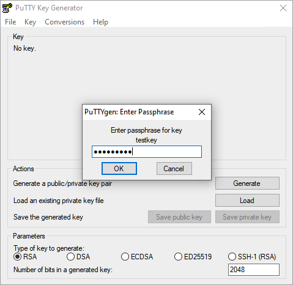

# Working with SSH key passphrases

You can secure your SSH keys and configure an authentication agent so that you won't have to reenter your passphrase every time you use your SSH keys.

With SSH keys, if someone gains access to your computer, they also gain access to every system that uses that key. To add an extra layer of security, you can add a passphrase to your SSH key. You can use pageant to securely save your passphrase so you don't have to reenter it.

## Adding or changing a passphrase

You can change the passphrase for an existing private key without regenerating the keypair.

1. Open PuTTYgen.

<figure>
  

  <figcaption>
Figure. Initial PuTTYgen window
</figcaption>
</figure>

2. Click the Load button. If your key is already password protected, then you will be prompted to enter the existing passphrase for the key.

<figure>
  

  <figcaption>
Figure. Entering existing passphrase.
</figcaption>
</figure>

3. Enter a new passphrase in the `Key passphrase` and `Confirm passphrase` boxes. 

<figure>
  

  <figcaption>
Figure. Entering new passphrase.
</figcaption>
</figure>

4. Click `Save private` key under `Actions / Save the generated key` to save the private key to a file. To adhere to file-naming conventions, you should give the private key file an extension of `.ppk` (PuTTY private key).
