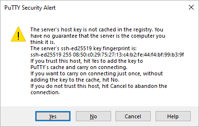
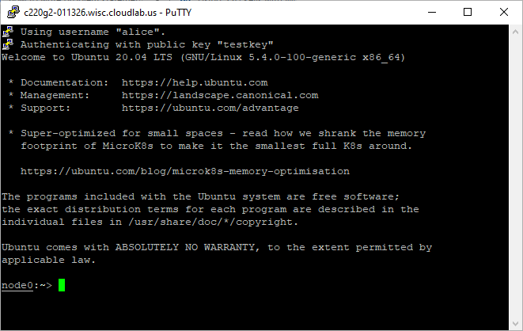

# Testing your SSH connection

After you've set up your SSH key and added it to your account on CloudLab, you can test your connection.

Before adding a new SSH key to your account on CloudLab, you should have:

- [Checked for existing SSH keys](existing-windows-putty.md)
- [Generated a new SSH key](generate-windows-putty.md)
- [Added a new SSH key to your CloudLab account](add-windows-putty.md)

When you test your connection, you'll need to authenticate this action using your password, which is the SSH key passphrase you created earlier. For more information on working with SSH key passphrases, see [Working with SSH key passphrases](passphrases-windows-putty.md).

1. Create a new experiment on CloudLab.

2. When your experiment is ready to use, the progress bar will be complete, and you’ll be given a lot of new options at the bottom of the screen. The `List View` lists all nodes in the topology, and gives you the command to ssh login to the node (if you provided a public key). 

<figure>
  

  <figcaption>
Figure. CloudLab experiment dashboard.
</figcaption>
</figure>

3. Click on the SSH command to automatically open a new SSH session, or 

4. Open PuTTY

5. Enter the username and hostname part of the SSH command into the `Host Name` box.

6. Click `Open` to manually open a new SSH session.

<figure>
  

  <figcaption>
Figure. PuTTY.
</figcaption>
</figure>

7. You may see a warning like this:

<figure>
  

  <figcaption>
Figure. PuTTY Security Alert.
</figcaption>
</figure>

8. Verify that the fingerprint in the message you see matches CloudLab's public key fingerprint. If it does, then click yes.

9. Upon the terminal login, you should see a Welcome Message similar to this:

<figure>
  

  <figcaption>
Figure. Welcome Message.
</figcaption>
</figure>
