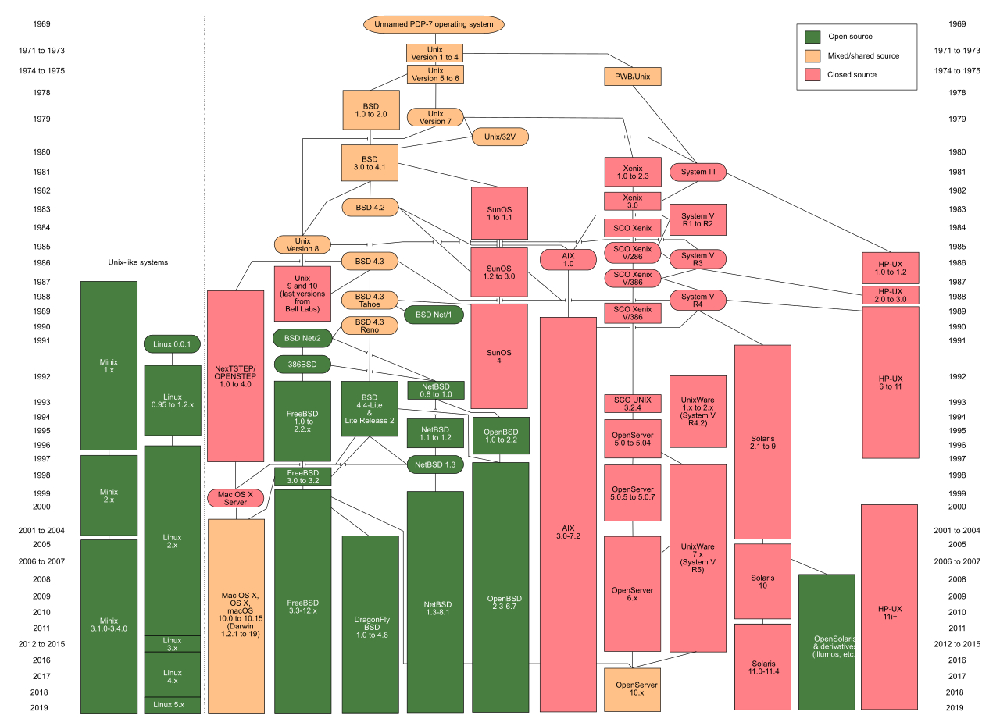

# Linux

## What, Who, When, Where & Why
---

# What is Linux

- Unix-like computer operating system assembled under the model of free and open-source software development and distribution.
- These operating systems share the Linux kernel.
  - Typically have the GNU utilities
- Comes in several “distributions” to serve different purposes.

---
# What is Linux

<div class="columns">
<div>
<h3>Bird’s eye view</h3>
</div>

<div>


</div>

</div>

---
# Who is Linux

<div class="columns">
<div>


Linux is an O/S core originally written by Linus Torvalds. Now almost 10,000 developers including major technology companies like Intel and IBM.
</div>

<div>


A set of programs written by Richard Stallman and others. They are the GNU utilities.
</div>
</div>

---

# When is Linux?

<div class="img-overlay-wrap">
   <svg xmlns="http://www.w3.org/2000/svg" viewBox="0 0 350 100">
   <defs>
      <marker id="arrowhead" markerWidth="10" markerHeight="7" 
      refX="0" refY="3.5" orient="auto">
         <polygon points="0 0, 10 3.5, 0 7" />
      </marker>
   </defs>
   <text x="20" y="35" class="tiny">1991</text>
   <line x1="40" y1="45" x2="120" y2="75" stroke="#000" 
   stroke-width="2" marker-end="url(#arrowhead)" />
   </svg>
   
</div>

---
# Where is Linux
- World Wide Web
   - 67% of the world’s web-servers run Linux (2016)
- Research/High-Performance Compute
   - Google, Amazon, NSA, 100% of TOP500 Super-computers.
- Modern Smartphones and devices
   - The Android phone
   - Amazon Kindle
   - Smart TVs/Devices

---

# Why Linux

- Free and open-source.
- Powerful for research datacenters
- Personal for desktops and phones
- Universal
- Community (and business) driven.

---
# Connecting

## Let’s use Linux
 
---


---

# Connection Protocols and Software

<div class="columns-three">
<div>

<div class="small center">
Remote Connections: <br>Secure SHell <br>(SSH)
</div>


</div>

<div>

<div class="small center">
Remote Graphics: <br>X-Windowing <br>(X, X-Win)
</div>


</div>

<div>

<div class="small center">
Data Transfer: <br>Secure File Transfer Protocol <br>(SFTP)
</div>


</div>

</div>

---

# Connecting from Different Platforms

<table class="small">
   <thead>
      <tr>
         <th align="center"></th>
         <th align="center">SSH</th>
         <th align="center">X-Win</th>
         <th align="center">SFTP</th>
        </tr>
    </thead>
    <tbody>
        <tr>
            <td align="center" rowspan=3>Microsoft<br> Windows</td>
        </tr>
        <tr>
            <td align="center" colspan=3>MobaXterm<br> <a href="https://mobaxterm.mobatek.net">https://mobaxterm.mobatek.net</a></td>
        </tr>
        <tr>
            <td align="center" colspan=3>PuTTY<br> <a href="https://www.putty.org/">https://www.putty.org/</a></td>
        </tr>
        <tr>
            <td align="center">Apple<br> MacOS</td>
            <td align="center">Terminal<br> (Built in)</td>
            <td align="center">XQuartz<br><a href="https://www.xquartz.org">https://www.xquartz.org</a></td>
            <td align="center">Various<br>(Built in)</td>
        </tr>
        <tr>
            <td align="center">Linux</td>
            <td align="center">Terminal<br>(Built in)</td>
            <td align="center">X11<br>(Built in)</td>
            <td align="center">Various<br>(Built in)</td>
        </tr>
    </tbody>
</table>

---

# Microsoft Windows

You need software that emulates an “X” terminal and that connects using the “SSH” Secure Shell protocol.
- Recommended: PuTTY
   - Download: http://www.putty.org/
- Alternatives:
   - MobaXterm
      http://mobaxterm.mobatek.net/
   - SSH/X-Windows: X-Win32
      https://www.bu.edu/tech/services/support/desktop/distribution/xwindows/
   - SFTP: Filezilla
      https://filezilla-project.org/

---

# Apple macOS

- SSH: Terminal
   - Built in to macOS
     Applications > Utilities > Terminal
- X-Windows: XQuartz
   - Download: https://www.xquartz.org/
   - Note: This install requires a logout.
- SFTP: Your choice
   - Filezilla: https://filezilla-project.org/
   - Cyberduck: https://cyberduck.io
   - Many others

---
# Linux

- SSH: Terminal 
   - Built in to Linux
   Applications > System > Terminal
- X-Windows: X11
   - Built in to Linux
   - Use your package manager.
- SFTP: Your choice
   - Usually has one Built in.
   - Alternate: Filezilla (https://filezilla-project.org/)

---

# Connecting

- Use your CloudLab account

---

# Linux Interaction
## Shell, Prompt, Commands and System Use
 
---

# Linux: The Shell


- Program that *interprets commands* and sends them to the OS
- Provides:
   - Built-in commands
   - Programming control structures
   - Environment variables
- Linux supports multiple shells.
   - The default on CloudLab is Bash
      “Bash” = “Bourne-again Shell”
      (GNU version of ~1977 shell written by Stephen Bourne)

---

# Linux: The “prompt”


<br>
<center> ( In Linux “ ~ ” is a shorthand for your home directory. ) </center>

---

# Linux: Command Basics


- <span style="color:blue">Command: Command/program that does one thing</span>

- <span style="color:green">Options: Change the way a command does that one thing</span>
   - Short form: Single-dash and one letter e.g. ls -a
   - Long form: Double-dash and a word e.g. ls --all

- <span style="color:orange">Argument: Provides the input/output that the command interacts with.</span>

<br>
<center>For more information about any command, use <b>man</b> or <b>info</b> (e.g. “<b>man ls</b>”)</center>

---
#  Commands: Hands-On

After you connect, type

```bash
whoami                           # my login
hostname                         # name of this computer
echo “Hello, world”              # print characters to screen
echo $HOME                       # print environment variable
echo my login is $(whoami)       # replace $(xx) with program output 
date                             # print current time/date
cal                              # print this month’s calendar
shazam                           # bad command
``` 

---

# Commands: Hands-On Options

- Commands have three parts; command, options and arguments/parameters.

- Example: cal –j 3 1999

   ```
   [username@scc1 ~]$ cal -j 3 1999
   ```

   -  `cal` is the command, 
   -  `-j` is an option (or switch)
   -  `3` and `1999` are arguments/parameters.

- What is the nature of the prompt?
- What was the system’s response to the command?

---

# Commands

## "Small programs that do one thing well"

- The Unix Programming Environment, Kernighan and Pike

   ... at its heart is the idea that the power of a system comes more from the <span style="color:green">relationships</span> among programs than from the programs themselves. Many UNIX programs do quite trivial things in isolation, but, combined with other programs, become general and useful tools.
 
---

# Commands: Selected text processing utilities

<div class="footnotesize">
<div class="columns">            
<div> 

|command|description
|:------|:----------
| `wc`  |Line, word and character count
| `awk` | Pattern scanning and processing language
| `cat` | Display file(s)
| `cut` | Extract selected fields of each line of a file
| `diff`| Compare two files
| `grep`| Search text for a pattern
| `head`| Display the first part of files
| `less`| Display files on a page-by-page basis

</div>

<div>

|command|description
|:------|:----------
| `sed` | Stream editor (esp. search and replace)
| `sort` |Sort text files
| `split`|Split files
| `tail` |Display the last part of a file
| `tr`   |Translate/delete characters
| `uniq` |Filter out repeated lines in a file
| `wc`   |Line, word and character count

</div>

---

# Variables and Environment Variables

- *Variables* are named storage locations. 
   - `USER=augustin`
   - `foo="this is foo’s value"`

- *Environment variables* are variables used and shared by the shell
   - For example, `$PATH` tells the system where to find commands.

- Environment variables are **shared with programs** that the shell runs.
 
 ---

# Bash variables

- To create a new variable, use the assignment operator `=` 

   ```
   [username@scc1 ~]$ foo="this is foo’s value"
   ```

- The foo variable can be printed with `echo`
 
   ```
   [username@scc1 ~]$ echo $foo this is foo’s value
   ```

- To make `$foo` visible to programs run by the shell (i.e., make it an “environment variable”), use `export`:

   ```
   [username@scc1 ~]$ export foo
   ```

---

# Environment Variables

To see all currently defined environment variable, use printenv:
 
```  
[username@scc1 ~]$ printenv
HOSTNAME=scc1
TERM=xterm-256color
SHELL=/bin/bash
HISTSIZE=1000
TMPDIR=/scratch
SSH_CLIENT=168.122.9.131 37606 22
SSH_TTY=/dev/pts/191
USER=cjahnke
MAIL=/var/spool/mail/cjahnke 
PATH=/usr3/bustaff/cjahnke/apps/bin:/usr/local/bin:/bin:/usr/bin:/usr/local/sbin:/usr/sbin:/sbin PWD=/usr3/bustaff/cjahnke/linux-materials
LANG=C
MODULEPATH=/share/module/bioinformatics:/share/module/chemistry
SGE_ROOT=/usr/local/ogs-ge2011.11.p1/sge_root
HOME=/usr3/bustaff/cjahnke
```

---

# Command History and Command Line Editing

- Try the `history` command
- Choose from the command history using the up ↑ and down ↓ arrows
- To redo your last command, try `!!`
- To go further back in the command history try `!`, then the number as shown by history (e.g., `!132`). Or, `!ls`, for example, to match the most recent `ls` command.
- What do the left ← and right → arrow do on the command line?
- Try the <b>\<Del></b> and <b>\<Backspace></b> keys

---

#  Help with Commands


- Type
   - `date –-help`
   - `man date`
   - `info date`
- BASH built-ins
   - A little different from other commands
   - Just type the command `help`
   - Or `man bash`
 
---

# On using man with less

The `man` command outputs to a pager called `less`, which supports many ways of scrolling through text:

```bash
Space, f    # page forward
b           # page backward
<           # go to first line of file
>           # go to last line of file
/           # search forward (n to repeat)
?           # search backward (N to repeat)
h           # display help
q           # quit help
```

---

# I/O Redirection

---

# I/O redirection with pipes

- Many Linux commands print to “standard output”, which defaults to the terminal screen. The `|` (pipe) character can be used to divert or “redirect” output to another program or filter.

   ```bash
   w                    # show who's logged on

   w | less             # pipe into the 'less' pager
   w | grep 'tuta'      # pipe into grep, print lines containing 'tuta' 
   w | grep -v 'tuta'   # print only lines not containing ‘tuta’

   w | grep 'tuta' | sed s/tuta/scholar/g
                        # replace all 'tuta' with 'scholar'
   ```

---

# More examples of I/O redirection

- Try the following (use up arrow to avoid retyping each line):

   ```bash 
   w | wc                              # count lines
   w | cut –d ' ' –f1 | sort           # sort users
   w | cut –d ' ' –f1 | sort | uniq    # eliminate duplicates
   ```
- We can also redirect output into a file:
   ```bash
   w | cut –d ' ' –f1 | sort | uniq > users
   ```
- Note that 'awk' can be used instead of 'cut':
   ```bash
   w | awk '{print $1;}' | sort | uniq > users
   ```
- Quiz:
   - How might we count the number of distinct users currently logged in? 
   For extra credit, how can we avoid over-counting by 2? (Hint: use `tail`.)

---

# The Filesystem

- The Linux File System
- The structure resembles an upside-down tree
- Directories (a.k.a. folders) are collections of files and other directories.
- Every directory has a parent except for the root directory.
- Many directories have subdirectories.

 

---


---

# Navigating the File System

Essential navigation commands:
```bash
pwd   # print current directory
ls    # list files
cd    # change directory
```

---

# Navigating the File System

We use *pathnames* to refer to files and directories in the Linux file system.

- There are two types of pathnames:
   - *Absolute* – The full path to a directory or file; begins with `/`
   - *Relative* – A partial path that is relative to the current working directory;
   does not begin with `/`

---

# Navigating the File System

Special characters interpreted by the shell for filename expansion:

```bash
~        # your home directory (e.g., /usr1/tutorial/tuta1) 
.        # current directory
..       # parent directory
*        # wildcard matching any filename
?        # wildcard matching any character
TAB      # try to complete (partially typed) filename
```

---

# Navigating the File System

Examples:

```bash
cd /usr/local           # Change directory to /usr/local/lib
cd ~                    # Change to home directory (could just type 'cd')
pwd                     # Print working (current) directory
cd ..                   # Change directory to the “parent” directory 
cd /                    # Change directory to the “root”
ls –d pro*              # Listing of only the directories starting with 'pro'
```

---

# The ls Command

Useful options for the “ls” command:

```bash
ls -a       # List all files, including hidden files beginning with a '.' 
ls -ld *    # List details about a directory and not its contents
ls -F       # Put an indicator character at the end of each name 
ls –l       # Simple long listing
ls –lR      # Recursive long listing
ls –lh      # Give human readable file sizes
ls –lS      # Sort files by file size
ls –lt      # Sort files by modification time (very useful!)
```

---

# Some Useful File Commands

```bash
cp [file1] [file2]         # copy file
mkdir [name]               # make directory
rmdir [name]               # remove (empty) directory
mv [file] [destination]    # move/rename file
rm [file]                  # remove (-r for recursive)
file [file]                # identify file type
less [file]                # page through file
head -n N [file]           # display first N lines
tail -n N [file]           # display last N lines
ln –s [file] [new]         # create symbolic link
cat [file] [file2...]      # display file(s)
tac [file] [file2...]      # display file in reverse order 
touch [file]               # update modification time
od [file]                  # display file contents, esp. binary
```

---

# Manipulating files and directories

Examples:

```bash 
cd                                     # The same ascd ~
mkdir test
cd test
echo 'Hello everyone' > myfile.txt
echo 'Goodbye all' >> myfile.txt
less myfile.txt
mkdir subdir1/subdir2                  # Fails. Why?
mkdir -p subdir1/subdir2               # Succeeds
mv myfile.txt subdir1/subdir2
cd ..
rmdir test                             # Fails. Why?
rm –rf test                            # Succeeds
```

---

# Symbolic links

- Sometimes it is helpful to be able to access a file from multiple locations within the hierarchy. On a Windows system, we might create a "shortcut". On a Linux system, we can create a symbolic link:

   ```bash
   mkdir foo         # make foo directory
   touch foo/bar     # create empty file
   ln –s foo/bar .   # create link in current dir
   ```

---

# Finding a needle in a haystack

- The `find` command has a rather unfriendly syntax, but can be exceedingly helpful for locating files in heavily nested directories.
- Examples:
   ```bash
   find ~ -name bu –type d    # search for 'bu' directories in ~
   find . –name my-file.txt   # search for my-file.txt in .
   find ~ -name '*.txt'       # search for '*.txt' in ~
   ```

- Quiz:
   - Can you use find to locate a file called `needle` in your haystack directory?
   - Extra credit: what are the contents of the `needle` file?


---

# Processes & Job Control

---

# Processes and Job Control
- As we interact with Linux, we create numbered instances of running programs called *processes*. You can use the `ps` command to see a listing of your processes (and others!). To see a long listing, for example, of all processes on the system try:

   ```bash
   [username@scc1 ~]$ ps -ef
   ```

- To see all the processes owned by you and other members of the class, try:

   ```
   [username@scc1 ~]$ ps -ef | grep tuta
   ```

---
# File permissions

- Every file has a set of permissions, an owner user, and an owning group

- Permission format


---

# Viewing/changing permissions

- View permissions:

   ```bash
   ls -l
   ```

- Change permissions with chmod:

   ```bash
   chmod {ugo}{+-}{rwx} file
   ```
   
   Example:
   
   ```bash
   chmod o+rx myfile
   ```

- Change owner with chown:

   ```bash
   chown <user>:<group> <file>
   ```
---

# Processes and Job control

Use `top` to see active processes.

```bash
Tasks: 408 total,   1 running, 407 sleeping,   0 stopped,   0 zombie
Cpu(s):  0.3%us,  0.1%sy,  0.0%ni, 99.6%id,  0.0%wa,  0.0%hi,  0.0%si,  0.0%st
Mem:  99022756k total, 69709936k used, 29312820k free,   525544k buffers
Swap:  8388604k total,        0k used,  8388604k free, 65896792k cached

  PID USER      PR  NI  VIRT  RES  SHR S %CPU %MEM    TIME+  COMMAND
 7019 root      20   0  329m 137m 4852 S  4.0  0.1 217:01.56 sge_qmaster
38246 isw       20   0 88724 2764 1656 S  0.7  0.0   0:01.28 sshd
41113 cjahnke   20   0 13672 1512  948 R  0.7  0.0   0:00.03 top
 2324 root      20   0     0    0    0 S  0.3  0.0   0:21.82 kondemand/2
 7107 nobody    20   0 89572  10m 2400 S  0.3  0.0   2:18.05 gmond
27409 theavey   20   0 26652 1380  880 S  0.3  0.0   0:34.84 tmux
    1 root      20   0 25680 1604 1280 S  0.0  0.0   0:05.74 init
    2 root      20   0     0    0    0 S  0.0  0.0   0:00.07 kthreadd
    3 root      RT   0     0    0    0 S  0.0  0.0   0:00.89 migration/0
    4 root      20   0     0    0    0 S  0.0  0.0   0:01.72 ksoftirqd/0
    5 root      RT   0     0    0    0 S  0.0  0.0   0:00.00 stopper/0
```

---

# Foreground/background

- Thus far, we have run commands at the prompt and waited for them to complete. We call this running in the *foreground*.
- Use the `&` operator, to run programs in the *background*,
   - Prompt returns immediately without waiting for the command to complete:

   ```bash
   [username@scc1 ~]$ mycommand & 
   [1] 54356                                  # ← process id
   [username@scc1 ~]$
   ``` 

--- 

# Process Control Practice

- Let’s look at the `countdown` script, in your scripts folder for practice
 
   ```bash 
   [username@scc1 ~]$ cd ~/scripts 
   [username@scc1 ~]$ cat countdown
   ```

- Make the script executable with `chmod`:

   ```bash
   [username@scc1 ~]$ chmod +x countdown
   ```

- First, run it for a few seconds, then kill with Control-C.

   ```bash
   [username@scc1 ~]$ ./countdown 100 100
   99
   98
   ^C             # ← Ctrl-C = (^C)
   ``` 

---

# Process control

- Now, let’s try running it in the background with &:
   
   ```bash 
   [username@scc1 ~]$ ./countdown 60 & 
   [1] 54355
   [username@scc1 ~]$
   60
   59
   ```

- The program’s output is distracting, so redirect it to a file:

   ```bash
   [username@scc1 ~]$ countdown 60 > c.txt &
   [1] 54356
   [username@scc1 ~]$
   ```

---

#  Process control

- Type `ps` to see your countdown process.

- Also, try running `jobs` to see any jobs running in the background from this bash shell.

- To kill the job, use the `kill` command, either with the five-digit process id:

   ```bash
   kill 54356
   ```

- Or, you can use the job number (use `jobs` to see list) with `%`:

   ```bash
   kill %1
   ```
 
---

# Backgrounding a running job with C-z and `bg`

Sometimes you start a program, then decide to run it in the background.

```bash 
[username@scc1 scripts]$ ./countdown 200 > c.out
^Z                                                    # ← Ctrl-Z = (^Z)
[1]+  Stopped            ./countdown 200 > c.out

[username@scc1 scripts]$ bg 
[1]+ ./countdown 200 > c.out &

[username@scc1 scripts]$ jobs
[1]+ Running ./countdown 200 > c.out &

[username@scc1 scripts]$
```

---

# Editors

---

# Regular expressions

Many Linux tools, such as `grep` and `sed`, use strings that describe sequences of characters. These strings are called regular expressions.

Here are some examples:

```bash
^foo                 # line begins with “foo”
bar$                 # line ends with “bar”
[0-9]\{3\}           # 3-digit number
.*a.*e.*i.*o.*u.*    # words with vowels in order*
```

---

# File Editors

- nano
   - Lightweight editor

- emacs
   - Swiss-army knife, has modes for all major languages, and can be customized
   - Formerly steep learning curve has been reduced with introduction of menu and tool bars

- vim
   - A better version of vi (an early full-screen editor).
   - Very fast, efficient 
   - Steep learning curve 
   - Popular among systems programmers
   
---

# vi/vim

- vi/vim is a very popular text editor among programmers and system administrators
- It supports many programming and scripting languages
- Suitable for more advanced file editing
- vi/vim has two modes:
   1. *Text mode*: which can be enabled by typing <b>i</b> (insert) or <b>a</b> (append)
   1. *Command mode*: which will be enabled by pressing the <b>Esc</b> key on keyboard

---

# vi/vim: some useful commands

<div class="small">
<div class="columns">            
<div> 

|command|description
|:------|:----------
| `!`  | Forces the action
| `:q` | Quit
| `:q!` | Force quit
| `:w` | Write
| `:wq`| Write and quit
| `:x`|  Write (if have changes) and quit

</div>

<div>

|command|description
|:------|:----------
| `i` | Insert
| `a` | Append
| `x`| Delete a character
| `y[count]y` | Yank (copy) [count] lines
| `d[count]d`   | Cut (Delete) [count] lines
| `p`   | Paste after the current line

</div>

---

# Basic Bash Scripting in Linux

---

# What is Bash Script?

- Bash script is an executable file contains Bash shell commands which could
be used to automate and simplify things.

- Shell script is a text file starts with (`#!`) followed by the path to the shell
interpreter (i.e. `/bin/bash`)

---

# A simple bash script

```bash
#!/bin/bash

echo "Hello, World!"
```
---

# Running the bash script

```bash
$ ./hello.sh
bash: ./hello.sh: Permission denied

$ ls -l
-rw-r--r-- 1 alice alice 47 Nov 8 15:53 hello.sh

$ chmod u+x hello.sh

$ ls -l
-rwxr--r-- 1 alice alice 47 Nov 8 15:53 hello.sh

$ ./hello.sh
Hello, World!
```

---

# For loops

```bash
#!/bin/bash
for i in 1 2 3 4 5 6 7 8 9 10; do
   echo Count: ${i}
done
```

### Alternative approach using `seq`

```bash
for i in `seq 1 10`; do
   echo Count: ${i}
done
```

- Back ticks ( ` ) tell bash to execute the command in the ticks
- `seq 1 10` gives a list from 1 to 10

---

# `*`  wildcard in for loop

Perform some operation on every file in the directory:

```bash
for file in *.pdf; do
   pdftohtml ${file}
done
```
- `pdftohtml` is a command that converts a pdf file to html

---

# Control flow

```bash
#!/bin/bash

a=1
b=2

if [[ $a -gt $b ]]
then
    echo $a is greater than $b
elif [[ $a -lt $b ]]
then
    echo $a is less than $b
elif [[ $a -eq $b ]]
then
    echo $a is equal to $b
else
    echo "unknown condition"
fi
```